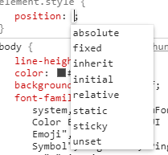
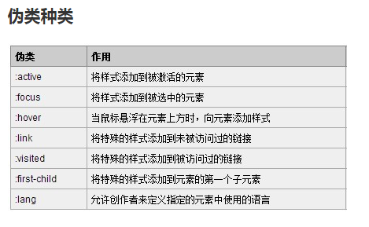
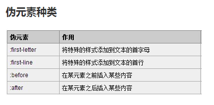
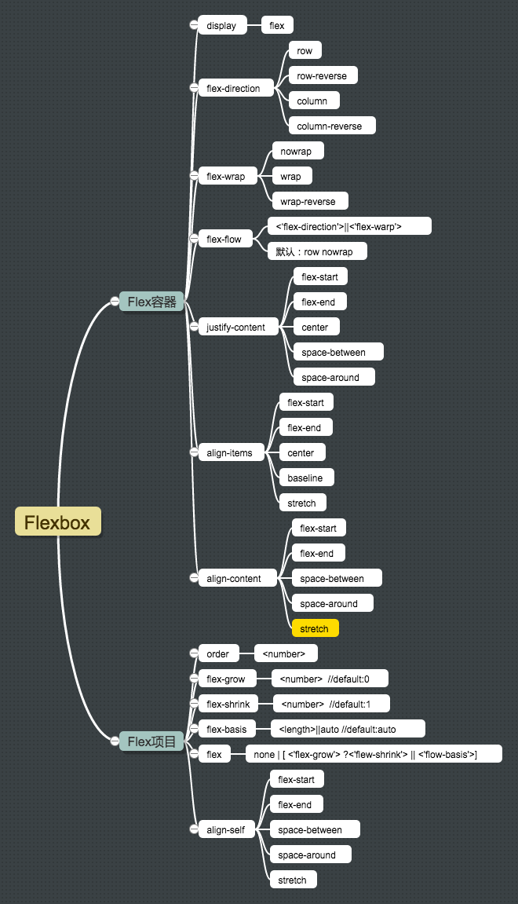
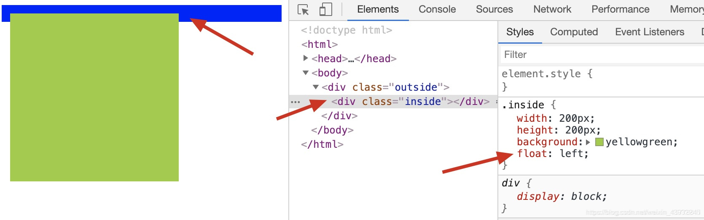
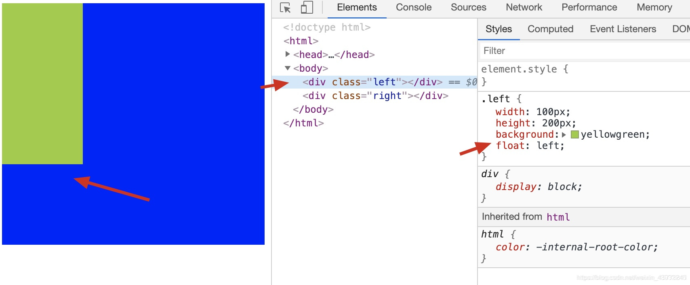

# css知识点

# <font color="#e96900">css3的新特性</font>
 - 媒体查询 @media
 - 动画 transform，transition，translate @keyframes
 - 阴影 box-shadow,text-shadow等特效
 - border-radius 等新增属性
 - RGBA和透明度
 ---
#  <font color="#e96900">css选择器相关</font>
## css选择器有哪些？
 id选择器(#myid)
 
 类选择器(.myclassname) 
 
 标签选择器(div, h1, p)、
 
 相邻选择器(h1 + p)、
 
 子选择器（ul > li）、
 
 后代选择器（li a）、
 
 通配符选择器（*）、
 
 属性选择器（a[rel="external"]）、
 
 伪类选择器（a:hover, li:nth-child）
## 哪些属性可以继承
- 可继承的属性：`font,font-size, font-weight,font-family, color,text-align,line-height,visibility,cursor`
- 不可继承的样式：`border, padding, margin, width, height,display,background`

## 选择器的优先级
 CSS选择器的优先级是：!important > 行内样式 > ID选择器 > 类选择器 > 标签 > 通配符 > 继承 > 浏览器默认属性。

## 权重怎么计算
 权重:行内样式（1000）>ID选择器（100）>类选择器（10）>标签选择器（1）>通用选择器（0）
```css
#box p .tt =100+1+10
#box .tt =100+10
```
**权重值越大，优先级越高**

**选择器选择的范围越小越精确，优先级越高**

---

#  <font color="#e96900">下面哪种渲染性能比较高</font>
```css
第一种
.box a{
  xxx
}

第二种
a{
  xxxx
}
```
答：第二种，因为`css`浏览器的渲染机制是`选择器从右到左查询`，所以第二种是查询所有的`a` ，第一种是先查询所有的`a`，然后查找`.box`下的所有`a` 二次筛选，所以第二种的性能更高

---

# <font color="#e96900">link和@import的区别？</font>
- `link`属于`XHTML`标签，而`@import`是`CSS`提供的。
- 页面被加载时，`link`会同时被加载，而`@import`引用的`CSS`会等到页面被加载完再加载。
- `import`只在`IE 5`以上才能识别，而`link`是`XHTML`标签，无兼容问题。
- `link`方式的样式权重高于`@import`的权重。
- 使用`dom`控制样式时的差别。当使用`javascript`控制`dom`去改变样式的时候，只能使用`link`标签，因为`@import`不是`dom`可以控制的。

```html
link方式:

<head>

<link href="mystyle.css" rel="stylesheet" type="text/css" />

</head>

import方式：

<head>

<style type="text/css" > @import url("mystyle.css"); </style>

</head>
```
---

# <font color="#e96900">em\px\rem区别？</font>
- px：绝对单位，页面按精确像素展示。
- em：相对单位，基准点为父节点字体的大小，如果自身定义了font-size按自身来计算（浏览器默认字体是16px），整个页面内1em不是一个固定的值。
- rem：相对单位，可理解为”root em”, 相对根节点html的字体大小来计算，CSS3新加属性，chrome/firefox/IE9+支持

--- 

# <font color="#e96900">如何做到rem自适应</font>
rem 相对于根元素的大小 1rem = 16px ， 动态设置根元素fontsize就可以达到rem动态自适应

如果想要不管屏幕大小 始终保持 1rem = 100px，那么就是让根元素fontsize始终是100px，如果设计图是750px，手机调试是375px，那么我们需要保持在750px下为100px，在375px的时候就应该是一半50px

得出：font-size:（页面宽度/设计图宽度）* 100 ==> (375/750)*100 = 50px

如果手机是750px，那么 (750/750)*100 = 100px;
```js
initSize();
function initSize(setwidth){
  var win = document.body.offsetWidth;
  var rem = (win * 100) / 750;
  document.documentElement.style.fontSize  = rem+'px';
}
window.onresize = initSize

```
---

# <font color="#e96900">positon都有哪些属性？</font>


`static` 默认值 - - - 不脱离文档流，`top，right，bottom，left`等属性不生效。（可以快速取消定位 让`top，right，bottom，left`等无效）`

`relative` 相对定位- - - 不脱离文档流，左右 `margin`为`auto`仍然有效，元素偏移前位置

`absolute` 绝对定位 - - - 脱离文档流,左右`margin`为`auto`将会失效

`fixed` 固定定位 - - - 脱离文档流 根据 `window` （或者 `iframe`）确定位置

`sticky` 粘性定位 - - - 相当于`relative`和`fixed`的结合，它的行为就像 `position:relative`; 而当页面滚动超出目标区域时，它的表现就像 `position:fixed`;，它会固定在目标位置。

`sticky`使用条件：
1. 父元素不能`overflow:hidden`或者`overflow:auto`属性。
2. 必须指定`top、bottom、left、right`4个值之一，否则只会处于相对定位
3. 父元素的高度不能低于`sticky`元素的高度
4. `sticky`元素仅在其父元素内生效 滚动超过父元素就会变成`relative`

`inherit` - - - 规定应该从父元素继承 `position` 属性的值。

`initial `- - - 设置`positon`的值为默认值(`static`) ,有了`static`为什么还会存在此属性，不是多此一举？,`initial` 关键字可用于任何 `HTML `元素上的任何 `CSS` 属性，不是`postion`特有的

`unset`设置`positon`的值为不设置

如果该属性的默认属性是 `继承属性`(例如字体相关的默认属性基本都是继承)，该值等同于 `inherit`
如果该属性的默认属性 `不是继承属性`(例如`pisition`的默认属性为`static`)，该值等同于`initial`

---

#  <font color="#e96900">z-index的工作原理及适用范围</font>

1. `z-index`这个属性控制着元素在z轴上的表现形式。
2. 适用范围:`仅适用于定位元素`，`即拥有relative,absolute,fixed属性的position元素。`
3. 堆叠顺序是当前元素位于z轴上的值，数值越大说明元素的堆叠顺序越高，越靠近屏幕。
4. 未定义时，后来居上，未定义`z-index`的属性，元素的堆叠顺序基于它所在的文档树。默认情况下，后来的元素的`z-index`的值越大。

使用范围：
1. 网页两侧的浮动窗口（播放器，指定按钮，广告等）
2. 导航栏浮动置顶
3. 隐藏div实现弹窗功能（通过设置div定位和z-index:-9999控制div的位置和出现隐藏）

## 如何理解层叠上下文？
层叠上下文是HTML元素的三维概念，这些HTML元素在一条假想的相对于面向（电脑屏幕的）视窗或者网页的用户的z轴上延伸，HTML元素依据其自身属性按照优先级顺序占用层叠上下文的空间。

触发以下条件则会产生层叠上下文：
- 根元素 (HTML)
- z-index 值不为 "auto"的 绝对/相对定位，
- position: fixed --- fixed即使不写z-index层级也是比较高的 
- 一个 z-index 值不为 "auto"的 flex 项目 (flex item)，即：父元素 display: flex|inline-flex
- opacity 属性值小于 1 的元素
- transform 属性值不为 "none"的元素，

---

## <font color="#e96900">为什么有时候人们用translate来改变位置而不是定位</font>
translate()是transform的一个值。

改变transform或opacity不会触发浏览器重新布局（reflow）或重绘（repaint），只会触发复合（compositions）。

而改变绝对定位会触发重新布局，进而触发重绘和复合。

transform使浏览器为元素创建一个 GPU 图层，但改变绝对定位会使用到 CPU。 因此translate()更高效，可以缩短平滑动画的绘制时间。

而translate改变位置时，元素依然会占据其原始空间，绝对定位就不会发生这种情况。

transform会产生堆叠上下文，内容是不脱离文本流的，在过渡的过程中不改变页面布局 过渡结束后回到原有位置。

---
# <font color="#e96900">transition、transform、animation三个属性的使用与区别详解</font>
transition（过渡）------是一个过渡属性，就是一个属性从一个值过渡到另一个值

transform（变换）------就是一个整体的位置（或整体大小）发生变换

animation（动画）------就是在一段时间内各种属性进行变化从而达到一个动画的效果。

## transition（过渡）
>W3C中对transition的描述是：css中的transition允许css的属性值在一定的时间区间内平滑地过渡。这种效果可以在鼠标单击、获得焦点、被点击或对元素任何改变中触发，并圆滑的以动画效果改变css的属性值。
- `transition-property`（执行变换的属性），
  - `none` 没有属性需要执行过渡
  - `all` 所有属性发生变化（默认值）
  - `indent` 元素的某一个属性值 
- `transition-duration`（执行变换的持续时间）,
  - 用来指定元素转换过程的持续时间，单位为s或ms，可以作用域任何元素。默认值为0
- `transition-timing-function`(变换的速率变化模式),
  - `ease`（逐渐变慢）
  - `linear`（匀速）
  - `ease-in`（加速）
  - `ease-out`（减速）
  - `ease-in-out`（加速然后减速）
  - `cubic-bezier`（允许自定义一个时间曲线）
- `transition-delay`(变换延迟时间)。
  - 用来指定一个动画开始执行的时间，也就是说当改变元素属性值后多长时间执行`transition`效果。

简写：transition: `<property>` `<duration>` `<animation type>` `<delay>`

---

## transform（变换）
> transform就是变换，改变，主要的值有以下几种
- `rotate(30deg)`:围绕中心点2D旋转若干度，单位为deg。
- `translate（x,y）`:移动
  - translate有三种情况，translate(x,y),x轴和y轴同时移动（如果这里只设定一个值，证明x的值和y的值相同，同样的也是x轴和y轴同时移动），translateX(x),沿着x轴移动，translateY(y),沿着y轴移动。
- `scale`:缩放
  - transform: scale(1.5);transform: scale(0.5);
- `skew`:扭曲（倾斜）
  - shewX(30deg)
  - shewY(30deg)
  - shew(30deg,30deg) x,y
  - shew(30deg) 默认x轴

---

## animation（动画）

- `animation-name`(动画名，也就是keyfram中定义的动画名)
- `animation-duration`（动画持续时间）
- `animation-timing-function`（动画变化的速率）
- `animation-delay`（动画延迟播放的时间）
- `animation-iteration-count`（动画循环的次数，infinite是无限次）
- `animation-direction`（动画的方向）
- `animation-play-state`动画的播放状态

简写 transition: `<name> <duration> <animation type> <delay> <iteration> <direction>`

---

## animation和transition的区别

1、transition更适用于简单状态的过渡

2、animation可以没有触发条件但是transition不可以，所以在例如页面刚加载时的动画可以使用animation

3、animation可以通过更多的参数实现更复杂的动画效果，包括关键帧数、速度曲线、播放的次数、是否逆向播放等，（官方介绍中animation是transition属性的扩展）

---

# <font color="#e96900">对媒体查询的理解？</font>
> [深入理解CSS Media媒体查询](https://www.cnblogs.com/xiaohuochai/p/5848612.html)

---

# <font color="#e96900">伪类和伪元素的区别是什么</font>



**伪类**：用于**已有元素**处于某种状态时为其添加对应的样式，这个状态是根据用户行为而动态变化的。

当用户悬停在指定元素时，可以通过`:hover`来描述这个元素的状态，虽然它和一般css相似，可以为已有元素添加样式，但是它只有处于DOM树无法描述的状态下才能为元素添加样式，所以称为伪类。

**伪元素**：用于创建一些**不在DOM树中的元素**，并为其添加样式。

例如，我们可以通过`:before`来在一个元素之前添加一些文本，并为这些文本添加样式，虽然用户可以看见这些文本，但是它实际上并不在DOM文档中。

## 区别
1. 有没有创建一个文档树之外的元素 --- 伪类：没有，伪元素：有
2. 伪类单冒号，伪元素双冒号 ，大部分浏览器都支持伪元素的双冒号(::)表示方法 ，兼容低版本浏览器（ie8），伪元素也可使用单冒号，但其他浏览器要养成写双冒号的习惯。

(`w3c标准中说到，虽然CSS3标准要求伪元素使用双冒号的写法，但也依然支持单冒号的写法。为了向后兼容，我们建议你在目前还是使用单冒号的写法。`)

3. 伪类与伪元素的本质区别就是是否抽象创造了新元素

---

# <font color="#e96900">你对flex的理解</font>
> Flexbox，一种CSS3的布局模式，也叫做弹性盒子模型，用来为盒装模型提供最大的灵活性。

布局的传统解决方案，基于盒状模型，依赖display属性 + position属性 + float属性。它对于那些特殊布局非常不方便，比如，垂直居中就不容易实现。

简单的分为**容器属性**和**元素属性**

## 容器属性
- `flex-direction`:决定主轴的方向（即子item的排列方法）
- `flex-wrap`:决定换行规则
- `flex-flow`: flex-flow: `<flex-direction> `|| `<flex-wrap>` 上面两个属性的缩写;
- `justify-content`:对其方式，水平主轴对齐方式
- `align-items`: 对齐方式，竖直轴线方向

## 元素属性
- `order`:定义项目的排列顺序，顺序越小，排列越靠前，默认为0
- `flex-grow`:定义项目的放大比例，即使存在空间，也不会放大 默认为0
- `flex-shrink`:定义了项目的缩小比例，当空间不足的情况下会等比例的缩小，如果定义个item的flow-shrink为0，则为不缩小 默认为1
- `flex-basis`:定义了在分配多余的空间，项目占据的空间 默认为auto。
- `flex`:是flex-grow和flex-shrink、flex-basis的简写，默认值为0 1 auto。
- `align-self`:允许单个项目与其他项目不一样的对齐方式，可以覆盖align-items，默认属性为auto，表示继承父元素的align-items



# <font color="#e96900">盒模型</font>

 > 常见提问：标准模式和怪异模式的区别？ 
 > 解析：主要是想问标准盒模型和ie（怪异）盒模型的区别
 
 盒模型的组成包含：`content`+`padding`+`border`+`margin`

 两种盒模型的主要区别在于盒模型的**宽度**的界定

## 标准盒模型
 盒模型大小：`content（width）`+`padding`+`border`+`margin`

 标准盒模型中，盒模型的宽度只是内容`content`的大小

## ie（怪异）盒模型
 盒模型大小：`content（width+padding+border）`+`margin`

ie（怪异）盒模型中，盒模型的宽度是 `content+padding+border`

## 如何设置两种盒模型
我们在日常开发过程中，根据设计图的尺寸，一般使用的都是`ie`盒模型，因为可以始终保证盒子的`width`不变，方便布局.

可以通过`box-sizing`属性来切换盒模型的使用

ie模式（常用）:`border-sizing:border-box`; 标准模式（默认）:`border-sizing:content-box;`

---

# <font color="#e96900">盒子水平垂直居中的方案</font>

## 1、定位一
```html
<style>
body{
 position: relative;
}  
.box{
 position: absolute;
 top: 50%;
 left: 50%;
 margin-top: -25px;
 margin-left: -50px;
}
</style>
```
`top` `left` 为`50%` 是`box`左上角相对父元素 所以要往上和左移动盒子一半的位置才是相对居中，也就是为什么要写margin处理

**缺点：这种方式的限制是 必须知道元素的具体宽高才行**

---

## 2、定位二
```html
<style>
body{
  position: relative;
}  
.box{
  position: absolute;
  top: 0;
  left: 0;
  right: 0;
  bottom: 0;
  margin: auto;
}
</style>
```
这种方式**只是**不需要考虑宽高，不需要用margin来取中计算，但是一定要有宽高才行，没有任意一方 定位后盒子相对父元素都是100% 

---

## 3、定位三
```html
<style>
body{
  position: relative;
}  
.box{
  position: absolute;
  top: 50%;
  left: 50%;
  transform: translate(-50%,-50%);
}
</style>
```
css3的`transform`实现 ,这种方式**不需要考虑元素的宽高**，**缺点就是兼容性问题**

---

## 4、flex
```html
<style>
body{
   display: flex;
   justify-content: center;
   align-items: center;
 }
</style>
```
css3 `flex` 让子元素水平轴和垂直轴方面居中，**无需考虑子元素的宽高**, **缺点就是兼容性问题**

---

## 5、display:table-cell 不常用
```html
<style>
body{
 display: table-cell;
 vertical-align: middle;//行内元素垂直居中
 text-align: center; //行内元素 水平居中
 background: lightcoral;
 width:500px; //必须设定固定宽高
 height: 500px;
}
.box{
 display: inline-block;
}
</style>
```
本身是控制文本的居中 要是盒子的话 可以设置为`inline / inline-block` 

**缺点很明显 1、需要父元素有固定宽高 2、需要子元素为行内/行内块 但子元素可以不设置宽高**

---
## 6、js处理
```js
let HTML = document.documentElement,
  winW = HTML.clientWidth,
  winH = HTML.clientHeight,
  boxW = box.offsetWidth,
  boxH = box.offsetHeight;
  box.style.position = 'absolute';
  box.style.left = (winW - boxW) / 2 + 'px';
  box.style.top = (winH - boxH) / 2 + 'px';
```
注意！带有`id`的`dom`元素 可以直接使用`id`名称获取，无需使用`document.getElementById('id')`

---

# <font color="#e96900">左右固定中间自适应方案</font>
>圣杯布局、双飞翼布局 ===> 左右固定，中间自适应 也都是通过 浮动+负margin 只是处理的方式不同而已。
## 1、圣杯布局
```html
<style>
html,body{
  height: 100%;
  overflow: hidden;
}
.container{
  height: 100%;
  padding: 0 200px; 给左右留出空间
}
.left,.right{
  width: 200px;
  min-height: 200px;
  background: lightblue;
}
.center{
  width: 100%;
  min-height: 400px;
  background: lightcoral;
}
.left,.right,.center{
  float: left;
}
.left{
  margin-left: -100%; 
  position: relative;
  left: -200px;
}
.right{
  margin-right: -200px;
}

</style>
<div class="container clearfix">
  <div class="center"></div>
  <div class="left"></div>
  <div class="right"></div>
</div>
```

## 2、双飞翼布局

```html
<style>
html,body{
  height: 100%;
  overflow: hidden;
}
.left,.right,.container{
  float: left;
}
.container{
  width: 100%;
}
.left,.right{
  width: 200px;
  min-height: 200px;
  background: lightblue;
}
.container .center{
  margin: 0 200px;
  min-height: 400px;
  background: lightgreen
}
.left{
  margin-left:-100%; 
}
.right{
  margin-left:-200px;
}
</style>
<body class="clearfix">
   <div class="container">
     <div class="center"></div>
   </div>
   <div class="left"></div>
   <div class="right"></div>
</body>
```
---

## 3、flex布局
```html
<style>
html,body{
height: 100%;
overflow: hidden;
}
.container{
display: flex;
height: 100%;
justify-content: space-between;
}
.left,.right{
flex: 0 0 200px; /* flex: 放大比例  缩小比例 大小*/
height: 200px;
background: lightblue;
}
.center{ 
flex: 1; /* flex:1 剩下的空间占几份 如果其他都是固定值 1代表全占  如果其他也设置为不同的值 那个就是 几分之几*/
height: 200px;
background: lightcoral;
}

</style>
<body class="container">
  <div class="left"></div>
  <div class="center"></div>
   <div class="right"></div>
</body>
```
## 4、calc表达式
```html
<style>
html,body{
  height: 100%;
  overflow: hidden;
}
.container{
  height: 100%;
}
.left,.right{
  float: left;
  width:200px;
  height: 200px;
  background: lightblue;
}
.center{ 
  float: left;
  /* 兼容到ie9 */
  width: calc(100% - 400px);
  height: 200px;
  background: lightcoral;
}
/* 一般情况下不推荐使用类似calc这种表达式的写法 因为表达式在渲染上性能比较慢  尽可能少写 */
</style>
<body class="container">
  <div class="left"></div>
  <div class="center"></div>
   <div class="right"></div>
</body>
```

 <font color="#e96900">一般情况下不推荐使用类似calc这种表达式的写法 因为表达式在渲染上性能比较慢  尽可能少写</font>


## 5、定位
```html
<style>
*{
  margin: 0;
  padding: 0;
}
html,body{
  height: 100%;
  overflow: hidden;
}
.container{
  height: 100%;
}
.left,.right{
  position: absolute;
  top: 0;
  width:200px;
  height: 200px;
  background: lightblue;
}
.left{
  left: 0;
}
.right{
  right: 0;
}
.center{ 
  margin:0 200px;
  height: 200px;
  background: lightcoral;
}
</style>
<body class="container">
  <div class="left"></div>
  <div class="center"></div>
   <div class="right"></div>
</body>
```
 ---

# <font color="#e96900">使用css，让元素div消失在视野的方案</font>
1. display:none //不占位 `display 设置了 none 属性会隐藏元素，且其位置也不会被保留下来，所以会触发浏览器渲染引擎的回流和重绘。`
2. visibility:hidden //占位  `visibility 设置 hidden 会隐藏元素，但是其位置还存在与页面文档流中，不会被删除，所以会触发浏览器渲染引擎的重绘`
3. opacity:0 //占位 存在兼容性问题 可使用`filter:alpha(opacity=80);/* 设置不透明度为80 */`  opacity 会将元素设置为透明，但是其位置也在页面文档流中，不会被删除，所以会触发浏览器渲染引擎的重绘
4. position:absolute/relative/fixed  +  方位 top/bottom/left/right: -9999px
5. margin-top/bottom/left/right:-9999px;
6. width:0 + overflow:hidden
   height:0 + overflow:hidden
7. background-color:transparent
8. transform: translateX(-9999px)/translateY(-9999px)/translate(-9999px,-9999px)
9. transform: scale(0)

---

# <font color="#e96900">对BFC的理解</font>
## 什么是BFC？
`Formatting context(格式化上下文)` 是 W3C CSS2.1 规范中的一个概念。它是页面中的一块渲染区域，并且有一套渲染规则，它决定了其子元素将如何定位，以及和其他元素的关系和相互作用。

`BFC` 即 `Block Formatting Contexts (块级格式化上下文)`，它属于上述定位方案的普通流。

**具有 BFC 特性的元素可以看作是隔离了的独立容器，容器里面的元素不会在布局上影响到外面的元素，并且 BFC 具有普通容器所没有的一些特性。**

## 为什么使用BFC？
BFC有自己的一些特性，`比如容器里面的元素不会在布局上影响到外面的元素`，我们可以创建不同的BFC让每个盒子都不受外界的影响，合理的使用
BFC可以解决一些布局问题。

---

## BFC的触发条件
<font color="#ff0000">BFC就是一个盒子，不会影响到外部，但内部还是有BFC的一些特性影响样式，所以我们可以大盒子套小盒子，子级遇到样式问题还可以创建BFC解决子级间的样式问题,这就是为什么我们要去触发BFC，下面是一些触发BFC的几种方式。</font>

>1. `根元素(<html>)` -- 所以说在我们写页面的时候本身就是一个BFC
2. `float非none（left，right）`
3. `overflow非visible(hidden、auto、scroll)`
4. `display值为inline-block、flex、inline-flex、table-cell、table-caption`
5. `position值为absolute、fixed`

## BFC的特性
>1. 属于同一个`BFC`的两个相邻容器的上下`margin`会重叠（重点）
2. 计算`BFC`高度时`浮动元素`也参于计算（重点）---也可以说可以清除浮动
3. BFC的区域不会与浮动容器发生重叠（重点）--- 不受同层级的浮动影响
4. BFC内的容器在垂直方向依次排列
5. 元素的margin-left与其包含块的border-left相接触
6. BFC是独立容器，容器内部元素不会影响容器外部元素

## 讲解什么特性用哪种触发条件

>1. 属于同一个`BFC`的两个相邻容器的上下`margin`会重叠（重点）

```html
<style type="text/css">
.top {
  width: 200px;
  height: 200px;
  background: red;
  margin-bottom: 40px;
}

.bottom {
  width: 200px;
  height: 200px;
  background: blue;
  margin-top: 60px;
}
</style>
<div class="top"></div>
<div class="bottom"></div>

```
上面的情况，`top、bottom`元素的间隔不是`100px`，而是`60px`，两个元素的外边距重叠并且取了较大的值。

原因：
`BFC`的特性1规定 “属于同一个`BFC`的两个相邻容器的上下`margin`会重叠”，故两者上下边距发生重叠。

<font color="#e96900">触发条件使用:</font>
可以设置任意一方为 `display: inline-block`，让任意一方触发`BFC`，那么彼此就不处于同一个`BFC`了，彼此之前布局相互不影响。

--- 

>2. 计算`BFC`高度时`浮动元素`也参于计算（重点）---也可以说可以清除浮动
```html
<style>
.outside {
  border: 10px solid blue;
}

.inside {
  width: 200px;
  height: 200px;
  background: yellowgreen;
  float: left;
}
</style>
<div class="outside">
	<div class="inside"></div>
</div>

```


当父元素`.outside`没有设置高度且子元素`.inside`都浮动时，父元素`.outside`会出现高度塌陷。

原因：
子元素`.inside`设置浮动后脱离文档流，而父元素`.outsid`e又没有设置高度，故父元素`.outside`会出现高度塌陷。

<font color="#e96900">触发条件使用:</font>
父元素设置 `overflow: hidden;`,使得父元素`.outside`触发了BFC（见BFC触发条件3），而`BFC特性规定“计算BFC高度时浮动元素也参于计算”`，此时子元素`.inside`虽然设置了浮动，但其高度仍计算至父元素内，从而解决了高度塌陷问题。

---

>3. BFC的区域不会与浮动容器发生重叠（重点）--- 不受同层级的浮动影响
```html
<style type="text/css">
    .left{
        width: 100px;
        height: 200px;
        background: yellowgreen;
        float: left;
    }
    .right{
        height: 300px;
        background: blue;
    }
</style>
<div class="left"></div>
<div class="right"></div>

```

正常情况下，左侧元素`.left`浮动时，会与右侧元素`.right`发生重叠，不能实现自适应两栏效果。
原因：
左侧元素浮动，脱离文档流。
<font color="#e96900">触发条件使用:</font>
给右侧元素`.right`添加声明`overflow: hidden;`，左右侧元素重叠消失，实现自适应两栏效果。而`BFC`特性规定`“BFC的区域不会与浮动容器发生重叠”`，从而解决了重叠问题，实现自适应两栏效果。

## 防止外边距重叠解决方案

1、外层元素padding代替

2、内层元素透明边框 border:1px solid transparent;

3、内层元素绝对定位 postion:absolute

4、外层元素 overflow:hidden;

5、内层元素 加float:left;或display:inline-block;

6、内层元素padding:1px;

总结：

1、可以利用`BFC`解决两个相邻元素的上下`margin`重叠问题；

2、可以利用`BFC`解决高度塌陷问题；

3、可以利用`BFC`实现多栏布局（两栏、三栏、圣杯、双飞翼等）。

---

# <font color="#e96900">如何清除浮动</font>

## 为何 float 会导致父元素塌陷？
`float` 被设计出来的初衷是用于文字环绕效果，即一个图片一段文字，图片`float:left`之后，文字会环绕图片
但是，后来大家发现结合`float + div`可以实现之前通过`table`实现的网页布局，因此就被“误用”于网页布局了

`float` 的破坏性 —— `float` 破坏了父标签的原本结构，使得父标签出现了坍塌现象。

导致这一现象的最根本原因在于：被设置了 `float` 的元素会`脱离文档流`，我们的浮动是左右浮动，所以我们的块级元素都是左右排列。其根本原因在于 `float` 的设计初衷是解决文字环绕图片的问题

`包裹性`也是 `float` 的一个非常重要的特性，普通的 `div `如果没有设置宽度，它会撑满整个屏幕，在之前的盒子模型那一节也讲到过。而如果给` div` 增加`float:left`之后，它突然变得紧凑了，宽度发生了变化，`把内容中的三个字包裹了——这就是包裹性`。为 `div` 设置了 `float` 之后，其宽度会自动调整为包裹住内容宽度，而不是撑满整个父容器，对于高度不同的容器，`float` 排版出来的网页严丝合缝。

---

## 清除浮动---clear
额外添加标签，再最后一个浮动的盒子的后面，新添加一个标签添加样式`clear:both`。然后他可以清除浮动

但我们在开发过程中额外的添加标签很不友好，可以是用伪类::after来清除浮动，::after是在内容后添加内容，类似于在盒子之后添加标签，所以能达到效果，很多大型网站都常用这种方式，比如新浪，淘宝等
```html
<style>
.clearfix:after{
    content: '';
    display: block;
    clear: both;
    height:0;
}
.clearfix{
  zoom: 1; /* 兼容ie */
} 
```
---

## 清除浮动---父元素overflow:hidden
`overflow:hidden`之前在BFC中讲到`计算BFC高度时浮动元素也参于计算`,可以清除浮动

注意！！！ 必须定义`width`或`zoom:1`，同时不能定义`height`，使用`overflow:hidden`时，浏览器会自动检查浮动区域的高度。

不能和`position`配合使用，因为超出的尺寸的会被隐藏。

---
## 清除浮动---父元素固定height（不推荐）

只适合高度固定的布局，要给出精确的高度，其实没有清除浮动，只是让浮动不影响到其他元素。

---
