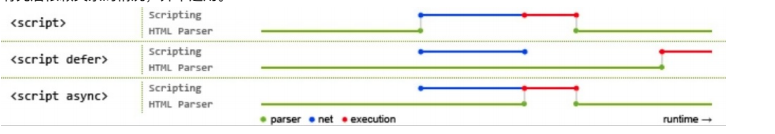

# html 知识点

## <font color="#e96900">什么是标签语义化？</font>

> 合理的标签干合适的事情 让页面具有良好的结构与含义
>
> 1. 开发者友好：使用语义类标签增强了可读性，开发者也能够清晰地看出网页的结构，也更为便于团队的开发和维护

2. 机器友好：带有语义的文字表现力丰富，更适合搜索引擎的爬虫爬取有效信息

---

### 都有哪些标签，都是什么意思

> 块标签、行内标签、行内块标签

- 块标签：`div` `p` `table` `form` `h1-h6` `ul li` `ol li` `dl dt dd` `header footer ` `article ` `nav` `section`
- 行内标签： `a` `span` `i` `label` `strong` `em` `var` `code`
- 行内块标签：`input` `img` `select` `textarea` `button` 也被称为可置换元素

---

### 这三类标签有哪些区别

<strong style="background:#ffff00">块级标签</strong>

1. 元素自己独占一行显示
2. 可以设置宽度和高度
3. 当两个块级元素发生嵌套关系的时候，子元素如果没有设置宽度，那么该子元素的宽度与父元素的宽度一致。

<strong style="background:#ffff00">行内标签</strong>

1. 元素不能独占一行，默认在一行排列
2. 行内元素不能直接设置宽度和高度，元素的宽和高就是内容撑开的宽高

<strong style="background:#ffff00">行内块标签</strong>

1. 同时具备行内、块级标签的特点
2. 元素在一行上显示
3. 可以设置宽高

---

### 这三类标签怎么转换

`display:block`、`display:inline-block`、`display:inline`

---

### display 除了这几个值还有哪些

- `display:none` 元素隐藏 [(细讲如何让元素隐藏的几种方式点这里)](htmlcss/css?id=使用css，让元素div消失在视野的方案)
- `display:flex` 弹性布局 [(弹性布局细讲)](htmlcss/css?id=你对flex的理解)
- `display:table` 让元素作为块级表格来显示（类似 table）
- `display:inherit` 规定应该从父元素继承 display 属性的值。

---

以上只是一个问题`什么是标签语义化？`的回答，提问中会涵盖很多延伸问题，自己掌握的是否清楚只有自己知道，以后遇到问题的时候，也要带着这种提问方式来问问自己这块内容是否真正的掌握了。

---

# <font color="#e96900">html5 的新特性</font>

- 文件类型声明（<!DOCTYPE>）仅有一型：`<!DOCTYPE HTML>` --- 与 html4 的区别。
- 新的解析顺序：不再基于 SGML。 --- 与 html4 的区别
- 新增语义化标签类：article 、footer 、header 、nav 、section。
- 音视频处理: video、radio
- input type 添加新属性： calendar 、date 、time 、email 、url 、search
- canvas、webGL、svg 画图、可视化、矢量图
- history API
- 本地存储:localStorage 和 sessionStorage [(详细讲解)](htmlcss/html?id=有几种前端储存的方式)
- 地理位置：Geolocation API
- websocket 实时通信
- 获取设备能力：摇一摇 横竖屏等。

> 核心是语义化、多媒体、图形、存储，以及 WebSocket等功能

---

# <font color="#e96900">doctype 的作用是什么</font>

1. DOCTYPE 是`html5标准网页声明`，且必须声明在 HTML 文档的第一行。来告知浏览器的解析器用什么文档标准解析这个文档，不同的渲染模式会影响到浏览器对于 CSS 代码甚至 JavaScript 脚本的解析
2. 在 HTML 4.01 中，<!DOCTYPE> 声明引用 DTD，因为 HTML 4.01 基于 SGML。DTD 规定了标记语言的规则，这样浏览器才能正确地呈现内容。
   HTML5 不基于 SGML，所以不需要引用 DTD。

文档解析类型有：

- BackCompat：`怪异模式`，浏览器使用自己的怪异模式解析渲染页面。（如果没有声明 DOCTYPE，默认就是这个模式）
- CSS1Compat：`标准模式`，浏览器使用 W3C 的标准解析渲染页面。

### 怪异模式和标准模式的区别

标准模式(standards mode)：是浏览器按照 W3C 标准解析执行代码，这样用规定的语法去渲染，就可以兼容各个浏览器，保证以正确的形式展示网页。

怪异模式(quirks mode)模式： 是浏览器为了兼容很早之前针对旧版本浏览器设计，并未严格遵循 W3C 标准而产生的一种页面渲染模式，是使用浏览器自己的方式解析执行代码，因为不同浏览器解析执行的方式不一样，所以我们称之为怪异模式。

`如果存在一个完整的DOCTYPE则浏览器将会采用标准模式，如果缺失就会采用怪异模式`。

**盒模型区别**

- 在标准模式下，盒模型为标准盒模型，`content = width` ; `box-sizing:content-box;`
- 在怪异模式下，盒模型为 IE 盒模型 `content = width+padding+border` ; `box-sizing:border-box`

---

# <font color="#e96900">常见获取宽高方式的区分</font>

用于元素和 body 上的

- `document.body(或dom元素).offsetWidth` //width+padding+border;
- `document.body(或dom元素).clientWidth` //width+padding;
- `document.body(或dom元素).scrollWidth` //内容没有溢出时 跟 clientWidth 一样 width+padding; 如果溢出：需要计算实际内容宽高

用于 window 上的

- `window.innerHeight` //可视区高度 带滚动条高度
- `window.outerHeight` //可视区高度 带工具条的高度 + 带滚动条高度

---

# <font color="#e96900">HTML、XML、XHTML 有什么区别</font>

- HTML(超文本标记语言): 在 html4.0 之前 HTML 先有实现再有标准，导致 HTML 非常混乱和松散
- XML(可扩展标记语言): 主要用于存储数据和结构，可扩展，大家熟悉的 JSON 也是相似的作用，但是更加轻量高效，所以 XML 现在市场越来越小了
- XHTML(可扩展超文本标记语言): 基于上面两者而来，W3C 为了解决 HTML 混乱问题而生，并基于此诞生了 HTML5，开头加入<!DOCTYPE html>的做法因此而来，如果不加就是兼容混乱的 HTML，加了就是标准模式。

---

# <font color="#e96900">什么是 data-属性？</font>

HTML 的`数据属性`，用于将`数据储存于标准的HTML元素中作为额外信息`,我们可以通过 js 访问并操作它，来达到操作数据的目的。

```js
;<div id="tar" data-name="xxxx" data-age="23" data-h-y="hy">
  1111
</div>

//获取data-属性值
//如果是用data-h-y这种形式 多个连接符 使用驼峰的形式获取 hY
console.log($(this).data()) //{age: 23,hY: "hy",name: "xxxx"}
console.log($(this).data('age')) //23
console.log($(this).data('hY')) //hy
console.log($(this).data('name')) //xxxx

//设置data-属性值
$(this).data('h-y', 'cat') //cat
$(this).data('age', '66') //66
$(this).data('name', 'yyyy') //yyyy
console.log($(this).data())
```

### data()兼容 ie8 及以上

```js
//获取data-属性值
//如果是用data-h-y这种形式 多个连接符 使用驼峰的形式获取 hY
console.log($(this).data()) //{age: 23,hY: "hy",name: "xxxx"}
console.log($(this).data('age')) //23
console.log($(this).data('hY')) //hy
console.log($(this).data('name')) //xxxx

//设置data-属性值
$(this).data('h-y', 'cat') //cat
$(this).data('age', '66') //66
$(this).data('name', 'yyyy') //yyyy
console.log($(this).data())
```

### dataset 兼容 ie10+

```js
//  获取data-属性值
console.log(this.dataset) //{age: 23,hY: "hy",name: "xxxx"}
console.log(this.dataset.age) //23
console.log(this.dataset.hY) //hy
console.log(this.dataset.name) //xxxx

//设置data-属性值
this.dataset.hY = 'cat' //cat
this.dataset.age = 66 //66
this.dataset.name = 'yyyy' //yyyy
console.log(this.dataset)
```

### attr() 需获取属性全称

```js
//获取data-属性值
console.log($(this).attr('data-name')) //xxxx
//设置data-属性值
$(this).attr('data-name', 'yyyy') //yyyy
```

**data()可以获取到所有的属性值 ，dataset 无法获取到通过 data()设置的属性值**

---

# <font color="#e96900">有哪些常用的 meta 标签？</font>

> `<meta>` 标签位于 `<head>` 内，用来描述文档的**元数据（metadata），本身不渲染在页面上**。它通过 `name/content` 或 `http-equiv/content` 这种「键值对」的形式，告诉浏览器、搜索引擎、社交平台如何处理这个页面。

`charset`，用于描述 HTML 文档的字符编码（必背，几乎必问）

```html
<meta charset="UTF-8" />
```
- 告诉浏览器用 UTF-8 解码，避免中文乱码。
- 追问点：为什么一定要放？——如果放错或不放，浏览器会按错误编码解析，出现乱码；建议放在 <head> 最前面，让浏览器尽早知道编码。

`http-equiv`，顾名思义，相当于 http 的文件头作用,比如下面的代码就可以设置 http 的缓存过期日期,定义浏览器的渲染方式的

```html
<meta http-equiv="expires" content="Wed, 20 Jun 2019 22:33:00 GMT" />
<meta http-equiv="X-UA-Compatible" content="IE=edge,chrome=1" />
```

`viewport`视口(移动端适配核心，必考)

```html
<meta
  name="viewport"
  content="width=device-width, initial-scale=1, maximum-scale=1"
/>
```
- width=device-width：让布局宽度等于设备宽度，而不是默认的 980px 缩放。
- initial-scale=1.0：初始缩放比例为 1。
- 还可以加 user-scalable=no（禁止缩放，但现在不推荐，影响无障碍）、maximum-scale（最大缩放比例为 1.0） 等。

追问点：viewport 解决了什么问题？ —— 移动端网页不再被当成桌面页面缩小显示，是实现响应式/移动端适配的前提。

`author` `keywords` `description` 关键字 描述 SEO 相关

```html
<meta name="author" content="作者名">
<meta
  name="keywords"
  content="doc,docs,documentation,gitbook,creator,generator,github,jekyll,github-pages"
/>
<meta name="description" content="A magical documentation generator." />
```
移动端 / Web App 相关

```html
<meta name="apple-mobile-web-app-capable" content="yes">   <!-- iOS 添加到主屏后全屏显示 -->
<meta name="apple-mobile-web-app-status-bar-style" content="black">
<meta name="format-detection" content="telephone=no">     <!-- 禁止 iOS 自动识别手机号为链接 -->
<meta name="theme-color" content="#ffffff">               <!-- 浏览器地址栏主题色 -->

```

追问点：format-detection 是干嘛的？—— iOS 会把页面里的数字（如电话号码、QQ号）自动识别成可点击链接，telephone=no 就是关闭这个行为。

**总结**
1. `viewport` 视口是移动端适配的核心，它让布局宽度等于设备宽度，而不是默认的 980px 缩放。
2. `charset` 字符编码是必须的，它告诉浏览器用 UTF-8 解码，避免中文乱码。
3. `http-equiv` 文件头作用是定义浏览器的渲染方式的，比如缓存过期日期、定义浏览器的渲染方式的。
4. SEO 相关`author` `keywords` `description` 。
5. 移动端 / Web App 相关的 meta 标签，比如 `apple-mobile-web-app-capable`、`apple-mobile-web-app-status-bar-style`、`format-detection`、`theme-color` 等。
---

# <font color="#e96900">src 和 href 的区别？</font>

- `src`是指向外部资源的位置，指向的内容会嵌入到文档中**当前标签所在的位置**，在请求`src`资源时会将其指向的资源下载并应用到文档内，如`js`脚本，`img`图片和`frame`等元素。**当浏览器解析到该元素时，会暂停其他资源的下载和处理，直到将该资源加载、编译、执行完毕，所以一般 js 脚本会放在底部而不是头部**。

- `href`是指向网络资源所在位置（的超链接），用来建立和当前元素或文档之间的连接，**当浏览器识别到它他指向的文件时，就会并行下载资源，不会停止对当前文档的处理**

---

# <font color="#e96900">知道 img 的 srcset 的作用是什么？</font>

可以设计响应式图片，我们可以使用两个新的属性`srcset` 和 `sizes`来提供更多额外的资源图像和提示，帮助浏览器选择正确的一个资源。

`srcset` 定义了我们允许浏览器选择的图像集，以及每个图像的大小。

`sizes` 定义了一组媒体条件（例如屏幕宽度）并且指明当某些媒体条件为真时，什么样的图片尺寸是最佳选择。

所以，有了这些属性，浏览器会：

- 查看设备宽度
- 检查 `sizes` 列表中哪个媒体条件是第一个为真
- 查看给予该媒体查询的槽大小
- 加载 `srcset` 列表中引用的最接近所选的槽大小的图像

```html

```

### 还有哪一个标签能起到跟 srcset 相似作用？

`<picture>`元素通过包含零或多个 `<source> `元素和一个 `元素来为不同的显示/设备场景提供图像版本。浏览器会选择最匹配的子 `<source>` 元素，如果没有匹配的，就选择 ` `元素的 `src `属性中的`URL`。然后，所选图像呈现在``元素占据的空间中

```html
<picture>
  <source
    srcset="/media/examples/surfer-240-200.jpg"
    media="(min-width: 800px)"
  />
  
</picture>
```

---

# <font color="#e96900">img 的 alt 和 title 区别</font>

## alt vs title

| | alt | title |
|---|---|---|
| 作用 | 替代文本 | 悬停提示 |
| 时机 | 加载失败/读屏 | 鼠标 hover |
| 目的 | 无障碍 + SEO | 补充说明（可选） |

**加分**：装饰图写 `alt=""`（跳过读屏）；`title` 移动端看不到，别放关键信息。


---

# <font color="#e96900">script 标签中 defer 和 async 的区别？</font>

- `defer`（延迟）：**浏览器指示脚本在文档被解析后执行，script 被异步加载后并不会立刻执行，而是等待文档被解析完毕后执行。**
- `async`(异步)：**同样是异步加载脚本，区别是脚本加载完毕后立即执行，这导致 async 属性下的脚本是乱序的，要注意引入的先后顺序，对于 script 有先后依赖关系的情况，并不适用。**
  

**那`defer`这么好用为什么不默认就使用呢**

因为 `defer` 的本质是「推迟执行」而不是「优化执行」——它对埋点这类要尽早跑的脚本会漏数据、对和内联脚本有依赖的脚本会乱序，而且重脚本执行时照样卡主线程；所以没有万能默认值，defer 保顺序、async 抢时机、普通 script 保立即按序，选哪个取决于脚本的依赖关系和执行时机。

---

# <font color="#e96900">有几种前端储存的方式</font>

- `cookies`： 在`HTML5`标准前本地储存的主要方式，优点是兼容性好，请求头自带`cookie`方便，缺点是大小只有`4k`，自动请求头加入`cookie`浪费流量，每个`domain`限制`20`个`cookie`，使用起来麻烦需要自行封装

- `localStorage`：`HTML5`加入的以键值对(`Key-Value`)为标准的方式，优点是操作方便，永久性储存（除非手动删除），大小为`5M`，兼容`IE8+`

- `sessionStorage`：与`localStorage`基本类似，区别是`sessionStorage`当页面关闭后会被清理，而且与`cookie、localStorage`不同，**他不能在所有同源窗口中共享，是会话级别的储存方式**

(`session`他不能在所有同源窗口中共享具体解释 ：**刷新当前页面**，或者通过`location.href`、`window.open`、或者通过带`target="_blank"`的`a`标签打开新标签，之前的`sessionStorage`还在，**但是如果你是主动打开一个新窗口或者新标签，对不起，打开 F12 你会发现，`sessionStorage`空空如也。**
也就是说，`sessionStorage`的`session`仅限**当前标签页或者当前标签页打开的新标签页**，通过其它方式新开的窗口或标签不认为是同一个`session`。)

- `IndexedDB`： **浏览器数据库** 是被正式纳入`HTML5`标准的数据库储存方案，它是`NoSQL`数据库，用键值对进行储存，可以进行快速读取操作，非常适合 web 场景，同时用 JavaScript 进行操作会非常方便。

---
