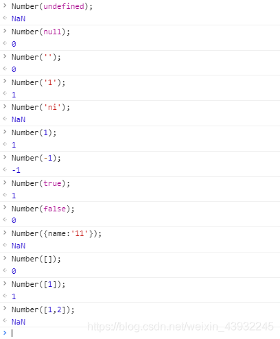
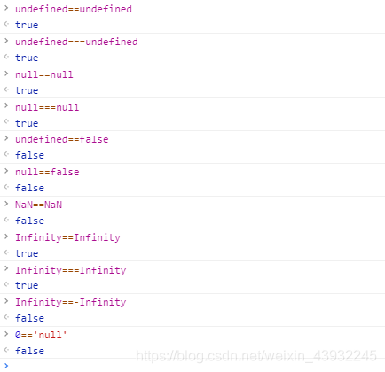
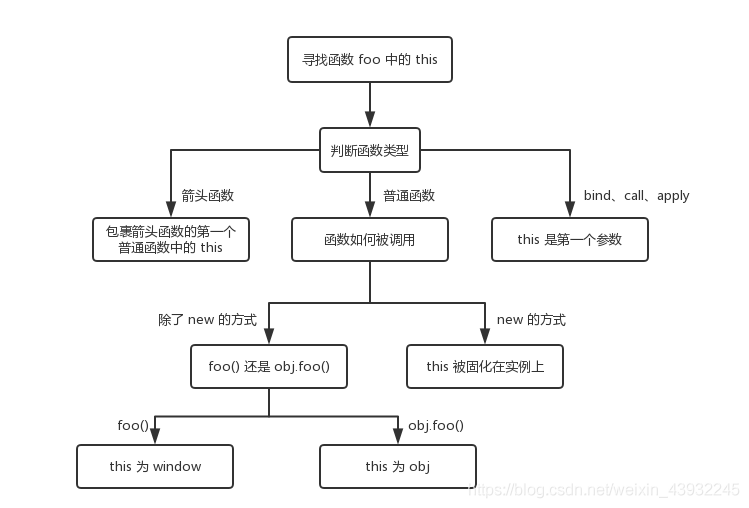
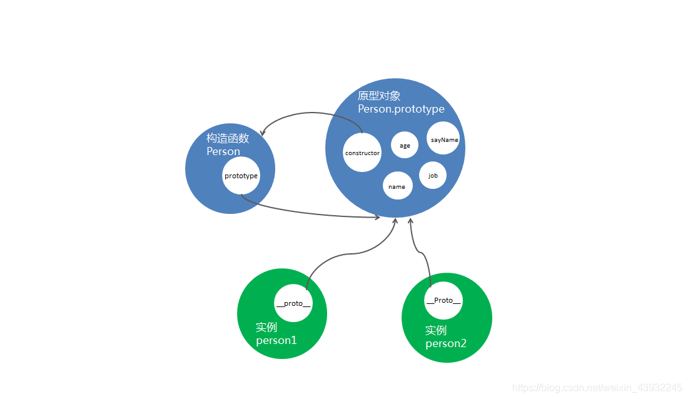
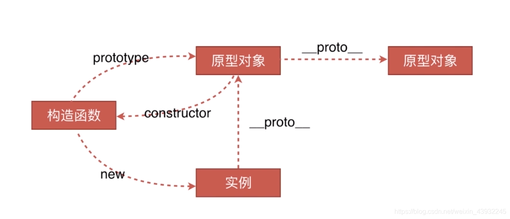

# javascript 知识点

# <font color="#e96900">数据类型</font>

## 原始数据类型

> 首先原始类型存储的都是值，是没有函数可以调用的
> 注意：原始类型不包含 Object。

- `string`
- `number`
- `boolean`
- `null`
- `undefined`
- `symbol(es6)`
- `bigInt`

**首先原始类型存储的都是值，是没有函数可以调用的，比如 undefined.toString()**


## 基本包装类型

**类似于下面的代码！**

```js
var str = 'hello' //string 基本类型
var s2 = str.charAt(0)
alert(s2) // h
```

上面的`string`是一个基本类型，但是它却能召唤出一个 `charAt() `的方法，主要是因为在基本类型中，有三个比较特殊的存在就是**基本包装类型**：`String Number Boolean`，这三个基本类型都有自己对应的包装对象。包装对象，其实就是对象，有相应的属性和方法。调用方法的过程，是在后台偷偷发生的 调用之后一瞬间就会销毁 实际上我们没有改变字符串本身的值。

## 值类型 VS 引用类型

> 原始类型存储的是值，对象类型存储的是地址（指针）。

- **值类型**:值类型变量包括 `Boolean`、`String`、`Number`、`Undefined`、`Null`
- **引用类型**:引用类型包括了 `Object` 类的所有，如 `Date`、`Array`、`Function`

## 函数形参问题

> 按值传递一个参数给函数。即使按引用传递对象和数组时，如果直接在函数中用新值覆盖原先的值，在函数外并不反映新值。
> 只有在对象的属性或者数组的元素改变时，在函数外才可以看出。

> 其实形参是局部变量，当函数调用结束以后，用作形参的局部变量就会不存在。即使在函数用新值覆盖原先的值，在函数外并不影响原有值(基本类型和引用类型都适用),只有在对象(引用类型)的属性或者数组的元素改变时，在函数外才可以看出.

```js
function foo(a) {
  a = a * 10
}
function bar(b) {
  b.value = 'new'
}
var a = 1
var b = { value: 'old' }
foo(a)
bar(b)
console.log(a) // 1 a的值没有发生改变
console.log(b) // value: new 而b的值发生了改变
```

```js
function test(person) {
  person.age = 26 // p1的age属性在这里已经改变了
  person = {
    name: 'yyy',
    age: 30,
  }
  return person //这里返回一个新对象person给p2
}
const p1 = {
  name: 'yck',
  age: 25,
}
const p2 = test(p1)
console.log('p1', p1) // -> ?{age: 26,name: "yck"}
console.log('p2', p2) // -> ?{age: 30,name: "yyy"}
```

## 类型判断的方法

### **typeof**

> typeof xxx 得到的值有以下几种类型：`undefined boolean number string object function、symbol`

```js
var x = 1
console.log(typeof x) //number

var a = undefined
console.log(typeof a) //undefined

var b = null
console.log(typeof b) //object，（null是空对象引用/或者说指针）。

var c = new Object()
console.log(typeof c) //object

var e = [1, 2, 3]
console.log(typeof e) //object

var d = function () {
  // ... 语句块
}
console.log(typeof d) //function
```

1. `typeof null`结果是`object` ，实际这是`typeof`的一个`bug`，`null`是原始值，非引用类型
2. `typeof Symbol()` 用`typeof`获取`symbol`类型的值得到的是`symbol`，这是 ES6 新增的知识点
3. 引用类型除了`function`其他的全部都是`object`,`function`的类型是`function`

> `typeof` 对于原始类型来说，除了 `null` 都可以显示正确的类型

> `typeof` 对于对象来说，除了`函数`都会显示 `object`，所以说 `typeof` 并不能准确判断变量到底是什么类型

### typeof null 为什么是 Object?

js 在底层存储变量的时候，会在变量的机器码的低位 1-3 位存储其类型信息

- 000：对象
- 010：浮点数
- 100：字符串
- 110：布尔
- 1：整数
  特别的是 `null`：所有机器码均为 0 ，`typeof` 在判断 `null` 的时候就出现问题了，由于 `null` 的所有机器码均为 0，因此直接被当做了对象来看待。

### typeof function 为什么是 function 而不是 Object？

我们再来看一下现在 ES6 的 typeof 是如何对待函数和对象类型的：

1. 如果一个对象（Object）没有实现 `[[Call]]` 内部方法，那么它就返回 `object`
2. 如果一个对象（Object）实现了 `[[Call]]` 内部方法，那么它就返回 `function`

#### [[Call]] 是什么

> 执行与此对象关联的代码。通过函数调用表达式调用。内部方法的参数是一个 this 值和一个包含调用表达式传递给函数的参数的列表。实现此内部方法的对象是可调用的。

这是翻译的原话，简单点说，一个对象如果支持了内部的 `[[Call]]` 方法，那么它就可以被调用，就变成了函数，所以叫做**函数对象。**

相应地，如果一个函数对象支持了内部的 `[[Construct]]` 方法，那么它就可以使用 `new` 或 `super` 来调用，这时我们就可以把这个函数对象称为：**构造函数。**

还有一个不错的判断类型的方法，就是`Object.prototype.toString`，我们可以利用这个方法来对一个变量的类型来进行比较准确的判断

```javascript
Object.prototype.toString.call(1) // "[object Number]"

Object.prototype.toString.call('hi') // "[object String]"

Object.prototype.toString.call({ a: 'hi' }) // "[object Object]"

Object.prototype.toString.call([1, 'a']) // "[object Array]"

Object.prototype.toString.call(true) // "[object Boolean]"

Object.prototype.toString.call(() => {}) // "[object Function]"

Object.prototype.toString.call(null) // "[object Null]"

Object.prototype.toString.call(undefined) // "[object Undefined]"

Object.prototype.toString.call(Symbol(1)) // "[object Symbol]"
```

可以截取后面几位更明显一点就是：

```javascript
Object.prototype.toString.call('111').slice(8, -1) // [object String] ====> string
```

---

### **instanceof**

`用于实例和构造函数的对应`。例如判断一个变量是否是数组，使用`typeof`无法判断，但可以使用`[1, 2] instanceof Array`来判断。因为，`[1, 2]`是数组，它的构造函数就是`Array`。同理：

```js
function Foo(name) {
  this.name = name
}
var foo = new Foo('bar')
console.log(foo instanceof Foo) // true
```

**因为内部机制是通过原型链来判断的**

### instanceOf 实现原理

`instanceOf `是通过原型链来判断的，比较左侧的实例`__proto__`是否跟右侧的`prototype`一致，如果不一致左侧就继续向上找`__proto__`再次比较

```javascript
function instanceOf(left, right) {
  var L = left.__proto__ //取left的隐式原型
  var R = right.prototype //取right的显式原型

  while (true) {
    if (L === null) return false
    if (L === R) {
      return true
    }
    L = L.__proto__
  }
}
```

---

# <font color="#e96900">数据类型之间的转换</font>

首先我们要知道，在 JS 中类型转换只有三种情况，分别是：

- 转换为布尔值
- 转换为数字
- 转换为字符串

## 转 boolean

在条件判断时，除了 `undefined`， `null`， `false`， `‘’`， `NaN`， `0`， `-0`为`false`，其他所有值都转为 `true`，**包括所有对象**。

**注意！基本包装类型也是对象**

```js
Boolean(new Boolean(false)) //true
new Boolean(false) 是基本包装类型是对象
Boolean(对象) ===>true
```

## 转 number

**在条件判断时，会比较==/===两边的值是否相等，这里会隐式转换成 nubmer 然后再去进行比较。**

下图可以看出:

- 0 的情况有：null、’’、false、[]
- NaN 的情况有： undefined、非数字内容的字符串(‘asda’)、对象({})、非空非单一数值类型的数组([1,2])



## 转 string

- 数组转 string，`[1,2,3] => ‘1,2,3’`
- 对象转 string，`‘[object,object]’`
- 其余的都可以正常转为`string`类型**且内容不会变**

## 对象转原始类型<font color="#ff0000">(知识点很重要)</font>

所有的对象(null 除外)继承了两个转换方法:valueOf 和 toString 几乎都是在出现操作符(+-\*/==><)时被调用（隐式转换）。

**toString**

> 返回一个表示该对象的字符串，当对象表示为文本值或以期望的字符串方式被引用时，toString 方法被自动调用。

很多类定义了更多特定版本的 toString()方法

- 对象`toString`------ 返回'[object,object]'
- 数组`toString`------将每个数组元素转换为一个字符串，并在元素之间添加逗号后合并成结果字符串
- 函数`toString`------返回了这个函数的实现定义的表示方式字符串
- 日期`toString`------回了一个可读的（可被 JavaScript 解析的）日期和时间字符串
- RegExp`toString`------将 RegExp 对象转换为表示正则表达式直接量的字符串

```js
let a = {}
let b = [1, 2, 3]
let c = '123'
let d = function () {
  console.log('fn')
}
let e = new Date()
let f = /\d+/g
console.log(a.toString()) // '[object Object]'
console.log(b.toString()) // '1,2,3'
console.log(c.toString()) // '123'
console.log(d.toString()) // 'function(){ console.log('fn') }'
console.log(e.toString()) // 'Sat May 08 2021 13:28:00 GMT+0800 (中国标准时间)'
console.log(f.toString()) // '/\d+/g'
```

> 可以自己定义一个对象的 toString()方法来覆盖它原来的方法。这个方法不能含有参数，方法里必须 return 一个值。

```js
var a1 = {}
console.log(a1.toString()) //'[object Object]'
a1.toString = function () {
  return 'a new toString '
}
console.log(a1 + 'hello') //a new function hello
```

**valueOf**

> 返回当前对象的原始值。 如果对象没有原始值，valueOf() 就会返回对象自身

```js
// 没有原始值 返回对象本身
var a = {}
console.log(a.valueOf()) //返回 Object {} 不是字符串 就是对象本身
var b = [1, 2, 3]
console.log(b.valueOf()) //返回[1, 2, 3]
var c = function () {
  console.log('lalala')
}
console.log(c.valueOf()) //返回 function (){console.log('lalala')}
var d = 12345
console.log(b.valueOf()) //返回 12345
```

> 可以自己定义一个对象的 valueOf()方法来覆盖它原来的方法。这个方法不能含有参数，方法里必须 return 一个值。

```js
var x = {}
x.valueOf = function () {
  return 10
}
x.toString = function () {
  return 30
}
console.log(x + 1) // 输出11
console.log(x + 'hello') //输出10hello
```

**什么时候执行 toString，什么时候执行 valueOf**

> 如果一个对象它的 toString() 和 valueOf()方法均存在时，到需要调用的时候，引用哪一个方法？

```js
function fn() {
  return 20
}
console.log(fn + 10) // function fn() {return 20;}10
console.log(fn + 'hello') // function fn() {return 20;}hello

fn.toString = function () {
  return 10
}
console.log(fn + 10) // 20
console.log(fn + 'hello') //10hello

fn.valueOf = function () {
  return 5
}

console.log(fn + 10) // 15
console.log(fn + 'hello') //5hello
```

当函数`fn`用`+`连接一个字符串或者是数字的时候，如果我们没有重新定义`valueOf`和`toString`，其隐式转换会**调用默认的`toString()`方法**，将函数本身内容作为字符串返回

如果我们自己重新定义`toString/valueOf`方法，那么其转换会按照我们的定义来，其中`valueOf`比`toString`优先级更高

进行运算操作的时候 \* -/+ > < == ===

- 如果同时有`valueOf`和`toString` 优先执行`valueOf `如果只有一方 直接执行
- 如果没有`valueOf`和`toString` 调用默认的`toString() `

```js
// 没有valueoOf和toString
var x1 = {}

console.log(x1) // 返回对象本身{}
console.log(x1 + 1) //[object Object]1
console.log(x1 + 'zfc') // [object Object]zfc
console.log(x1 + true) // [object Object]true
```

```js
var x = {
  toString: function () {
    return '执行string'
  },
  valueOf: function () {
    return '执行valueOf '
  },
}

console.log(x) // 返回对象本身{}
//alert(x) //执行string  注意 是alert 是alert 是alert  只执行toSring
console.log(x + 1) //执行valueOf 1
console.log(x + 'zfc') // 执行valueOf zfc
console.log(x + true) // 执行valueOf true
```

当只是显示的时候 没有进行逻辑运算 只执行`toString` 没有`toString`的话 undefined

```js
var y = function () {
  return y //不添加这行代码 默认打印y 也是执行toString
}
y.toString = function () {
  return 'y函数执行toString'
}
y.valueOf = function () {
  return 'y函数执行valueOf'
}
console.log(y) //y函数执行toString
console.log(y()) //y函数执行toString
console.log(y()()) //y函数执行toString
```

**[Symbol.toPrimitive]**

> Symbol.toPrimitive 是一个内置的 Symbol 值，它是作为对象的函数值属性存在的，当一个对象转换为对应的原始值时，会调用此函数。

> 作用：同 valueOf()和 toString()一样，如果重写的话 优先级要高于这两者；

该函数被调用时，会被传递一个字符串参数`hint`
表示当前运算的模式，一共有三种模式：

string：字符串类型

number：数字类型

default：默认

```js
class A {
  constructor(count) {
    this.count = count
  }
  valueOf() {
    return 2
  }
  toString() {
    return '哈哈哈'
  } // 我在这里
  [Symbol.toPrimitive](hint) {
    if (hint == 'number') {
      return 10
    }
    if (hint == 'string') {
      return 'Hello Libai'
    }
    return true
  }
}

const a = new A(10)

console.log(`${a}`) // 'Hello Libai' => (hint == "string")
console.log(String(a)) // 'Hello Libai' => (hint == "string")
console.log(+a) // 10            => (hint == "number")
console.log(a * 20) // 200           => (hint == "number")
console.log(a / 20) // 0.5           => (hint == "number")
console.log(Number(a)) // 10            => (hint == "number")
console.log(a + '22') // 'true22'      => (hint == "default")
console.log(a == 10) // false        => (hint == "default")
```

**小结**

1. 逻辑运算（(+-\*/==><)）隐式转换时，`valueOf` 和 `toString` 没有重新定义，默认调用 `toString`,`valueOf` 和 `toString` 重新定义，`valueOf` 优先级高
2. 当只是显示的时候 没有进行逻辑运算 只执行`toString` 没有`toString`的话 `undefined`
3. `alert()`只会执行`toString`,`console.log('xx'+yy)`使用运算符执行 `toString`

**面试题分析**

> 1.  a===1&&a===2&&a===3 为 true

双等号(==)：会触发隐式类型转换，所以可以使用 `valueOf` 或者 `toString` 来实现。

```js
class A {
  constructor(value) {
    this.value = value
  }
  valueOf() {
    return this.value++
  }
}
const a = new A(1)
if (a == 1 && a == 2 && a == 3) {
  console.log('Hi Libai!')
}
```

全等(===)：严格等于不会进行隐式转换，这里使用` Object.defineProperty` 数据劫持的方法来实现

```js
let value = 1
Object.defineProperty(window, 'b', {
  get() {
    return value++
  },
})
if ((b === 1) & (b === 2) & (b === 3)) {
  console.log('全等通过')
}
```

> 2.  实现一个无限累加函数 add(1)(2)(3)

```js
function add(a) {
  function sum(b) {
    a = b ? a + b : a //a = b有的话 a+b 没有的话 就是a
    return sum //这步是显示连续调用的地方 只是返回函数本身 ()可直接调用
  }
  sum.toString = function () {
    return a
  }
  return sum
}
console.log('add==>' + add(1)) // 1
console.log('add==>' + add(1)(2)) // 3
console.log('add==>' + add(1)(2)(3)) //6
```

add 函数内部定义 sum 函数并返回，实现连续调用

sum 函数形成了一个闭包，每次调用进行累加值，再返回当前函数 sum

add()每次都会返回一个函数 sum，直到最后一个没被调用，默认会触发 toString 方法，所以我们这里重写 toString 方法，并返回累计的最终值 a

这样说才能理解:

add(10): 执行函数 add(10)，返回了 sum 函数，注意这一次没有调用 sum，默认执行 sum.toString 方法。所以输出 10；

add(10)(20): 执行函数 add(10)，返回 sum(此时 a 为 10)，再执行 sum(20)，此时 a 为 30，返回 sum，最后调用 sum.toString()输出 30。add(10)(20)...(n)依次类推。

> 3.  柯里化实现多参累加 add(1,2)(3)(4,5,6)

```js
// 这里是上面累加的升级版，实现多参数传递累加
function klhAdd(...args) {
  let sum = [...args]
  let addMore = function (...b) {
    sum.push(...b)
    return addMore
  }
  addMore.toString = function () {
    return sum.reduce((c, d) => {
      return c + d // 实现累加
    })
  }
  return addMore
}
console.log('klhAdd===>', klhAdd(1, 2)(3)(4, 5)) //15
```

> 4.  实现参数内相乘多个参数相加 add(1,2)(3)(4,5) ==> 25

```js
function klhAdd2(...args) {
  let arr = []
  let sum = [...args].reduce((c, d) => {
    return c * d // 实现累乘
  })
  arr.push(sum)
  let addMore = function (...b) {
    let _b = [...b].reduce((c, d) => {
      return c * d // 实现累乘
    })
    arr.push(_b)
    console.log(arr)

    return addMore
  }
  addMore.toString = function () {
    return arr.reduce((c, d) => {
      return c + d // 实现累加
    })
  }
  return addMore
}
console.log('klhAdd2===>' + klhAdd2(1, 2)(3)(4, 5)) //25
```

## 四则运算符

> (+)加法运算符不同于其他几个运算符，它有以下几个特点：

- **运算中其中一方为字符串，那么就会把另一方也转换为字符串**
- **如果一方不是字符串或者数字，那么会将它转换为数字或者字符串**

```js
1 + '1' // '11'
true + true // 2
4 + [1, 2, 3] // "41,2,3"
```

- 对于第一行代码来说，触发特点一，所以将数字 1 转换为字符串，得到结果 '11'
- 对于第二行代码来说，触发特点二，所以将 true 转为数字 1
- 对于第三行代码来说，触发特点二，所以将数组通过 toString 转为字符串 1,2,3，得到结果 41,2,3

另外对于加法还需要注意这个表达式 'a' + + 'b'

```js
'a' + +'b' // -> "aNaN"
```

因为 + 'b' 等于 NaN(+转为 number 类型)，所以结果为 "aNaN"，**你可能也会在一些代码中看到过 + '1' 的形式来快速获取 number 类型**。

那么对于除了加法的运算符来说，只要其中一方是数字，那么另一方就会被转为数字

```js
4 * '3' // 12
4 * [] // 0
4 * [1, 2] // NaN
```

## 比较运算符 ==

对于 `== `来说，如果对比双方的类型不一样的话，就会进行**类型转换**

假如我们需要对比 `x` 和 `y` 是否相同，就会进行如下判断流程：

1.  首先会判断两者类型是否**相同**。相同的话就是比大小了
2.  类型不相同的话，那么就会进行类型转换
3.  会先判断是否在对比 `null` 和 `undefined`，是的话就会返回 `true`
4.  判断两者类型是否为 `string` 和 `number`，是的话就会将字符串转换为 `number`

    ```js
    1 == '1'
          ↓
    1 ==  1

    ```

5.  判断其中一方是否为 `boolean`，是的话就会把 `boolean` 转为 `number` 再进行判断

    ```js
    '1' == true
            ↓
    '1' ==  1
            ↓
     1  ==  1

    ```

6.  判断其中一方是否为 `object` 且另一方为 `string`、`number` 或者 `symbol`，是的话就会把 `object` 转为原始类型再进行判断

    ```js
    '1' == { name: 'yck' }
            ↓
    '1' == '[object Object]'

    ```

- **undefiend 和 null,自身比较和相互比较的时候为 true，其余跟任何数据类型比较都为 false**
- NaN not a number 自身比较的时候也不相等比如 ：'abc' 不是一个数字 ‘def’也不是一个数字
- infinity 表示为无穷大，自身比较为 true， -infinity 表示为负无穷大，两者比较为 false



## !和!!转换

js 中 ! 的用法是比较灵活的，它除了做逻辑运算常常会用！做类型判断，可以用！与上对象来求得一个布尔值，

1、！可将变量转换成 boolean 类型，null、undefined 和空字符串取反都为 true，其余都为 false，主要是用来判空

```js
!null=true

!undefined=true

!''=true

!100=false

!'abc'=false
```

2、！！常常用来做类型判断，在第一步!（变量）之后再做逻辑取反运算，这其实不好理解，其实就是强制的转为 boolean 类型
在条件判断 if 中其实没比较使用

```js
!!a ==Boolean(a)

一般这样写hasName == name? true : false，换种写法hasName = !!name
```

---

# <font color="#e96900">执行上下文</font>

在一段 `JS `脚本**执行之前**，要先**解析代码**（所以说 JS 是解释执行的脚本语言），解析的时候会先创建一个 **全局执行上下文**环境 ，在这个环境中，所有**变量提升**、**函数声明提前**都会先拿出来，有的直接赋值，有的为默认值 `undefined`，代码**从上往下**开始执行，就叫做**执行上下文**。**（这是在代码执行之前开始的工作）**
在 JavaScript 的世界里，运行环境有三种，分别是：

1. 全局环境：代码首先进入的环境，任何不在函数内部的代码都在全局上下文中。它会执行两件事：创建一个全局的 `window` 对象（浏览器的情况下），并且设置 `this `的值等于这个全局对象。一个程序中只会有一个全局执行上下文。
2. 函数环境：函数被调用时执行的环境,每当一个函数被调用时, 都会为该函数创建一个新的上下文。每个函数都有它自己的执行上下文，不过是在函数被调用时创建的。函数上下文可以有任意多个
3. eval 函数：https://www.cnblogs.com/chaoguo1234/p/5384745.html（不常用）

特点：

- 单线程，在主进程上运行
- 同步执行，从上往下按顺序执行
- 全局上下文只有一个，浏览器关闭时会被弹出栈
- 函数的执行上下文没有数目限制
- 函数每被调用一次，都会产生一个新的执行上下文环境

**注意！** 执行全局代码时，会产生一个执行上下文环境，每次调用函数都又会产生执行上下文环境。当函数调用完成时，这个上下文环境以及其中的数据都会被消除，再重新回到全局上下文环境。处于活动状态的执行上下文环境只有一个。

```js
console.log(a) // undefined
var a = 100

fn('zhangsan')
function fn(name) {
  age = 20
  console.log(name, age) // 'zhangsan' 20
  var age
}

console.log(b) // 这里报错
// Uncaught ReferenceError: b is not defined
b = 100
```

为什么`a`是`undefined`，而`b`却报错了，实际 `JS` 在代码执行之前，要「全文解析」，发现`var a`，知道有个`a`的变量，存入了执行上下文，而`b`没有找到`var`关键字，这时候没有在执行上下文提前「占位」，所以代码执行的时候，提前报到的`a`是有记录的，只不过值暂时还没有赋值，即为`undefined`，而`b`在执行上下文没有找到，自然会报错（没有找到`b`的引用）。

函数中的`console.log(name, age)`, `name`是形参传过来的是`zhangsan`，`age`虽然在最后进行声明的，但函数执行上下文也存在变量提升，所以也能拿到`age`的值`20`

另外，一个函数在执行之前，也会创建一个 **函数执行上下文** 环境，跟 **全局上下文** 差不多，不过 **函数执行上下文** 中会多出`this arguments`和**函数的参数**

总结一下：

- 范围：一段`<script>`、`js `文件或者一个函数
- 全局上下文：变量提升，函数声明提前
- 函数上下文：变量提升，函数声明提前，`this`，`arguments`

---

# <font color="#e96900">作用域和作用域链</font>

## 作用域

> ES6 之前 JS 没有**块级作用域**，只有**全局作用域**和**函数作用域**

作用域就是一个独立的地盘，让变量不会外泄、暴露出去，也就是说作用域最大的用处就是**隔离变量**，**不同作用域下同名变量不会有冲突**。

**全局作用域**就是最外层的作用域，如果我们写了很多行 `JS` 代码，变量定义都没有用函数包括，那么它们就全部都在全局作用域中。这样的坏处就是很容易撞车、冲突。

**函数作用域**：顾名思义就是在这个函数体里边才能访问的变量；

```js
var a = 100
function fn() {
  var a = 200
  console.log('fn', a) //200
}
console.log('global', a) //100
fn()
```

这就是为何` jQuery、Zepto` 等库的源码，所有的代码都会放在`(function(){....})()`中。因为放在里面的所有变量，都不会被外泄和暴露，不会污染到外面，不会对其他的库或者 `JS` 脚本造成影响。这是函数作用域的一个体现。

**块级作用域**：ES6 新增，用`let`命令新增了块级作用域，外层作用域无法获取到内层作用域，非常安全明了。即使外层和内层都使用相同变量名，也都互不干扰；

```js
if (true) {
  let name = 'zhangsan'
}
console.log(name) // 报错，因为let定义的name是在if这个块级作用域
```

## 作用域链

首先认识一下什么叫做**自由变量 **。如下代码中，`console.log(a)`要得到`a`变量，但是在当前的作用域中没有定义`a`（可对比一下`b`）。当前作用域没有定义的变量，这成为**自由变量** 。

自由变量如何得到 —— **向父级作用域寻找**。如果父级也没呢？再一层一层向上寻找，直到找到全局作用域还是没找到，就宣布放弃。这种一层一层的关系，就是**作用域链**。

```js
var a = 100
function F1() {
  var b = 200
  function F2() {
    var c = 300
    console.log(a) //100 自由变量，顺作用域链向父作用域找
    console.log(b) //200 自由变量，顺作用域链向父作用域找
    console.log(c) //300 本作用域的变量
  }
  F2()
}
F1()
```

---

# <font color="#e96900">闭包</font>

很多人对于闭包的解释可能是函数嵌套了函数，然后返回一个函数。其实这个解释是不完整的，就比如我下面这个例子就可以反驳这个观点。没有返回函数而是将函数挂载到 window 上。

```js
function A() {
  let a = 1
  window.B = function () {
    console.log(a)
  }
  通常我们也喜欢这么写
  return function () {
    console.log(a)
  }
  a = null
}
A()
B() // 1
```

> 核心的一点！！！ 闭包依据的是**函数定义时的作用域链，而不是函数执行时** ，这句话理解明白 闭包就搞懂了

> 闭包的定义其实很简单：函数 `A` 内部有一个函数 `B`，函数 `B `可以访问到函数`A`中的变量，那么就形成了闭包 <br>
> 函数可以访问它定义时所在词法作用域中的变量，即使这个函数在外部作用域之外执行，也依然可以访问这些变量。<br>
> 闭包存在的意义就是让我们可**以间接访问函数内部的变量。** <br>
> 缺点是造成内存泄露，解决办法是使用完变量之后将其设置为`null`。


> 比如防抖
```js
function debounce(fn, delay) {
  let timer = null

  return function (...args) {
    clearTimeout(timer)

    timer = setTimeout(() => {
      fn.apply(this, args)
    }, delay)
  }
}
```
这里 `timer` 就是闭包保存下来的变量。每次触发返回的函数时，都能访问同一个 timer，所以才能清除上一次定时器。

> 经典面试题，循环中使用闭包解决 `var `定义函数的问题

```js
for (var i = 1; i <= 5; i++) {
  setTimeout(function timer() {
    console.log(i)
  }, 1000)
}
```

首先因为 `setTimeout` 是个异步函数，所以会先把循环全部执行完毕，这时候 `i` 就是` 6` 了，所以会输出一堆 `6`。

解决方法：第一种是使用闭包的方式

```js
for (var i = 1; i <= 5; i++) {
  ;(function (j) {
    setTimeout(function timer() {
      console.log(j)
    }, 1000)
  })(i)
}
```

在上述代码中，我们首先使用了立即执行函数将 i 传入函数内部，这个时候值就被固定在了参数 j 上面不会改变，当下次执行 timer 这个闭包的时候，就可以使用外部函数的变量 j，从而达到目的。

解决方法：第二种就是使用 `setTimeout` 的第三个参数，这个参数会被当成 `timer `函数的参数传入。

```js
for (var i = 1; i <= 5; i++) {
  setTimeout(
    function timer(j) {
      console.log(j)
    },
    1000,
    i
  )
}
```

解决方法：第三种就是使用 `let` 定义`i`了来解决问题了，这个也是最为推荐的方式

```js
for (let i = 1; i <= 5; i++) {
  setTimeout(function timer() {
    console.log(i)
  }, 1000)
}
```

总结
1. JavaScript 使用的是词法作用域，也叫静态作用域。**函数能访问那些变量，是在函数定义时决定的不是执行时决定的**

# <font color="#e96900">this</font>

> 考察知识点：如何正确判断 this？箭头函数的 this 是什么？
> 先搞明白一个很重要的概念 ——` this`的值是**在执行的时候才能确认，定义的时候不能确认！** 为什么呢 —— 因为`this`是**执行上下文环境的一部分，而执行上下文需要在代码执行之前确定，而不是定义的时候**。

## this 指向

**谁调用了它，this 就指向谁**

```js
function foo() {
  console.log(this.a)
}
var a = 1
foo() //1

const obj = {
  a: 2,
  foo: foo,
}
obj.foo() //2

const c = new foo() // 先是1（foo()执行的时候打印1） 然后undefined
```

接下来我们一个个分析上面几个场景

- **对于直接在全局调用 `foo` 来说，不管 `foo` 函数被放在了什么地方，`this` 一定是 `window`**
- **对于 `obj.foo()` 来说，我们只需要记住，谁调用了函数，谁就是 `this`，所以在这个场景下 `foo` 函数中的 `this` 就是 `obj` 对象**
- **对于 `new` 的方式来说，`this` 被永远绑定在了 `c` 上面，不会被任何方式改变 `this`**

---

## 改变 this 指向的 call、apply、bind 方法使用

由于`js` 中`this`的指向受函数运行环境的影响，指向经常改变，使得开发变得困难和模糊,`call、apply、bind`基本都能明了的绑定`this`的指向。

## call

> `call` 方法可以指定`this `的指向（即函数执行时所在的的作用域），然后再指定的作用域中，执行函数

```js
var name = 'globalName'
var age = 'globalAge'
var obj = {
  name: 'qfl',
  age: '26',
}
var f = function () {
  return this.name + ' ' + this.age
}
f() // globalName globalAge
f.call(obj) // qfl 26
```

`call` 可以接受多个参数，第一个参数是`this` 指向的对象，之后的是函数回调所需的入参

```js
func.call(thisValue, arg1, arg2, ...)
```

在全局调用的时候，第一个参数是下面几种情况时，指向的都是`window`全局

- f.call()
- f.call(null)
- f.call(undefined)
- f.call(window)
- f.call(this)

---

## apply

> `apply` 和`call `作用类似，也是改变`this` 指向，然后调用该函数，唯一区别是`apply` **接收数组**作为函数执行时的第二个参数，只有两个参数

```js
func.apply(thisValue, [arg1, arg2, ...])
```

`apply`方法的第一个参数也是`this`所要指向的那个对象，如果设为`null`或`undefined`，则等同于指定全局对象。

第二个参数则是一个数组，该数组的所有成员依次作为参数，传入原函数。

```js
function f(x, y) {
  console.log(x + y)
}

f.call(null, 1, 1) // 2
f.apply(null, [1, 1]) // 2
```

---

## bind

> **bind 用于将函数体内的 this 绑定到某个对象，然后返回一个新函数**<br>
> (call/apply 则是可以指定 this 的指向（即函数执行时所在的的作用域），然后再指定的作用域中，执行函数)

```js
var d = new Date()
d.getTime() // 1481869925657

var print = d.getTime
print() // Uncaught TypeError: this is not a Date object.
```

报错是因为，`d.getTime` 赋值给 `print` 后，`getTime` 内部的`this` 指向方式变化，已经不再指向`date` 对象实例了

```js
var print = d.getTime.bind(d)
print() // 1481869925657
```

`bind `接收的参数就是所要绑定的对象

```js
var add = function (x, y) {
  return x * this.m + y * this.n
}

var obj = {
  m: 2,
  n: 2,
}

var newAdd = add.bind(obj)
newAdd(5, 2) // 14
```

**注意！ 多个 bind 一起使用，生效的始终是第一个 bind!** (add.bind(obj).bind(window) ===> 指向的始终是 obj)

**区别：call 和 apply 都是立即执行的，bind 会返回一个函数，然后再执行函数才会生效**

---

## 箭头函数中的 this

```js
function a() {
  return () => {
    return () => {
      console.log(this)
    }
  }
}
console.log(a()()()) //window
```

**首先箭头函数其实是没有 `this` 的，箭头函数中的 `this` 只取决包裹箭头函数的第一个普通函数的`this`**。在这个例子中，因为包裹箭头函数的第一个普通函数是 `a`，所以此时的 `this` 是 `window`。

**重点：**
箭头函数的 `this` 一旦被绑定，就不会再被任何方式所改变。由于没有属于自己的`this`,而箭头函数是不会被`new`调用的，这个所谓的`this`也不会被改变.另外对箭头函数使用 `bind` 这类函数是无效的。
<br>

以上就是 `this` 的规则了，但是可能会发生多个规则同时出现的情况，这时候不同的规则之间会根据优先级最高的来决定 `this` 最终指向哪里。

首先，`new` 的方式优先级最高，接下来是 `bind` 这些函数，然后是 `obj.foo()` 这种调用方式，最后是 `foo` 这种调用方式，同时，箭头函数的 `this` 一旦被绑定，就不会再被任何方式所改变。



---

# <font color="#e96900">new 的原理</font>

> new 的原理是什么？通过 new 的方式创建对象和通过字面量创建有什么区别？

在调用 new 的过程中会发生以上四件事情：

1. 新生成了一个对象,如：var obj = {};
2. 链接到原型,新对象的`_proto_`属性指向构造函数的原型对象`prototype`。`obj.__proto__ == foo.prototype`
3. 绑定 this,将构造函数的作用域赋值给新对象。（也所以 this 对象指向新对象）（借助 call/apply）
4. 执行构造函数内部的代码，将属性添加给 person 中的 this 对象。
5. 返回新对象

对于对象来说，其实都是通过 `new `产生的，无论是 `function Foo() `还是 `let a = { b : 1 }` 。

对于创建一个对象来说，更推荐使用字面量的方式创建对象（无论性能上还是可读性）。因为你使用 `new Object() `的方式创建对象需要**通过作用域链一层层找到 `Object`**，但是你使用字面量的方式就没这个问题。

```js
function Foo() {}
// function 就是个语法糖
// 内部等同于 new Function()
let a = { b: 1 }
// 这个字面量内部也是使用了 new Object()
```

---

# <font color="#e96900">原型和原型链</font>

> 什么是原型？什么又是原型链？

## 原型

先写一个简单的代码示例。

```js
// 构造函数
function Foo(name, age) {
  this.name = name
}
Foo.prototype.alertName = function () {
  alert(this.name)
}
// 创建示例
var f = new Foo('zhangsan')
f.printName = function () {
  console.log(this.name)
}
// 测试
f.printName()
f.alertName()
```

执行`printName`时很好理解，但是执行`alertName`时发生了什么？这里再记住一个重点 **当试图得到一个对象的某个属性时，如果这个对象本身没有这个属性，那么会去它的`__proto__`（即它的构造函数的`prototype`）中寻找**，因此`f.alertName`就会找到`Foo.prototype.alertName`。

其实每个 JS 对象都有 `__proto__` 属性，这个属性指向了**原型**。这个属性在现在来说已经不推荐直接去使用它了，这只是浏览器在早期为了让我们访问到内部属性 [[prototype]] 来实现的一个东西。


看到这里你应该明白了，原型也是一个对象，并且这个对象中包含了很多函数，所以我们可以得出一个结论：对于 `obj `来说，可以通过 `__proto__` 找到一个原型对象，在该对象中定义了很多函数让我们来使用。


打开 `constructor` 属性我们又可以发现其中还有一个 `prototype` 属性，并且这个属性对应的值和先前我们在 `__proto__` 中看到的一模一样。所以我们又可以得出一个结论：原型的 `constructor` 属性指向构造函数，构造函数又通过 `prototype` 属性指回原型，但是并不是所有函数都具有这个属性，`Function.prototype.bind()` 就没有这个属性。



**通过上面的说明可以知道，实例对象中有一个`__proto__`属性指向原型对象，原型中有一个`cunstructor`属性指向它的构造函数，构造函数中有一个`prototype`属性，执行它的原型对象.**

---

## 原型链

> **当试图得到一个对象的某个属性时，如果这个对象本身没有这个属性，那么会去它的`__proto__`（即它的构造函数的 prototype）中寻找** （找到最顶层找不到就是 null）

其实原型链就是多个对象通过 `__proto__` 的方式连接了起来。为什么 `obj` 可以访问到 `valueOf` 函数，就是因为 `obj` 通过原型链找到了 `valueOf` 函数。



---

## 原型链中的 this

所有从原型或更高级原型中得到、执行的方法，其中的`this`在执行时，就指向了当前这个触发事件执行的对象。
