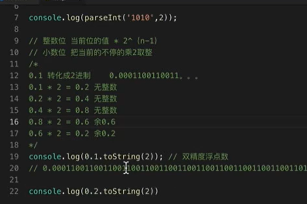
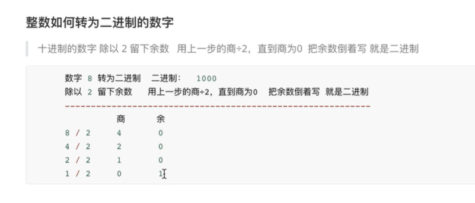

# js 常见手写面试题

## <font color="#e96900">为什么 0.1 + 0.2 != 0.3</font>

> 涉及面试题：为什么 0.1 + 0.2 != 0.3？如何解决这个问题？
> 先说原因，因为 JS 采用 IEEE 754 双精度版本（64 位），并且只要采用 IEEE 754 的语言都有该问题。

我们都知道计算机是通过二进制来存储东西的，那么 0.1 在二进制中会表示为

```js
// (0011) 表示循环
0.1 = 2^-4 * 1.10011(0011)
```

我们可以发现，`0.1` 在二进制中是无限循环的一些数字，其实不只是 `0.1`，其实很多十进制小数用二进制表示都是无限循环的。这样其实没什么问题，但是 JS 采用的浮点数标准却会裁剪掉我们的数字。

IEEE 754 双精度版本（64 位）将 64 位分为了三段

- 第一位用来表示符号
- 接下去的 11 位用来表示指数
- 其他的 52 位数用来表示有效位，也就是用二进制表示 `0.1` 中的 `10011(0011)`




那么这些循环的数字被裁剪了，就会出现精度丢失的问题，也就造成了 `0.1` 不再是 `0.1` 了，而是变成了 `0.100000000000000002`

```
0.100000000000000002 === 0.1 // true

```

那么同样的，`0.2` 在二进制也是无限循环的，被裁剪后也失去了精度变成了 `0.200000000000000002`

```
0.200000000000000002 === 0.2 // true

```

所以这两者相加不等于 `0.3` 而是 `0.300000000000000004`

```
0.1 + 0.2 === 0.30000000000000004 // true

```

那么可能你又会有一个疑问，既然 `0.1` 不是 `0.1`，那为什么 `console.log(0.1)` 却是正确的呢？

因为在输入内容的时候，二进制被转换为了十进制，十进制又被转换为了字符串，在这个转换的过程中发生了取近似值的过程，所以打印出来的其实是一个近似值，你也可以通过以下代码来验证

```
console.log(0.100000000000000002) // 0.1

```

1、那么说完了为什么，最后来说说怎么解决这个问题吧。其实解决的办法有很多，这里我们选用原生提供的方式来最简单的解决问题

```j's
parseFloat((0.1 + 0.2).toFixed(10)) === 0.3 // true

```

2、当然你也可以把计算数字 提升 10 的 N 次方 倍 再 除以 10 的 N 次方

```js
;(0.1 * 1000 + 0.2 * 1000) / 1000 == 0.3 // true
```

3、ES6 在 Number 对象上面，新增一个极小的常量`Number.EPSILON`,它实际上是 JavaScript 能够表示的最小精度，误差如果小于这个精度就表示没有误差了。

```js
Number.EPSILON === Math.pow(2, -52) // true
```

demo:

```js
// 这里做一个 Number.EPSILON 是否存在，存在最好，不存在则重新定义
if (!Number.EPSILON) {
  Number.EPSILON = Math.pow(2, -52)
}
// 判断实际值和计算值是否相等（即是否在误差范围内）
function show(n1, n2) {
  return Math.abs(n1 - n2) < Number.EPSILON
}
alert(show(0.1 + 0.2, 0.3))
```

---

## <font color="#e96900">垃圾回收机制</font>

> 涉及面试题：V8 下的垃圾回收机制是怎么样的？
> 在新生代空间中，内存空间分为两部分，分别为 `From `空间和 `To `空间。**在这两个空间中，必定有一个空间是使用的，另一个空间是空闲的**。新分配的对象会被放入 `From` 空间中，当 `From `空间被占满时，新生代 `GC `就会启动了。算法会检查`From`空间中存活的对象并复制到` To` 空间中，如果有失活的对象就会销毁。当复制完成后将 `From` 空间和` To` 空间互换，这样` GC` 就结束了。

---

## <font color="#e96900">数组相关</font>

### <font color="#e96900">Js 不使用循环生成长度为 10 内容分别为 0-9 的数组的方法</font>

```js
var arr = new Array(10)

var arr1 = arr
  .join(',')
  .split(',')
  .map((v, i) => {
    return i
  })

console.log('arr1', arr1)
```

这里为啥要用 join(',').split(',')搞一把，new Array(10)生成的每一项都为空，map 循环的时候会跳过空项

```js
let arr = Array.apply(null, { length: 10 }).map((item, index) => {
  return index
})
console.log(arr)
//(10) [0, 1, 2, 3, 4, 5, 6, 7, 8, 9]
```

Array.apply 的第二个参数是类数组调用 Array.apply(null, { length: 10 })等于生成了长度为 10 内容都为 undefinded 的数组

```js
let arr = Array.from({ length: 10 }).map((item, index) => {
  return index
})
console.log(arr)
//(10) [0, 1, 2, 3, 4, 5, 6, 7, 8, 9]
```

---

### <font color="#e96900">数组去重</font>

#### 1.利用对象的属性，如果不存在放入新数组

```js
function unique1(arr) {
  var res = [],
    obj = {}
  for (var i = 0; i < arr.length; i++) {
    if (!obj[arr[i]]) {
      obj[arr[i]] = 1
      res.push(arr[i])
    }
  }
  return res
}
console.log('unique1', unique1(arr)) // [1, 2, 7, 5, 4, 3, "a", "c", "b"]
```

#### 2.利用 indexOf

```js
function unique2(arr) {
  var res = []
  for (var i = 0; i < arr.length; i++) {
    if (res.indexOf(arr[i]) == -1) {
      res.push(arr[i])
    }
  }
  return res
}
console.log('unique2', unique2(arr)) // [1, 2, 7, 5, 4, 3, "a", "c", "b"]
```

#### 3.利用数组的 includes()

```js
function unique3(arr) {
  var res = []
  for (var i = 0; i < arr.length; i++) {
    if (!res.includes(arr[i])) {
      res.push(arr[i])
    }
  }
  return res
}
console.log('unique3', unique3(arr)) // [1, 2, 7, 5, 4, 3, "a", "c", "b"]
```

#### 4.new Set()

```js
var setArr = Array.from(new Set(arr))

var setArr = [...new Set(arr)]
console.log('setArr', setArr) // [1, 2, 7, 5, 4, 3, "a", "c", "b"]
```

---

### <font color="#e96900">冒泡排序</font>

```js
var arr = [3, 2, 5, 9, 1, 6, 33, 4, 65, 22]
var temp = 0

for (var i = 0; i < arr.length; i++) {
  for (var j = i + 1; j < arr.length; j++) {
    if (arr[i] > arr[j]) {
      //相邻比较，如果前一个大，就调换位置
      temp = arr[i] //temp储存前一个大的数
      arr[i] = arr[j] //前一个换成小的那个数
      arr[j] = temp //将大的赋值给后一个
    }
  }
}
console.log(arr) //1 2 3 4 5 6 9 22 33 65
```

---

### <font color="#e96900">快速排序</font>

快速排序采用了一种分治的策略，通常称其为分治法，其基本思想是：

将原问题分解为若干个规模更小但结构与原问题相似的子问题。递归地解这些子问题，然后将这些子问题的解组合为原问题的解。 (取中间值 递归处理左右)

```js
var arr = [3, 2, 5, 9, 1, 6, 33, 4, 65, 22]

function quickSort(arr) {
  if (arr.length < 1) return arr
  var middleIndex = Math.floor(arr.length / 2) //取中间值
  var middle = arr.splice(middleIndex, 1) //删除并返回这个值，即把中间这个值拿出来用作比较
  var left = []
  var right = []
  for (var i = 0; i < arr.length; i++) {
    if (arr[i] > middle) {
      right.push(arr[i])
    } else {
      left.push(arr[i])
    }
  }
  return quickSort(left).concat(middle, quickSort(right)) //递归 直到length<=1
}
console.log(quickSort(arr)) // [1, 2, 3, 4, 5, 6, 9, 22, 33, 65]
```

---

### <font color="#e96900">数组的交集、并集、差集</font>

```js
var a = [1, 2, 3],
  b = [2, 4, 5]

// 交集
let intersection = a.filter((v) => b.includes(v)) // [2]

// 并集
let union = a.concat(b.filter((v) => !a.includes(v))) // [1,2,3,4,5]

// 差集
let difference = a.concat(b).filter((v) => !a.includes(v) || !b.includes(v)) // [1,3,4,5]
```

---

### <font color="#e96900">数组降维--数组扁平化</font>

#### 1.Array​.prototype​.flat()

```js
var arr1 = [1, 2, [3, 4]]
arr1.flat()
// [1, 2, 3, 4]

var arr2 = [1, 2, [3, 4, [5, 6]]]
arr2.flat()
// [1, 2, 3, 4, [5, 6]]

var arr3 = [1, 2, [3, 4, [5, 6]]]
arr3.flat(2)
// [1, 2, 3, 4, 5, 6]

//使用 Infinity 作为深度，展开任意深度的嵌套数组
arr3.flat(Infinity)
// [1, 2, 3, 4, 5, 6]
```

#### 2.递归

```js
var arrDown = [
  [1, 2, 3],
  [4, 5, [6, 1]],
  [9, 8, 7],
]

function down(arr) {
  var temp = []
  for (var i = 0; i < arr.length; i++) {
    if (arr[i].constructor == Array) {
      temp = temp.concat(down(arr[i]))
    } else {
      temp.push(arr[i])
    }
  }
  return temp
}
console.log(down(arrDown)) // [1, 2, 3, 4, 5, 6, 1, 9, 8, 7]
```

```js
function flatten(arr) {
  return arr.reduce((result, item) => {
    return result.concat(Array.isArray(item) ? flatten(item) : item)
  }, [])
}
```

### <font color="#e96900">找出数组中的最大值</font>

```js
var arrMax = [1, 2, 3, 4, 5]
//1.for循环,古老的写法，遍历之后取最大值
var arrRes = arrMax[0]
for (var i = 1; i < arrMax.length; i++) {
  var result = Math.max(arrRes, arrMax[i]) //两者比较 返回最大值
}
console.log(result)
//2.Math最大值。用到apply方法，可以将数组转换成参数列表再调用Math方法
Math.max.apply(null, arrMax)
//3.sort()
arrMax.sort((num1, num2) => {
  return num2 - num1
})[0] //或者sort()后reverse()
//4.reduce()
arrMax.reduce((num1, num2) => {
  return num1 > num2 ? num1 : num2
})
```

---

## <font color="#e96900">函数柯里化</font>

> 涉及面试题: add(1)(2)(3,4) 输出 1+2+3+4

```js
function add(...args) {
  let sum = [...args]
  let addMore = function (...b) {
    sum.push(...b)
    return addMore
  }
  addMore.toString = function () {
    return sum.reduce((c, d) => {
      return c + d
    })
  }
  return addMore
}
console.log(add(1, 2)(3)(4))
```

---

## <font color="#e96900">斐波那契数列</font>

> 斐波那契数列为 [1,1,2,3,5,8,13,21,34.....] 首先前两项为 1 然后每加一项 就是这一项前两项的和 1,2 = 3 ，2，3=5， 3,5 = 8 f(n) = f(n-1) + f(n-2)

```js
function fibonacci(count) {
  var arr = [1, 1]
  if (count < 2) {
    return 1
  }
  for (var i = 2; i < count.length; i++) {
    arr[i] = arr[i - 1] + arr[i - 2]
  }
  return arr[count]
}
console.log(fibonacci(3))
```

---

## <font color="#e96900">深拷贝和浅拷贝</font>

### 浅拷贝

#### 1.Object.assign

```js
let aa = {
  age: 1,
  name: ['aaa', 'bbb'],
}
let c = Object.assign({}, aa)
aa.age = 3
aa.name.push('ccc')
console.log(c.age) // 1
console.log(c.name) // aaa,bbb,ccc 浅拷贝对于对象无效
```

#### 2.新建对象

```js
let bb = {
  age: 1,
}
function qcopy(obj) {
  var c = {}
  for (var i in obj) {
    c[i] = obj[i]
  }
  return c
}
let cc = qcopy(bb)
bb.age = 4
console.log(cc.age) // 1
```

---

### 深拷贝

#### 1.JSON.parse(JSON.stringify(oldObj))

```js
const newObj = JSON.parse(JSON.stringify(oldObj))
```

#### 2.递归

```js
var os = {
  aa: undefined, //JSON.parse(JSON.stringify(os)) 该方法会忽略掉函数和 undefined 。
  name: '小花',
  friend: ['小明', '小兰'],
  fn: function () {
    console.log(1)
  },
}
function deepCopy(o, c) {
  var c = c || {}
  for (var i in o) {
    if (typeof o[i] == 'object') {
      c[i] = o[i].constructor == Array ? [] : {}
      deepCopy(o[i], c[i])
    } else {
      c[i] = o[i]
    }
  }
  return c
}
var c1 = deepCopy(os)
```

## <font color="#e96900">实现防抖函数</font>

> 防抖函数原理：在事件被触发 n 秒后再执行回调，如果在这 n 秒内又被触发，则重新计时。

```js
const debounce = (fn, delay) => {
  let timer = null
  return (...args) => {
    clearTimeout(timer)
    timer = setTimeout(() => {
      fn.apply(this, args)
    }, delay)
  }
}
```

按钮提交场景：防止多次提交按钮，只执行最后提交的一次

---

## <font color="#e96900">实现节流函数</font>

> 防抖函数原理:规定在一个单位时间内，只能触发一次函数。如果这个单位时间内触发多次函数，只有一次生效。

```js
const throttle = (fn, delay) => {
  let flag = true
  return (...args) => {
    if (!flag) return
    flag = false
    setTimeout(() => {
      fn.apply(this, args)
      flag = true
    }, delay)
  }
}
```

## <font color="#e96900">实现继承</font>

### 原始方式

```js
function Parent(value) {
  this.value = value
}
Parent.prototype.getValue = function () {
  console.log(this.value)
}
var c = new Parent(1)
c.getValue() //1

function Child(value) {
  Parent.call(this, value)
}
// Child.prototype = Object.create(Parentprototype)
Child.prototype = new Parent() //原型指向Parent
Child.prototype.constructor = Child //constructor构造函数指向自身
const b = new Child(2)
b.getValue(2) // 2
```

### ES6 方式

```js
class Parent {
  constructor(value) {
    this.value = value
  }
  getValue() {
    console.log(this.value)
  }
}
class Child extends Parent {
  constructor(value) {
    super(value)
  }
}
const xx = new Child(444)
xx.getValue()
```

## <font color="#e96900">实现 call apply 和 bind</font>

### call 的实现

```js
Function.prototype.call = function (context) {
  if (typeof this != 'function') {
    throw new TypeError('error')
  }
  // context 是传过来的this函数 没有指向window
  context = context || window
  context.fn = this //这一步是this指向到context  因为context.fn fn是context调用的 所以this指向的就是context
  const arg = [...arguments].slice(1) //将this后的参数获取
  const result = context.fn(...arg) // 如果this是b() 那么就是这样b(...args)
  delete context.fn // 删除临时用的fn
  return result
}
function a(a, b) {
  return a - b
}
function b(a, b) {
  return a + b
}

console.log(b.myCall(a, 3, 3)) //6   A调用b的函数
```

### apply 的实现

```js
Function.prototype.apply = function (context) {
  if (typeof this != 'function') {
    throw new TypeError('error')
  }
  context = context || window
  context.fn = this

  let result
  if (arguments[1]) {
    result = context.fn(...arguments[1])
  } else {
    result = context.fn()
  }
  return result
}
console.log(b.myApply(a, [3, 3])) // 6
```

### bind 的实现

```js
Function.prototype.myBind = function(context){
if(typeof this != 'function'){
    throw new Error('error')
  }
  const _this = this;
  const args = [...arguments].slice(1); //拿到除了this之外的参数
  return function F(){
    // 如果通过new实现
  if(this instanceOf F){
    return new _this(...args,...arguments)
  }else{
    // 如果普通实现
    return _this.apply(context,args.concat(...arguments))
  }
  }

}
const bindFn = renderFn.myBind(obj,'bindname');
    bindFn(40);
```

前几步和之前的实现大相径庭，就不赘述了

- bind 返回了一个函数，对于函数来说有两种方式调用，一种是直接调用，一种是通过 new 的方式，我们先来说直接调用的方式
- 对于直接调用来说，这里选择了 apply 的方式实现，但是对于参数需要注意以下情况：因为 bind 可以实现类似这样的代码 f.bind(obj, 1)(2)，所以我们需要将两边的参数拼接起来，于是就有了这样的实现 args.concat(...arguments)
- 最后来说通过 new 的方式，在之前的章节中我们学习过如何判断 this，对于 new 的情况来说，不会被任何方式改变 this，所以对于这种情况我们需要忽略传入的 this

---

## <font color="#e96900">实现 new</font>

1.创建一个空对象

2.链接到原型

3.绑定 this 值

4.返回新对象

定义一个构造器函数

```js
// 构造器函数
let Parent = function (name, age) {
  this.name = name
  this.age = age
}
Parent.prototype.sayName = function () {
  console.log(this.name)
}
```

封装 new 方法

```js
//定义的new方法
let newMethod = function (Parent, ...rest) {
  // 1.以构造器的prototype属性为原型，创建新对象（1、2）；
  let newObj = Object.create(Parent.prototype)
  // 2.将this和调用参数传给构造器执行（3）
  let result = Parent.apply(newObj, rest)
  // 3.如果构造器没有手动返回对象，则返回第一步的对象（4）
  return typeof result === 'object' ? result : newObj
}
```

调用函数，创建新对象

```js
//创建实例，将构造函数Parent与形参作为参数传入
const child = newMethod(Parent, 'echo', 26)
child.sayName() //'echo';
```

---

## 实现 instanceof

> 思路：xxx instanceof yyy ===> xxx.**proto** === yyy.prototype

```js
function instanceOf(left, right) {
  var L = left.__proto__ //取left的隐式原型
  var R = right.prototype //取right的显式原型

  while (true) {
    if (L === null) return false
    if (L === R) {
      return true
    }
    L = L.__proto__
  }
}
```

---

## 实现 Object.create

> 思路:`Object.create()`方法创建一个新对象，使用现有的对象来提供新创建的对象的`__proto__`。

```js
function create(proto) {
  function F() {
    F.prototype = proto
  }
  return new F()
}
```
