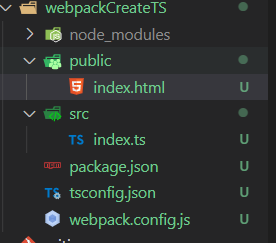

# <font color="#e96900"> 一、什么是 TypeScript</font>

> javascript 的超集，可以编译成 JavaScript。添加了类型系统的 JavaScript，可以适用于任何规模的项目

## TypeScript 特性

### 类型系统

从 TypeScript 的名字就可以看出来，【类型】是其最核心的特性。

我们知道，JS 是一门非常灵活的编程语言：

- 它没有类型约束，一个变量可能初始化时是字符串，过一会又被赋值为数字。
- 由于**隐式类型转换**的存在，有的变量的类型很难在**运行前**就确定。
- 基于原型的面向对象编程，使得原型上的属性或方法可以在运行时被修改。
- 函数时 JS 中的一等公民，可以赋值给变量，也可以当作参数或者返回值。

这种灵活性就像是一把双刃剑，一方面使得 JS 蓬勃发展，无所不能，另一方面也使得它的代码质量参差不齐，维护成本高，运行时错误多。

而 TypeScript 的类型系统，在很大程度上弥补了 JS 的缺点

<font color="#ff0000">tips：js 和 ts 的主要区别在于类型约束上，规范的类型约束提高了代码的严谨和可读性</font>

### Typescript 是静态类型

类型系统按照【类型检查的时机】来分类，可以分为**动态类型**和**静态类型**。

**动态类型**是指在运行时才会进行类型检查，这种语言的类型错误往往会导致运行时报错。JS 是一门解释性语言，没有编译阶段，所以他是动态类型（简单的说像是 java 在敲代码的阶段就会提示语法是否错误，JS 在开发中不会报错而是运行的时候才知道是否报错）

**静态类型** 是指编译阶段就能确定每个变量的类型，这种语言的类型错误往往会导致语法错误。TypeScript 在运行前需要先编译为 JS，而在编译阶段就会进行类型检查，所以**TypeScript 是静态类型**

<font color="#ff0000">tips:js 是在运行时才会进行类型检查（动态类型），ts 是在编译阶段进行类型检查（静态类型）</font>

### TypeScript 是弱类型

类型系统按照【是否允许隐式类型转换】来分类，可以分为强类型（C#、Java）和弱类型（TS、JS）

以下代码不管是在 JS 中还是在 TS 中都可以正常运行的，运行时数字 1 会被隐式类型转换为字符串 1，加号+被识别为字符串拼接，所以打印出的结果是字符串‘11’

```javascript
console.log(1 + '1')
// 11
```

TS 是完全兼容 JS 的，它不会修改 JS 运行时的特性，所以他们都是**弱类型**

<font color="#ff0000">tips：以是否允许隐式类型转换为标准，ts 和 js 一样都是存在隐式类型转换的特性，所有都是弱类型语言</font>

---

# <font color="#e96900"> 二、安装并编译 TypeScript</font>

1. 安装 TypeScript 需要 nodejs 环境，[https://nodejs.org/en/](https://nodejs.org/en/) (**node --version** 查看是否安装完成 node)
2. 起步安装 **npm install typescript -g** 是否安装成功 命令行：`tsc --version` 出现详细信息就表示安装成功了
3. 基础版运行：tsc 01.ts(会生成一个 01.js) ----> node 01.js(查看打印结果)
4. 如果想输出到指定目录： tsc --outFile ./js/01.js 01.ts

每次编译很麻烦 后期可以使用下面这种方式运行
npm i @types/node --save-dev （node 环境支持的依赖必装------如果 console 报错 ts-node 版本过高了 降低下版本就行 ts-node@8.5.4）
npm i ts-node --g
运行：ts-node 01.ts

这样每次直接编译文件就可以查看打印结果

---

# <font color="#e96900"> 三、基本数据类型</font>

## 字符串类型

```js
let a: string = '1234'
//模板字符串形式
let b: string = `123${a}`
```

## 数字类型

```js
let notNumber: number = NaN //NaN
let num: number = 1234
let infinityNumber: number = infinity //无穷大
let decimal: number = 6 //十进制
let hex: number = 0xf00d //十六进制
let binary: number = 0b1010 //二进制
let octal: number = 0o744 //八进制
```

## 布尔类型

注意，使用构造函数 `Boolean` 创造的对象**不是**布尔值：

```js
let createBoolean: boolean = new Boolean(1)
// 这样会报错 new Boolean是创建了一个对象 不是单纯的 true false类型 下面是正确写法
let createBoolean: Boolean = new Boolean(1)

let boolean: boolean = true //可以直接使用布尔值
let boolean2: boolean = Boolean(1) //也可以通过函数返回布尔值
```

## null 和 undefined 类型

```js
let u: undifined = undefined //
let n: null = null //
```

## 空值类型

javascript 没有空值的概念，在 TypeScript 中可以使用 void 表示没有任何返回值的函数（一般使用在函数中）

```js
function voidFn(): void {
  console.log('没有返回值')
}
```

void 类型的用法，主要是用在我们不希望调用者关心函数返回值的情况下，比如通常的异步回调函数

### void 也可以定义 undefined 和 null 类型

```js
let u: void = undefined
let n: void = null
```

### void 和 undefined 和 null 最大的区别

与 `void` 的区别是，`undefined` 和 `null` 是所有类型的**子类型**。也就是说 `undefined` 类型的变量，可以赋值给 string 类型的变量：

```js
//这样写会报错 void类型不可以分给其他类型
let test: void = undefined
let num2: string = '1'

num2 = test
```

```js
//这样是没问题的
let test: null = null
let num2: string = '1'

num2 = test

//或者这样的
let test: undefined = undefined
let num2: string = '1'

num2 = test
```

严格模式下**null 不能 赋予 void 类型**

```json
//tsconfig.json 开启了严格模式
{
  "compilerOptions": {
    "strict": true
  }
}
```

如果指定了 `--strictNullChecks `标记，`null` 和 `undefined` 只能赋值给`void`和**它们各自**，不然会报错。

<font color="#ff0000"> tips:</font>

<font color="#ff0000">1. undefined 和 null 类型是所有类型的子类型，可以赋值给任何类型（严格模式下 null 不能 赋予 void 类型）</font>

<font color="#ff0000">2.void 是表示空值，一般用在函数返回上</font>

---

# <font color="#e96900"> 四、任意类型</font>

## Any 类型 和 unknown 顶级类型

没有强制限定哪种类型，随时切换类型都可以，不需要检查类型，我们可以对 `any `类型的随意操作就像正常写 JavaScript 一样（这样 ts 就没有意义了）

```js
let anys: any = 123
anys = '1234'
anys = true
// 这样是都可以的
```

生明变量的时候没有指定变量类型 **默认就是 any 类型**

```js
let anys
anys = '123'
anys = true
// 这样是都可以的
```

TS3.0 中引入了`unknown`类型也被认为是 top type，但它更安全，与 any 类型一样，它可以分配任何类型，unknown 类型比 any 类型更严格，**unknown 类型不能赋值给其他类型，unknown 类型不能作为子类型只能作为父类型 any 可以作为父类型和子类型**

```js
let unknown: unknown = ''
let str: string = unknown //这样会报错的 无法分配给其它类型

let any: any = ''
let str: string = any // 这样是可以的
```

**any 类型在对象没有这个属性的时候获取属性不会报错，unknown 则是不可以调用的**

```js
let any2: any = { a: 1 }
console.log(any2.b) //undefined

let unknown2: unknown = { a: 1 }
console.log(unknown2.b) // 语法就会标红报错
```

在不知道传的是什么类型的情况下，可以使用 unknown 类型和断言结合来判断

```js
function divide(param: unknown) {
  return param as number / 2;
}
```

不知道传的是什么，但我的逻辑处理要的是 number 类型就可以这样使用

<font color="#ff0000"> tips:</font>

<font color="#ff0000"> 1. any 类型可以作为父类型也可以作为子类型，unknown 类型只能作为父类型</font>

<font color="#ff0000"> 2. any 类型在对象没有这个属性的时候获取属性不会报错，unknown 则是不可以调用的</font>

# <font color="#e96900"> never 类型</font>

`never`类型表示的是那些**永不存在的值的类型**。

有些情况下值会永不存在，比如:

- 如果一个函数执行时抛出了异常，那么这个函数永远不存在返回值，因为抛出异常会直接中断程序运行。
- 函数中执行无限循环的代码，使得程序永远无法运行到函数返回值那一步。

```js
//异常
function fn(mes: string): never {
  throw new Error(mes)
}

// 死循环
function fn(): never {
  while (true) {}
}
```

```js
type A = '小满' | '大满' | '超大满'

function isXiaoMan(value: A) {
  switch (value) {
    case '小满':
      break
    case '大满':
      break
    case '超大满':
      break
    default:
      //是用于场景兜底逻辑
      const error: never = value
      return error
  }
}
```

## never 与 void 的差异

```js
//void类型只是没有返回值 但本身不会出错
function Void(): void {
  console.log()
}

//只会抛出异常没有返回值
function Never(): never {
  throw new Error('aaa')
}
```

当我们鼠标移上去的时候会发现 只有 void 和 number never 在联合类型中会被直接移除

```js
type A = void | number | never
```

## never 类型是任何类型的子类型

没有类型是 `never `的子类型，没有类型可以赋值给`never`类型（除了 `never `本身之外）。即使` any`也不可以赋值给 `never `。

```js
let test1: never
test1 = 'lin' // 报错，Type 'string' is not assignable to type 'never'
```

```js
let test1: never
let test2: any

test1 = test2 // 报错，Type 'any' is not assignable to type 'never'
```

<font color="#ff0000"> tips: void 是没有返回值 never 表示不存在的值，常用于报异常这种逻辑</font>

<font color="#ff0000"> tips: never 类型是任何类型的子类型，never 只能赋值 never,any 也不行</font>

# <font color="#e96900"> 五、接口和对象类型</font>

## 对象类型

对象类型有` object` `Object` `{} `这三种 `object`适用于非原始类型，` Object``{} `包含原始类型

```js
let obj: object = {}
let obj1: object = []
let obj2: object = '123' //不可以

let obj3: Object = '123' //可以
let obj4: {} = '123' //可以
```

<font color="#ff0000"> tips: object 适用于非原始类型，Object {}包含原始类型</font>

在 TS 中，我们常用定义对象的方式是要用关键字 **interface**（接口）, **interface 就是定义一种约束，让数据结构满足约束的格式**

## 声明对象必须与接口格式保持一致

```js
// 这样会报错 因为我们在person定义了a，b但是对象里面缺少b属性
//使用接口约束的时候不能多一个属性也不能少一个属性，必须与接口保持一致，否则就没有起到约束的效果
interface Person {
  a: string;
  b: number;
}
const person: Person = {
  a: '1234',
}
// 正确方式
const person: Person = {
  a: '1234',
  b: 111,
}
```

## 重名/继承的 interface 会合并

```js
//重名interface  可以合并
interface A {
  name: string;
}
interface A {
  age: number;
}
var x: A = { name: 'xx', age: 20 }
//继承
interface A {
  name: string;
}

interface B extends A {
  age: number;
}

let obj: B = {
  age: 18,
  name: 'string',
}
```

## 可选属性--- ?

```js
//可选属性的含义是该属性可以不存在
//所以说这样写也是没问题的
interface Person {
  b?: string;
  a: string;
}

const person: Person = {
  a: '213',
}
```

## 只读属性--- readonly

readonly 只读属性是不允许被赋值的只能读取

```js
interface Person{
  a?:string,
  readonly b:number,
  [propName:string]:any
}
const person:Person = {
  a:'111',
  b:222
}
person.b = 333 // 这样会报错
```

## 任意属性---[propName:string]:any

<font color="#e96900"> 需要注意的是，一旦定义了任意属性，那么确定属性和可选属性的类型都必须是它的类型的子集</font>

```js
//在这个例子当中我们看到接口中并没有定义C但是并没有报错
//应为我们定义了[propName: string]: any;
//允许添加新的任意属性
interface Person {
  b?: string;
  a: string;
  [propName: string]: any;
}

const person: Person = {
  a: '213',
  c: '123',
}
```

## 对象添加函数

```js
interface Person{
  a:string,
  readonly b:number,
  [propName:string]:any,
  cb():void
}
const person:Person = {
  cb:()=>{
    console.log(123)
  }
}
```

<font color="#ff0000"> tips: interface 重名会继承，type 类型别名不会继承会覆盖</font>

# <font color="#e96900"> 六、数组类型</font>

## 基本写法

格式： 类型+【】

```js
//类型加中括号
let arr: number[] = [1, 2]
//这样会报错因为内容中出现了字符串
let arr: number[] = [1, 2, '1']

// 操作方式添加不同类型也是不允许的
let arr: number[] = [1, 2, 3]
arr.push('11')

let arr:number[] = [1,2,3]//数字类型的数组
let arr:string[] = ['1','2'],//字符串类型的数组
let arr:any[] = [1,'2',true],//任意类型的数组
```

## 泛型写法

格式：Array<类型>

```js
let arr: Array<number> = [1, 2]
```

## 用 interface 接口表示数组

一般用来描述**类数组**

```js
interface NumberArray {
  [index: number]: number; //含义：只要索引的类型是数字（一定是）：内容为number类型
}
let arr: NumberArray = [1, 2, 34]
```

<font color="#ff0000">tips: 只是表示类数组，无法使用数组的方法比如 push pop</font>

## 多维数组

```js
let data: number[][] = [
  [1, 2],
  [3, 4],
]
```

## arguments 类数组

ts 内置对象`IArguments` 定义

```js
function Arr(...args: any): void {
  console.log(arguments)
  //错误的arguments 是类数组不能这样定义
  let arr: number[] = arguments
}
Arr(1, 2, 3)

function Arr(...args: any): void {
  console.log(arguments)
  //ts 内置对象`IArguments` 定义
  let arr: IArguments = arguments
}
Arr(1, 2, 3)

//其中 IArguments 是 TypeScript 中定义好了的类型，它实际上就是：
interface IArguments {
  [index: number]: any;
  length: number;
  callee: Function;
}
```

## any 在数组中的应用

一个常见的例子数组中可以存在任意类型

```js
let list: any[] = ['test', 1, [], { a: 1 }]
```

# <font color="#e96900"> 六\_2、元组类型</font>

## 元组就是数组的变种

元组类型允许表示一个**已知元素数量和类型的数组，各元素的类型不必相同**。

**元组（Tuple）是固定数量的不同类型的元素的组合。**

元组与集合的不同之处在于，**元组中的元素类型可以是不同的，而且数量是固定的**。

元组的好处在于可以把多个元素作为一个单元传递，如果一个方法需要返回多个值，可以把多个值座位元组返回，而不需要创建额外的类来表示

```js
// 元组（Tuple）是固定数量的不同类型的元素的组合。
let arr:[number,string] = [1,'string']

let arr2: readonly[number,boolean,string,undefined] = [1,true,'sring',undefined] //只读的
```

当赋值或访问一个已知索引的元素时，会得到正确的类型

```js
arr[0].length //报错 数字是没有length 的
arr[1].length //可以
```

元组类型还可以支持自定义名称和变为可选的

```js
let a:[x:number,y?:boolean] = [1]
```

## 越界元素

超过元组定义的所有类型的元素

对于越界的元素他的类型被限制为 联合类型（就是你在元组中定义的类型）如下

```js
let arr3: [number, string] = [1, '2']
arr3.push(true) //报错的 类型“boolean”的参数不能赋给类型“string | number”的参数
arr3.push(3) //可以
arr3.push('4') //可以
```

## 应用场景 例如定义 excel 返回的数据

```js
let excel: [string, string, number, string][] = [
  ['title', 'name', 1, '123'],
  ['title', 'name', 1, '123'],
  ['title', 'name', 1, '123'],
  ['title', 'name', 1, '123'],
  ['title', 'name', 1, '123'],
]
```

<font color="#ff0000"> tips:元组是固定个数和类型的组合，跟数组一样使用</font>

<font color="#ff0000"> tips:越界元素的类型限制是当前元组中所有类型的联合类型 比如 number | string 这种 </font>

# <font color="#e96900"> 七、函数扩展</font>

## 函数类型

```js
//注意，参数不能多传少传，必须按照约定的类型来
const fn = (name: string, age: number): string => {
  return name + age
}
fn('11', 22)
```

## 函数的可选参数---？(放在参数的最后一个否则会报错)

```js
const fn = (name: string, age?: number): string => {
  return name + age
}
```

## 函数参数的默认值

```js
const fn = (name: string = '默认值'): string => {
  return name
}
```

## 接口定义函数参数

```js
interface Add {
  (num1: number, num2: number): number;
}
const fn: Add = (num1: number, num2: number): number => {
  return num1 + num2
}

interface User {
  name: string;
  age: number;
}
function getUserInfo(user: User): User {
  return user
}
```

## 定义剩余参数

...items: any[]

```js
const fn = (array: number[], ...items: any[]): any[] => {
  return items
}
let a: number[] = [1, 2, 3]
fn(a, '4', '5')
```

## 函数重载

重载是方法名字相同，而参数不同，返回类型可以相同也可以不同。

如果**参数类型不同**，则参数类型应该设置为**any**

**参数数量不同**你可以将不同的参数设置为**可选**

```js
function fn(params:number):void
function fn(params:string,params2:number):void
function fn(params:any,params2?:number):void{
  console.log(params)
  console.log(params2)
}
fn(123)
fn('123',456)
```

<font color="#ff0000"> tips:函数的可选参数放在参数的最后的位置，放在中间会影响到后面的参数 </font>

<font color="#ff0000"> tips:定义剩余参数...items:any[] </font>

<font color="#ff0000"> tips:函数重载:类型不同用 any 兼容，参数个数不同使用可选属性方式处理 </font>

# <font color="#e96900"> 八、联合、交叉类型、断言</font>

## 联合类型

可能是类型 1 也可能是类型 2

```js
let myPhone: number | string = '010-820'
```

函数使用联合类型

```js
const fn = (something: number | boolean): boolean => {
  return !!something
}
```

## 交叉类型

多种类型的集合，联合对象将具有所有联合类型特性(一般使用在`interface`接口中)

```js
interface People {
  age: number;
  height: number;
}
interface Man {
  sex: string;
}

const xiaoming = (man: People & Man) => {
  console.log(man.age, man.height, man.sex)
}
```

## 类型断言

**语法：值 as 类型：value as string 或者 <类型>值 : <string>value**

使用类型断言来告诉 TS，我（开发者）比你（编译器）更清楚这个参数是什么类型，你就别给我报错了，

> 注意，类型断言不是类型转换，把一个类型断言成联合类型中不存在的类型会报错。

```js
interface A{
  run:string
}
interface B{
  build:string
}
const fn = (type:A|B):string=>{
  return type.run
}
// 这样写是有警告的 因为B接口是没有定义run属性的
//下面这种写法是正确的,可以使用断言来推断它传入的是A接口的值
const fn = (type:A|B):string=>{
  return (type as A).run
}
```

**需要注意的是，类型断言只能够【欺骗】TS 编辑器，无法避免运行时的错误，谨慎滥用**

### 使用 any 临时断言

```js
window.abc = 123
//ts中这样写会报错因为window没有abc这个东西

(window as any).abc = 123
//可以使用any临时断言在any类型的变量上，访问任何属性都是允许的
```

### as const

**是对字面值的断言，与 const 直接定义常量是有区别的**

如果是普通类型跟直接 const 声明是一样的

```js
const name = '111'
name = 2 //无效

let names2 = '222' as const
name2 = '333' // 无效
```

```js
let a1 = [1,2] as const;
const a2 = [1,2]
a1.push(3) // 错误，此时已经断言字面量为[1, 2],数据无法做任何修改
a2.push(3) // 通过，没有修改指针
```

### 类型断言是不具影响力的

在下面的例子中，将 `something` 断言为 `boolean` 虽然可以通过编译，但是并没有什么用 并不会影响结果, 因为编译过程中会删除类型断言

```js
function toBoolean(something: any): boolean {
    return something as boolean;
}

toBoolean(1);
// 返回值为 1
//
```

# <font color="#e96900"> 九、内置对象</font>

javascript 中有很多内置对象，他们可以直接在 TS 中当做定义好了的类型

## ECMAScript 的内置对象

Boolean,Number,String,RegExp,Date,Error

```js
let b: Boolean = new Boolean(1)
console.log('b', b)
let n: Number = new Number(true)
console.log('n', n)
let s: String = new String('11111')
console.log('s', s)
let d: Date = new Date()
console.log('d', d)
let r: RegExp = /^1/
console.log('r', r)
let e: Error = new Error('error')
console.log('e', e)

b [Boolean: true]
n [Number: 1]
s [String: '11111']
d 2023-02-07T07:52:34.840Z
r /^1/
e Error
```

## DOM 和 BOM 的内置对象

Document、HTMLElement、Event、NodeList 等

```js
let body:HTMLElement = document.body;
let alldiv:NodeList = document.querySelectorAll('div')
let div:HTMLElement = document.querySelectorAll('div') as HTMLElement
document.addEventListener('click',function(e:MouseEvent){

})
```

# <font color="#e96900"> 十、TS 定义 Promise</font>

`Promise`如果我们不指定返回的类型 TS 是推断不出来返回的是什么类型的,返回类型格式`:Promise<type>`

```js
// 函数返回形式
function promise(): Promise<number> {
  return new Promise((resolve, reject) => {
    resolve(1)
  })
}
promise().then((res) => {
  console.log('res', res)
})

// 函数表达式形式
interface Data {
  data: DataList[];
  code: number;
  message: string;
}
interface DataList {
  a: number;
  b: number;
}
let p: Promise<Data> = new Promise((resolve, reject) => {
  resolve({
    data: [{ a: 1, b: 2 }],
    code: 0,
    message: '',
  })
})
p.then((res) => {
  if (res.code == 0) {
    console.log(res.data)
  }
})
```

# <font color="#e96900"> 十一、Class 类</font>

<font color="#ff0000">tips: 修饰符 public（都可以访问）、private（自己能访问，实例和继承都不行）、protected（实例不能访问，继承可以访问）</font>

<font color="#ff0000">tips: static 静态属性和静态方法，如果都是 static 定义的可以通过 this 访问，否则只能通过类名来调用，实例不可以访问</font>

<font color="#ff0000">tips: class 类通过 extends 实现继承，接口通过 implements 约束 class，多个接口用逗号隔开 </font>

<font color="#ff0000">tips: implements 只能约束类实例上的属性和方法 </font>
<font color="#ff0000">tips: </font>

<font color="#ff0000">抽象类(abstract)是指只能被继承，但不能实例化的类(基础功能类) </font>

<font color="#ff0000">抽象类中的抽象方法必须被子类实现 </font>

我们知道， JS 是靠原型和原型链来实现面向对象编程的，es6 新增了语法糖 `class`。

```js
//es6定义类
class Person {
  constructor() {}
  run() {}
}

// ts错误定义
// 这样会报错的 ts是不允许直接在constructor定义变量的，需要在constructor上面声明
class Person {
  constructor(name) {
    // 类型‘Person’上不存在属性‘name’
    this.name = name
  }
  run() {}
}
// ts正确写法
class Person {
  name: string
  constructor(name: string) {
    this.name = name
  }
}
```

## 类的修饰符

总共有三个 `public` `private` `protected`

### public

使用`public`修饰符 可以让你定义的变量在**内部和外部都可以访问**，如果变量修饰符**默认值就是 public**

```js
class Person {
  public name: string
  sayName() {
    console.log(this.name)
  }
}
let p = new Person()
p.name = '111' //外部访问并且修改
p.sayName() // 111 内部访问打印this.name
```

### private

使用`private`修饰符,私有的，**只属于这个类自己，实例对象和继承都无法访问**

```js
class Person2{
  private age:number
  sayAge(){
    console.log(this.age)
  }
}
class Person3 extends Person2{
  sayAge2(){
    console.log(this.age) // 继承不可以访问   属性“age”为私有属性，只能在类“Person2”中访问
  }
}
let p2  = new Person2()
p2.age = 18 //实例外部不可以访问  属性“age”为私有属性，只能在类“Person2”中访问
console.log(p2.age) //属性“age”为私有属性，只能在类“Person2”中访问
let p3  = new Person3()
p3.age = 19 //属性“age”为私有属性，只能在类“Person2”中访问
p3.sayAge2()
```

### protected

使用`protected`修饰符,**只能内部和继承访问，实例无法访问**

```js
class Person2{
  protected age:number = 10
  sayAge(){
    console.log(this.age)
  }
}
class Person3 extends Person2{
  sayAge2(){
    console.log(this.age)
  }
}
let p2  = new Person2()
p2.sayAge() // 内部访问可以
p2.age = 18 //属性“age”受保护，只能在类“Person2”及其子类中访问。
let p3  = new Person3()
p3.sayAge2() //继承访问可以
p3.age = 19 //属性“age”受保护，只能在类“Person2”及其子类中访问。
```

## static 静态属性和静态方法

我们用 static 定义的**属性**，可以理解为是类上的一些常量 ，不可以通过`this`去访问 只能通过`类名`去调用,实例不可以访问

```js
class PersonStatic {
  name: string
  static pi: number = 3.14
  point() {
    console.log(this.pi) //属性“pi”在类型“PersonStatic”上不存在。你的意思是改为访问静态成员“PersonStatic.pi”吗
    console.log(PersonStatic.pi) //正确
  }
}

let pStatic = new PersonStatic()
console.log(pStatic.pi) //报错 实例无法访问static属性
```

`static` 静态函数 同样也是不能通过`this `去调用 也是通过类名去调用,如果两个函数都是`static` 静态的是可以通过`this`互相调用

```js
class PersonStatic {
  name: string
  static pi: number = 3.14
  point() {
    console.log(PersonStatic.pi)
  }
  static run1() {
    console.log(2222)
  }
  static run2() {
    console.log(this.pi) // 3.14
    return this.run1()
  }
}
PersonStatic.run2() // 222
```

## interface 约束 class

`interface` 是 `TS` 设计出来用于定义对象类型的，可以对对象的形状进行描述。

`interface` 同样可以用来约束 `class`，要实现约束，需要用到 `implements `关键字。

### implements

`implements `是实现的意思，`class` 实现 `interface`,`class` 需要满足接口的约束，但是可以比接口的内容多不能少

```js
// interface 约束 class   implements
interface Music {
  play(): void;
}
class PersonInterface implements Music {
  play(): void {}
  name: string = '111' // play已经约束满足条件了 这个么问题
}
```

继承还是`extends`,多个约束条件用'，'逗号隔开

```js
interface Music {
  play(): void;
}
interface Video {
  pasue(): void;
}
class PersonInterface implements Music {
  name: string = '123'
  play(): void {}
}
let P3 = new PersonInterface()
console.log(P3.name)

class interExtend extends PersonInterface implements Music, Video {
  pasue(): void {}
}
```

### 约束构造函数和静态属性

使用 `implements` 只能约束**类实例上**的属性和方法，要约束**构造函数和静态属性**，需要这么写

```js
// interface 约束构造函数和静态属性
interface CircleStatic{
  new (radius:number):void  //构造签名的写法 new (参数):返回值
  pi:number
}
const Circle:CircleStatic = class Circle{
  static pi:number = 3.14
  public radius:number
  public constructor(radius:number){
    this.radius = radius
    console.log('radius---->',this.radius)
  }
}
let p1 = new Circle(50)
```

## 抽象类

抽象类，听名字似乎是非常难理解的概念，但其实非常简单。

`TS` 通过 `public、private、protected `三个修饰符来增强了 `JS `中的类。

其实 `TS` 还对 `JS `扩展了一个新概念——**抽象类**。

所谓抽象类，是指**只能被继承，但不能被实例化的类**，你也可以把他作为一个**基础类**,就这么简单。

抽象类有两个特点：

- 抽象类不允许被实例化

- 抽象类中的抽象方法必须被子类实现

抽象类用一个`abstract`关键字来定义，我们通过两个例子来感受一下抽象类的两个特点。

### 抽象类不允许被实例化

```js
abstract class Amimal{

}

const a = new Amimal() //无法创建抽象类的实例
```

### 抽象类中的抽象方法必须被子类实现

```js
abstract class Amimal{
  constructor(name:string){
    this.name = name
  }
  name:string
  public abstract say():void
}
class Dog extends Amimal{
  constructor(name:string){
    super(name)
  }
  // 如果不继承抽象方法会报错 ：非抽象类“Dog”不会实现继承自“Amimal”类的抽象成员“say”
  say(){
    console.log('wang')
  }
}
let dog = new Dog('111')
dog.say()
```

## 为什么叫抽象类？

很显然，抽象类是一个广泛和抽象的概念，不是一个实体，就比如上文的例子，动物这个概念是很广泛的，猫、狗、狮子都是动物，但动物却不好是一个实例，实例只能是猫、狗或者狮子。

官方一点的说法是，在面向对象的概念中，所有的对象都是通过类来描绘的，但是反过来，并不是所有的类都是用来描绘对象的，如果一个类中没有包含足够的信息来描绘一个具体的对象，这样的类就是抽象类。

比如 Animal 类只是具有动物都有的一些属性和方法，但不会具体到包含猫或者狗的属性和方法。

**所以抽象类的用法是用来定义一个基类，声明共有属性和方法，拿去被继承**

**抽象类的好处是可以抽离出事物的共性，有利于代码的复用。**

## 抽象方法和多态

多态是面向对象的三大基本特征之一。

多态指的是，父类定义一个抽象方法，在多个子类中有不同的实现，运行的时候不同的子类就对应不同的操作，比如，

```js
abstract class Animal {
    constructor(name:string) {
        this.name = name
    }
    public name: string
    public abstract sayHi():void
}

class Dog extends Animal {
    constructor(name:string) {
        super(name)
    }
    public sayHi() {
        console.log('wang')
    }
}

class Cat extends Animal {
    constructor(name:string) {
        super(name)
    }
    public sayHi() {
        console.log('miao')
    }
}
```

Dog 类和 Cat 类都继承自 Animal 类，Dog 类和 Cat 类都不同的实现了 sayHi 这个方法。

# <font color="#e96900"> 十二、枚举类型</font>

在任何项目开发中，我们都会遇到定义常量的情况，常量就是指不会被改变的值。

TS 中我们使用 `const` 来声明常量，但是有些取值是在一定范围内的一系列常量，比如一周有七天，比如方向分为上下左右四个方向。

这时就可以使用枚举（`Enum`）来定义。

## 数字枚举

数字枚举 : 1.数字递增 2.反向映射

```js
enum Direction {
  Up,
  Down,
  Left,
  Right
}
// 数字递增: 枚举成员会被赋值为从 0 开始递增的数字
console.log(Direction.Up)        // 0
console.log(Direction.Down)      // 1
console.log(Direction.Left)      // 2
console.log(Direction.Right)     // 3

// 反向映射: 枚举会对枚举值到枚举名进行反向映射，
console.log(Direction[0])      // Up
console.log(Direction[1])      // Down
console.log(Direction[2])      // Left
console.log(Direction[3])      // Right
```

如果枚举第一个元素赋有初始值，就会从初始值开始递增

```js
enum Direction2 {
  Up=6,
  Down,
  Left,
  Right
}
console.log(Direction2.Up)        // 6
console.log(Direction2.Down)      // 7
console.log(Direction2.Left)      // 8
console.log(Direction2.Right)     // 9
console.log(Direction2[0])      // 报错的 数字类型 从6开始 不能理解为索引哈
console.log(Direction2[6])      // Up 正确的
```

### 反向映射的原理

枚举是如何做到反向映射的呢，我们不妨来看一下被编译后的代码，

```js
var Direction
;(function (Direction) {
  Direction[(Direction['Up'] = 6)] = 'Up'
  Direction[(Direction['Down'] = 7)] = 'Down'
  Direction[(Direction['Left'] = 8)] = 'Left'
  Direction[(Direction['Right'] = 9)] = 'Right'
})(Direction || (Direction = {}))
```

主体代码是被包裹在一个自执行函数里，封装了自己独特的作用域。

```js
Direction["Up"] = 6 返回 6
```

会将 Direction 这个对象的 Up 属性赋值为 6，JS 的赋值运算符返回的值是被赋予的值。

```js
执行 Direction[Direction["Up"] = 6] = "Up";

相当于执行
Direction["Up"] = 6
Direction[6] = "Up"
```

这样就实现了枚举的反向映射。

## 手动赋值

定义一个枚举来管理外卖状态，分别有已下单，配送中，已接收三个状态。

可以这么写，

```JS
enum ItemStatus {
    Buy = 1,
    Send,
    Receive
}

console.log(ItemStatus['Buy'])      // 1
console.log(ItemStatus['Send'])     // 2
console.log(ItemStatus['Receive'])  // 3
```

但有时候后端给你返回的数据状态是乱的，就需要我们手动赋值。

比如后端说 Buy 是 100，Send 是 20，Receive 是 1，就可以这么写，

```JS
enum ItemStatus {
    Buy = 100,
    Send = 20,
    Receive = 1
}

console.log(ItemStatus['Buy'])      // 100
console.log(ItemStatus['Send'])     // 20
console.log(ItemStatus['Receive'])  // 1
```

别问为什么，实际开发中经常会有这种情况发生。

## 计算成员

```JS
enum FileAccess {
    Read    = 1 << 1,
    Write   = 1 << 2,
    ReadWrite  = Read | Write,
}

console.log(FileAccess.Read)       // 2   -> 010
console.log(FileAccess.Write)      // 4   -> 100
console.log(FileAccess.ReadWrite)  // 6   -> 110
```

看个实例吧，Vue3 源码中的 patchFlags，用于标识节点更新的属性。

```JS
// packages/shared/src/patchFlags.ts
export const enum PatchFlags {
  TEXT = 1,                    // 动态文本节点
  CLASS = 1 << 1,              // 动态 class
  STYLE = 1 << 2,              // 动态 style
  PROPS = 1 << 3,              // 动态属性
  FULL_PROPS = 1 << 4,         // 具有动态 key 属性，当 key 改变时，需要进行完整的 diff 比较
  HYDRATE_EVENTS = 1 << 5,     // 具有监听事件的节点
  STABLE_FRAGMENT = 1 << 6,    // 子节点顺序不会被改变的 fragment
  KEYED_FRAGMENT = 1 << 7,     // 带有 key 属或部分子节点有 key 的 fragment
  UNKEYED_FRAGMENT = 1 << 8,   // 子节点没有 key 的 fragment
  NEED_PATCH = 1 << 9,         // 非 props 的比较，比如 ref 或指令
  DYNAMIC_SLOTS = 1 << 10,     // 动态插槽
  DEV_ROOT_FRAGMENT = 1 << 11, // 仅供开发时使用，表示将注释放在模板根级别的片段
  HOISTED = -1,                // 静态节点
  BAIL = -2                    // diff 算法要退出优化模式
}
```

## 字符串枚举

字符串枚举的意义在于，提供有具体语义的字符串，可以更容易地理解代码和调试。

```js
enum Direction {
    Up = "UP",
    Down = "DOWN",
    Left = "LEFT",
    Right = "RIGHT",
}

const value = 'UP'
if (value === Direction.Up) {
    // do something
}
```

## 常量枚举

上文的例子，使用`const`来定义一个常量枚举

```js
const enum Direction {
    Up = "UP",
    Down = "DOWN",
    Left = "LEFT",
    Right = "RIGHT",
}

const value = 'UP'
if (value === Direction.Up) {
    // do something
}
```

编译出来的 JS 代码会简洁很多，提高了性能。

```js
const value = 'UP'
if (value === 'UP' /* Up */) {
  // do something
}
```

不写`const`编译出来是这样的，

```js
var Direction
;(function (Direction) {
  Direction['Up'] = 'UP'
  Direction['Down'] = 'DOWN'
  Direction['Left'] = 'LEFT'
  Direction['Right'] = 'RIGHT'
})(Direction || (Direction = {}))
const value = 'UP'
if (value === Direction.Up) {
  // do something
}
```

这一堆定义枚举的逻辑会在编译阶段会被删除，常量枚举成员在使用的地方被内联进去。

很显然，**常量枚举不允许包含计算成员**，不然怎么叫常量呢？

```js
const enum Test {
    A = "lin".length //会报错
}
```

常量枚举可以避免在额外生成的代码上的开销和额外的非直接的对枚举成员的访问。

## 小结

枚举的意义在于，可以定义一些带名字的常量集合，清晰地表达意图和语义，更容易地理解代码和调试。

常用于和后端联调时，区分后端返回的一些代表状态语义的数字或字符串，降低阅读代码时的心智负担。

<font color="#ff0000">tips: </font>

<font color="#ff0000">1.数字枚举:1.数字递增、2 反向映射（看下原理）</font>

<font color="#ff0000">2.枚举可以计算成员，常量枚举（const enum）不能计算成员</font>

# <font color="#e96900"> 十三、类型推论</font>

`TypeScript`里，在有些没有明确指出类型的地方，类型推论会帮助**提供类型**。

这种推断发生在`初始化变量`和`成员`，设置`默认参数值`和`决定函数返回值时`。

类型推论是一种概念，并没有具体的代码

## 定义时不赋值默认 any 类型

```js
let a

a = 18
a = '123'
```

定义时不赋值，就会被 TS 自动推导成 any 类型，之后随便怎么赋值都不会报错。

## 定义时赋值默认为该类型

```js
let userName = '123' // string类型

userName = 2 // number类型不是赋值
```

因为赋值的时候赋的是一个字符串类型，所以 TS 自动推导出 userName 是 string 类型。

这个时候，再更改 userName 时，就必须是 string 类型，是其他类型就报错

类型推论虽然能为我们提供帮助，但既然写了 `TS`，除非是函数默认返回类型为 `void `这种大家都知道的，其他的最好每个地方都定义好类型。

# <font color="#e96900"> 十四、类型别名</font>

类型别名（type aliase），听名字就很好理解，就是给**类型起个别名**,多用于复合类型。

就像 NBA 球员 扬尼斯-阿德托昆博，名字太长难记，我们叫他字母哥。

> 类型别名会给一个类型起个新名字。类型别名有时和接口很像，但是可以作用于原始值，联合类型，元组以及其它任何你需要手写的类型。

```js
// 定义类型别名
type str = string
let s: str = '111'

// 定义函数别名
type cb = () => string
let c: cb = () => '111'

// 定义联合类型
type str = string | number

let str: str = 123
let str2: str = '111'

// 定义值的别名
type value = boolean | 0 | '123'

let s: value = true
let s1: value = 0
let s2: value = '123'

// 交叉类型
type Person = {
  name: number,
}
type Student = Person & { grade: number }

type Teacher = Person & { major: string }

// 元组类型
type StudentAndTeacherList = [Student, Teacher]
const list: StudentAndTeacherList = [
  { name: 'lin', grade: 100 },
  { name: 'liu', major: 'Chinese' },
]
```

## type 和 interface 的区别

### 相同点

- 都可以定义一个对象和函数
- 都允许继承（type 是通过交叉类型的方式继承的）

#### 都可以定义一个对象和函数

```js
type addType = (num1: number, num2: number) => number

interface addType {
  (num1: number, num2: number): number;
}
const add: addType = (num1, num2) => {
  return num1 + num2
}
```

#### 都允许继承

我们定义一个` Person` 类型和`Student`类型，`Student `继承自 `Person`，可以有下面四种方式

```js
//interface 继承 interface
interface Person {
  name: string;
}
interface Student extends Person {
  grade: number;
}

const person: Student = {
  name: '123',
  grade: 100,
}
```

```js
//type继承type
type person = {
  name:string
}
type Student = Person & (grade:number) //交叉继承

```

```js
// interface继承 type
type Person = {
  name: string,
}
interface Student extends Person {
  grade: number;
}
```

```js
//type 继承 interface
interface Person {
  name: string;
}
type Student = Person & { grade: number } //交叉继承
```

**interface 使用 extends 实现继承， type 使用交叉类型实现继承**

### 不同点

- interface（接口） 是 TS 设计出来用于定义对象类型的，可以对对象的形状进行描述。
- type 是**类型别名**，用于给各种类型定义别名，让 TS 写起来更简洁、清晰。
- type 可以声明基本类型、联合类型、交叉类型、元组，interface 不行(只是对象形式)
- **interface 可以合并重复声明，type 不行**

**合并重复声明**

```js
interface Person {
  name: string;
}
interface Person {
  // 重复声明 interface，就合并了
  age: number;
}
const person: Person = {
  name: 'lin',
  age: 18,
}
```

重复声明 type ，就报错了

```js
type Person = {
  name: string,
}

type Person = {
  // Duplicate identifier 'Person'
  age: number,
}

const person: Person = {
  name: 'lin',
  age: 18,
}
```

这两者的区别说了这么多，其实本不该把这两个东西拿来做对比，他们俩是完全不同的概念。

`interface` 是**接口**，用于描述一个对象。

`type` 是**类型别名**，用于给各种类型定义别名，让 TS 写起来更简洁、清晰。

只是有时候两者都能实现同样的功能，才会经常被混淆

平时开发中，**一般使用组合或者交叉类型的时候，用 type。**

**一般要用类的 extends 或 implements 时，用 interface。**

其他情况，比如定义一个对象或者函数，就看你心情了。

# <font color="#e96900"> 十七、泛型</font>

泛型，是 TS 比较难理解的部分，拿下了泛型，对 TS 的理解就又上了一个台阶，对后续深入学习帮助很大。

## 为什么需要泛型？

> 官方文档中：软件工程中，我们不仅要创建一致的定义良好的 API，同时也要考虑可重用性。组件不仅能够支持当前的数据类型，同时也能支持未来的数据类型，这在创建大型系统时为你提供了十分灵活的功能。
> 在像 C# 和 Java 这样的语言中，可以使用泛型来创建可重用的组件，一个组件可以支持多种类型的数据。这样用户就可以以自己的数据类型来使用组件。

简直说的就不是人话，你确定初学者看得懂？

我觉得初学者应该要先明白为什么需要泛型这个东西，它解决了什么问题？而不是看这种拗口的定义。

我们还是先来看这样一个例子，体会一下泛型解决的问题吧

定义一个 print 函数，这个函数的功能是把传入的参数打印出来，再返回这个参数，传入参数的类型是 string，函数返回类型为 string。

```js
function print(arg: string): string {
  console.log(arg)
  return arg
}
```

现在需求变了，我还需要打印 number 类型，怎么办？

可以使用联合类型来改造：

```js
function print(arg: string | number): string | number {
  console.log(arg)
  return arg
}
```

现在需求又变了，我还需要打印 string 数组、number 数组，甚至任何类型，怎么办？

有个笨方法，支持多少类型就写多少联合类型。

或者把参数类型改成 any。

```js
function print(arg: any): any {
  console.log(arg)
  return arg
}
```

且不说写 any 类型不好，毕竟在 TS 中尽量不要写 any。

而且这也不是我们想要的结果，只能说传入的值是 any 类型，输出的值是 any 类型，传入和返回并不是统一的。

这么写甚至还会出现 bug

```js
const res: string = print(123)
```

定义 string 类型来接收 print 函数的返回值，返回的是个 number 类型，TS 并不会报错提示我们,我们想得到的是我传入的是什么类型输出的就应该是什么类型

这个时候，泛型就出现了，它可以轻松解决**输入输出要一致**的问题。

> 注意：泛型不是为了解决这一个问题设计出来的，泛型还解决了很多其他问题，这里是通过这个例子来引出泛型。

## 泛型基本使用

> **语法：泛型的语法是 <> 里写类型参数，一般可以用 T 来表示。< T >**

泛型中的 T 就像是一个占位符或者说就是一个变量，在使用的时候可以把定义的**类型**像**传参数**一样传入，它可以**原封不动的输出**

> 泛型的写法对前端工程师来说是有些古怪，比如 <> T ，但记住就好，只要一看到 <>，就知道这是泛型。

### 处理函数参数

```js
function print<T>(arg: T): T {
  console.log(arg)
  return arg
}
```

**这样，我们就做到了输入和输出的类型统一，且可以输入输出任何类型**,如果类型不统一，就会报错

**我们在使用的时候可以有两种方式指定类型。**

- 明确定义要使用的类型
- TS 类型推断，自动推导出类型

```js
print < string > 'hello' //明确定义T是string类型

print('hello') //ts推断，自动推断类型为string
```

## 用泛型写 type

```js
type print =(arg:number)=>number
// 泛型写法
type print = <T>(arg:T)=>T

const print:print = (arg){
  console.log(arg)
  return arg
}
```

## 用泛型写 interface

```js
interface Iprint {
  (arg: number): number;
}
// 泛型写法
interface Iprint<T> {
  (arg: T): T;
}

function print<T>(arg: T) {
  return arg
}
const myPrint: Iprint<number> = print
```

## 约束泛型

```js
function printLength<T>(arg: T): T {
  console.log(arg.length) //因为不确定 T 是否有 length 属性，会报错
  return arg
}
```

那么现在我想约束这个泛型，一定要有 length 属性，怎么办？

可以和 interface 结合，来约束类型。

```js
interface ILength {
    length: number
}

function printLength<T extends ILength>(arg: T): T {
    console.log(arg.length)
    return arg
}
```

这其中的关键就是 `<T extends ILength>`，让这个泛型继承接口 ILength，这样就能约束泛型

这个例子也再次印证了 interface 的 duck typing。

只要你有 length 属性，都符合约束，那就不管你是 str，arr 还是 obj，都没问题。

## 泛型约束类

定义一个栈，有入栈和出栈两个方法，如果想入栈和出栈的元素类型统一，就可以这么写：

```js
class Stack<T> {
    private data: T[] = []
    push(item:T) {
        return this.data.push(item)
    }
    pop():T | undefined {
        return this.data.pop()
    }
}
```

在定义实例的时候写类型，比如，入栈和出栈都要是 number 类型，就这么写：

```js
const s1 = new Stack<number>()
```

这是非常灵活的，如果需求变了，入栈和出栈都要是 string 类型，在定义实例的时候改一下就好了：

```js
const s1 = new Stack<string>()
```

特别注意的是，泛型无法约束类的**静态成员 static**。

## 泛型约束接口

使用泛型，也可以对 interface 进行改造，让 interface 更灵活。

```js
interface IKeyValue<T, U> {
    key: T
    value: U
}

const k1:IKeyValue<number, string> = { key: 18, value: 'lin'}
const k2:IKeyValue<string, number> = { key: 'lin', value: 18}
```

## 泛型定义数组

```js
const arr: number[] = [1, 2, 3]
// 泛型写法
const arr: Array<number> = [1, 2, 3]
```

## 默认参数

```js
interface Iprint<T = number> {
  (arg: T): T;
}

function print<T>(arg: T) {
  console.log(arg)
  return arg
}

const myPrint: Iprint = print
```

## 处理多个函数参数

现在有这么一个函数，传入一个只有两项的元组，交换元组的第 0 项和第 1 项，返回这个元组。

```js
function swap(tuple) {
    return [tuple[1], tuple[0]]
}

// 泛型写法
function swap<T,U>(tuple:[T,U]):[U,T>]{
  return [tuple[1], tuple[0]]

}

const res = swap(['lin',18]) // string number  ====> number string
```

## 函数副作用操作

泛型不仅可以很方便地约束函数的参数类型，还可以用在函数执行副作用操作的时候。

比如我们有一个通用的异步请求方法，想根据不同的 url 请求返回不同类型的数据。

```js
function request(url: string) {
  return fetch(url).then((res) => res.json())
}
request('user/info').then((res) => {
  console.log(res)
})
这时候res的类型是any类型
```

我们希望调用 API 都**清晰的知道返回类型是什么数据结构**，就可以这么做

```js
interface UserInfo{
  name:string
  age:number
}
function request<T>(url:string):Promise<T>{
   return fetch(url).then((res) => res.json())
}
request<UserInfo>('user/info').then((res) => {
  console.log(res)
})
这样就能很舒服地拿到接口返回res的数据类型
```

## 泛型的一些应用

使用泛型，可以在定义函数、接口或类的时候，不预先指定具体类型，而是在使用的时候再指定类型。

## 小结

泛型（Generics），从字面上理解，泛型就是一般的，广泛的。

泛型是指在定义函数、接口或类的时候，不预先指定具体类型，而是在使用的时候再指定类型。

泛型中的 T 就像一个占位符、或者说一个变量，在使用的时候可以把定义的类型像参数一样传入，它可以原封不动地输出。

泛型在成员之间提供有意义的约束，这些成员可以是：函数参数、函数返回值、类的实例成员、类的方法等。

# <font color="#e96900"> 十八、声明文件</font>

## declare

当使用第三方库时，很多三方库不是用 TS 写的，我们需要引用它的**声明文件**，**才能获得对应的代码补全，接口提示功能**

比如,在 TS 中直接使用 Vue，就会报错：

```js
const app = new Vue({
  el: '#app',
  data: {
    message: 'hello vue',
  },
})
```

这时，我们可以使用 `declare` 关键字来定义 Vue 的类型，简单写一个模拟一下，

```js
interface VueOption{
  el:string,
  data:any
}

declare class Vue{
  options:VueOption
  constructor(options:VueOption)
}

const app = new Vue({
  el:'#app',
  data:{
    message:'hello vue'
  }
})
```

这样就不会报错了，使用 declare 关键字，相当于告诉 TS 编译器，这个变量（Vue）的类型已经在其他地方定义了，你直接拿去用，别报错。

需要注意的是，declare class Vue 并没有真的定义一个类，只是定义了类 Vue 的类型，仅仅会用于编译时的检查，在编译结果中会被删除。它编译结果是：

```js
const app = new Vue({
  el: '#app',
  data: {
    message: 'hello vue',
  },
})
```

## .d.ts

通常我们会把声明语句放到一个单独的文件（Vue.d.ts）中，这就是声明文件，以 .d.ts 为后缀。

一般来说，ts 会解析项目中所有的 _.ts 文件，当然也包含以 .d.ts 结尾的文件。所以当我们将 Vue.d.ts 放到项目中时，其他所有 _.ts 文件就都可以获得 Vue 的类型定义了。

.d.ts 文件的格式就是想上面写的方式一样

```js

interface VueOption{
  el:string,
  data:any
}

declare class Vue{
  options:VueOption
  constructor(options:VueOption)
}

这样进入了vue（假如vue没有声明文件），就可以在ts文件中引入调用了

常见的写法
declare var 声明全局变量
declare function 声明全局方法
declare class 声明全局类
declare enum 声明全局枚举类型
declare namespace 声明（含有子属性的）全局对象
interface 和 type 声明全局类型
/// <reference /> 三斜线指令
```

## 使用三方库

那么当我们使用三方库的时候，是不是所有的三方库都要写一大堆 decare 的文件呢？

答案是不一定，要看社区里有没有这个三方库的 TS 类型包（一般都有）。

**社区使用 @types 统一管理第三方库的声明文件，如果能下载下来说明有对应的声明文件，如果没有并且你想使用的话就需要自己写声明文件**

比如安装 lodash 的类型包:

```js
npm install @types/lodash -D
```

只需要安装了，就可以在 TS 里正常使用 lodash 了，别的啥也不用做。

## 自己写声明文件

比如你以前写了一个请求小模块 myFetch，代码如下，

```js
function myFetch(url, method, data) {
  return fetch(url, {
    body: data ? JSON.stringify(data) : '',
    method,
  }).then((res) => res.json())
}
myFetch.get = (url) => {
  return myFetch(url, 'get')
}
myFetch.post = (url, data) => {
  return myFetch(url, 'post', data)
}

export default myFetch
```

现在新项目用了 TS 了，要在新项目中继续用这个 myFetch，你有两种选择：

- 用 TS 重写 myFetch，新项目引重写的 myFetch

- 直接引 myFetch ，给它写声明文件

如果选择第二种方案，就可以这么做，

```js
type HTTPMethod = 'get' | 'post' | 'put' | 'delete'

declare function myFetch<T = any>(url:string,method:HTTPMethod,data?:any):Promise<T>

declare namespace myFetch{
  const get:<T=any>(url:string)=> Promise<T>
  const post:<T=any>(url:string,data:any)=> Promise<T>
}
```

声明文件就写完了，然后需要进行下配置

创建一个 `types` 目录，专门用来管理自己写的声明文件，将 `myFetch` 的声明文件放到 `types/myFetch/index.d.ts` 中。这种方式需要配置下 `tsconfig.json` 中的 `paths` 和 `baseUrl` 字段。

```js
// tsconfig.json
{
    "compilerOptions": {
        "module": "commonjs",
        "baseUrl": "./",
        "paths": {
            "*": ["types/*"]
        }
    }
}
```

# <font color="#e96900"> 十九、装饰器 Decorator</font>

Decorator 装饰器是一项实验性特性，在未来的版本中可能会发生改变

它们不仅增加了代码的可读性，清晰地表达了意图，而且提供一种方便的手段，增加或修改类的功能

若要启用实验性的装饰器特性，你必须在命令行或 tsconfig.json 里启用编译器选项`experimentalDecorators`

```js
{
  "compilerOptions": {
    "target": "es2016",                                  /* Set the JavaScript language version for emitted JavaScript and include compatible library declarations. */
    // "lib": [],                                        /* Specify a set of bundled library declaration files that describe the target runtime environment. */
    // "jsx": "preserve",                                /* Specify what JSX code is generated. */
    "experimentalDecorators": true,                   /* Enable experimental support for TC39 stage 2 draft decorators. */
}
```

装饰器是一种特殊类型的声明，它能够被附加到**类声明，方法， 访问符，属性或参数上**。

```js
1.类装饰器 ClassDecorator
2.属性装饰器 PropertyDecorator
3.参数装饰器 ParameterDecorator
4.方法装饰器 MethodDecorator PropertyDescriptor
```

## 类装饰器 ClassDecorator

首先定义一个类

定义一个类装饰器函数 他会把 Class A 的构造函数传入你的 watcher 函数当做第一个参数(target)

```js

target:就是class A的构造函数 不是实例 不是原型
const watcher:ClassDecorator = (target:Function)=>{  // target [class A]
  target.prototype.getParams = <T>(params:T):T=>{
    return params
  }
}
@watcher // 写在对应类的上边就是作用到这个类上
class A {
  constructor() {}
}

let a = new A() as any
a.getParams('123') // 123
```

## 装饰器工厂

其实也就是一个高阶函数 外层的函数接受值 里层的函数最终接受类的构造函数(函数柯里化)

```js
// 外面包裹一层 然后返回fn 外层就可以接收参数
const watcher = (name:string)=>{
  const fn:ClassDecorator = (target:Function)=>{
    target.prototype.getName = ():string=>{
      console.log('name===>',name)
      return name
    }
  }
  return fn

}
@watcher('name')
class A {
  constructor() {}
}

let a = new A() as any
a.getName() // name
```

### 装饰器组合

```js
const watcher = (name: string): ClassDecorator => {
    return (target: Function) => {
        target.prototype.getParams = <T>(params: T): T => {
            return params
        }
        target.prototype.getOptions = (): string => {
            return name
        }
    }
}
const watcher2 = (name: string): ClassDecorator => {
    return (target: Function) => {
        target.prototype.getNames = ():string => {
            return name
        }
    }
}

@watcher2('name2')
@watcher('name')
class A {
    constructor() {

    }
}


const a = new A();
console.log((a as any).getOptions());
console.log((a as any).getNames());
```

## 方法装饰器 MethodDecorator

返回三个参数

1. 对于静态成员来说是类的构造函数，对于实例成员是类的原型对象
2. 成员的名字。
3. 成员的属性描述符。

```js
[
  {},
  'getName',
  {
    value: [Function: setParasm],
    writable: true,
    enumerable: false,
    configurable: true
  }
]


const met:MethodDecorator = (...args) => {
  console.log(args);
}

class A {
  constructor() {

  }
  @met
  getName ():string {
      return '11111'
  }
}


const a = new A();
```

## 属性装饰器 PropertyDecorator

返回两个参数

1. 对于静态成员来说是类的构造函数，对于实例成员是类的原型对象。
2. 属性的名字。

```js
const met: PropertyDecorator = (...args) => {
  console.log(args) //[ {}, 'name', undefined ]
}

class A {
  @met
  name: string
  constructor() {
    this.name = ''
  }
}

const a = new A()
```

## 参数装饰器

返回三个参数

1. 对于静态成员来说是类的构造函数，对于实例成员是类的原型对象。
2. 成员的名字。
3. 参数在函数参数列表中的索引

```js
const met: ParameterDecorator = (...args) => {
  console.log(args) // [ {}, 'setParasm', 0 ]
}

class A {
  constructor() {}
  setParasm(@met name: string = '213') {}
}

const a = new A()
```

## 结合

```js
//1.类装饰器 ClassDecorator
//2.属性装饰器 PropertyDecorator
//3.参数装饰器 ParameterDecorator
//4.方法装饰器 MethodDecorator PropertyDescriptor(描述参数的类型) 'https://api.apiopen.top/api/getHaoKanVideo?page=0&size=10'
//5.装饰器工厂
import axios from 'axios'
import 'reflect-metadata' // 可以快速存储元数据然后在用到的地方取出来 defineMetadata getMetadata
const Base  = (base:string) => {
    const fn:ClassDecorator = (target) => {
        target.prototype.base = base;
    }
    return fn
}

const Get = (url:string) => {
   const fn:MethodDecorator = (target:any,key,descriptor:PropertyDescriptor) => {
        axios.get(url).then(res=>{
            const key = Reflect.getMetadata('key',target)
            descriptor.value(key ? res.data[key] : res.data)
        })

   }
   return fn
}

const result = () => {
    const fn:ParameterDecorator = (target:any,key,index) => {
        Reflect.defineMetadata('key','result',target)
    }
    return fn
}

const Bt:PropertyDecorator = (target,key) => {
   console.log(target,key)
}

@Base('/api')
class Http {
    @Bt
    xiaoman:string
    constructor () {
        this.xiaoman = 'xiaoman'
    }
    @Get('https://api.apiopen.top/api/getHaoKanVideo?page=0&size=10')
    getList (@result() data:any) {
        // console.log(data)

    }
    // @Post('/aaaa')
    create () {

    }
}

const http = new Http() as any

// console.log(http.base)
```

# <font color="#e96900"> 二十、webpack 搭建 TS 项目</font>

## 安装相关依赖

1. npm init -y 初始化 package.json
2. npm install webpack -D 安装 webpack
3. npm install webpack-cli -D webpack4 以上需要
4. npm install webpack-dev-server -D `(package.json中script配置 "dev":"webpack-dev-server" "build":"webpack")`
5. npm install typescript -D TS 环境
6. npm install ts-loader -D 编译 TS
7. npm install html-webpack-plugin -D HTML 模板
8. tsc --init 生成 tsconfig.json

项目结构目录如下，创建`index.html、index.ts、webpack.config.js`



## webpack.config.js

```js
const path = require('path')
const htmlWebpackPlugin = require('html-webpack-plugin')

module.exports = {
  mode: 'development', //编译模式
  entry: './src/index.ts', //要编译的入口文件
  output: {
    //输出到dist文件夹 名称是index.js
    path: path.resolve(__dirname, 'dist'),
    filename: 'index.js',
  },
  resolve: {
    // 模块如何解析
    extensions: ['.ts', '.js'], //按顺序解析文件 不用写后缀名
    alias: {
      '@': path.resolve(__dirname, './src'),
    },
  },
  module: {
    rules: [
      {
        // ts文件使用ts-loader插件
        test: /\.ts$/,
        use: 'ts-loader',
      },
    ],
  },
  devServer: {
    //端口 跨域什么的
    port: 1988,
    proxy: {},
  },
  plugins: [
    // 编译html的插件
    new htmlWebpackPlugin({
      template: './public/index.html',
    }),
  ],
}
```

# <font color="#e96900"> 二十一、ts 封装 localstorage 带过期时间</font>

enum 定义枚举

```js
//字典 Dictionaries    expire过期时间key    permanent永久不过期
export enum Dictionaries{
  expire = "__expire__",
  permanent = "permanent "
}
```

定义类型

```js
import { Dictionaries } from "../enum";
export type Key=string;
// 过期时间格式 默认永久 | number
export type Expire = Dictionaries.permanent | number
export interface Data<T>{
  value:T,
  [Dictionaries.expire]: Dictionaries.permanent | number
}
export interface Result<T>{
  message:string
  value:T | null
}
export interface StorageCls{
    get:<T>(key:Key)=>void
    set:<T>(key:Key,value:T,expire:Expire)=>void
    remove:(key:Key)=>void
    clear:()=>void
}
```

逻辑实现

```js
import { StorageCls, Key, Expire, Data, Result } from './type'
import { Dictionaries } from './enum'
export class Storage implements StorageCls {
  set<T>(key: Key, value: T, expire: Expire = Dictionaries.permanent) {
    // 格式处理将过期时间传入
    let data = {
      value: value,
      [Dictionaries.expire]: expire,
    }
    localStorage.setItem(key, JSON.stringify(data))
  }
  get<T>(key: Key): Result<T> {
    let res = localStorage.getItem(key)
    if (res) {
      let obj: Data<T> = JSON.parse(res)
      let now = new Date().getTime()
      if (obj && obj[Dictionaries.expire] < now) {
        // 已经过期
        this.remove(key)
        return {
          message: `您的${key}已经过期`,
          value: null,
        }
      } else {
        // 没过期
        return {
          message: '成功读取',
          value: obj.value,
        }
      }
    } else {
      //否则key值无效
      console.warn('key值无效')
      return {
        message: `key值无效`,
        value: null,
      }
    }
  }
  remove(key: Key) {
    localStorage.removeItem(key)
  }
  clear() {
    localStorage.clear()
  }
}

// 模拟
var sl = new Storage()
//五秒后过期
sl.set('a', 123, new Date().getTime() + 5000)
setInterval(() => {
  var a = sl.get('a')
  console.log(a)
}, 500)
```

# <font color="#e96900"> 二十二、高级类型</font>

## 索引类型

从对象中抽取一些属性的值,然后拼接成数组，可以这么写

```js
const userInfo = {
  name: 'lin',
  age: '18',
}

function getValues(userInfo: any, keys: string[]) {
  return keys.map((key) => userInfo[key])
}

// 抽取指定属性的值
console.log(getValues(userInfo, ['name', 'age'])) // ['lin', '18']
// 抽取obj中没有的属性:
console.log(getValues(userInfo, ['sex', 'outlook'])) // [undefined, undefined]
```

虽然 obj 中并不包含 sex 和 outlook 属性,但 TS 编译器并未报错

此时使用 TS 索引类型,对这种情况做类型约束，实现动态属性的检查。

理解索引类型，需先理解 `keyof（索引查询）`、`T[K]（索引访问`） 和 `extends (泛型约束)。`

### keyof（索引查询）

keyof 操作符可以用于获取某种类型的所有键，其返回类型是**联合类型**。

```js
interface IPerson {
  name: string;
  age: number;
}

type Test = keyof IPerson; // 'name' | 'age'
```

### T\[K\]（索引访问）

T[K]，表示接口 T 的属性 K 所代表的类型，

```js
interface IPerson {
  name: string;
  age: number;
}

let type1: IPerson['name'] // string
let type2: IPerson['age'] // number
```

### extends (泛型约束)

T extends U，表示泛型变量可以通过继承某个类型，获得某些属性

```js
interface ILength {
    length: number
}

function printLength<T extends ILength>(arg: T): T {
    console.log(arg.length)
    return arg
}
```

这样入参就一定要有 length 属性，比如 str、arr、obj 都可以， num 就不行。

### 检查动态属性

对索引类型的几个概念了解后,对 getValue 函数进行改造，实现对象上动态属性的检查。

```js
const userInfo = {
  name: 'lin',
  age: '18',
}

function getValues(userInfo: any, keys: string[]) {
  return keys.map(key => userInfo[key])
}

// 泛型写法
function getValues<T, K extends keyof T>(userInfo: T, keys: K[]): T[K][] {
    return keys.map(key => userInfo[key])
}
```

这样当我们指定不在对象里的属性时，就会报错

## 映射类型

TS 允许将一个类型映射成另外一个类型。

### in

先介绍一下 in 操作符，用来对联合类型实现遍历。

```js
type Person = "name" | "school" | "major"

type Obj =  {
  [p in Person]: string
}

结果：
type obj = {
  name:string
  school:string
  major:string
}
```

### Partial

Partial<T>将 T 的所有属性映射为**可选**的

```js
interface IPerson {
    name: string
    age: number
}

type IPartial = Partial<IPerson>

let p1: IPartial = {} //不会报错


结果：
interface IPerson {
    name?: string
    age?: number
}

```

原理:

Partial 的实现用到了 in 和 keyof

```js
type Partial<T> = {
    [P in keyof T]?: T[P]
}
```

- [P in keyof T]遍历 T 上的所有属性
- ?:设置为属性为可选的
- T[P]设置类型为原来的类型

### Readonly

Readonly<T>将 T 的所有属性映射为**只读**的，例如：

```js
interface IPerson {
  name: string
  age: number
}

type IReadOnly = Readonly<IPerson>

let p1: IReadOnly = {
  name: 'lin',
  age: 18
}
p1.name = '222' //报错

结果：
interface IPerson {
  readonly name: string
  readonly age: number
}
```

原理：
和 Partial 几乎完全一样

```js
type Readonly<T> = {
    readonly [P in keyof T]: T[P]
}
```

### Pick

Pick 用于抽取对象子集，挑选一组属性并组成一个新的类型，例如：

```js
interface IPerson {
  name: string
  age: number
  sex: string
}

type IPick = Pick<IPerson, 'name' | 'age'>


let p1: IPick = {
  name: 'lin',
  age: 18
}
```

这样就把 name 和 age 从 IPerson 中抽取出来。

原理:

```js
type Pick<T, K extends keyof T> = {
    [P in K]: T[P]
}
```

Pick 映射类型有两个参数:

- 第一个参数 T，表示要抽取的目标对象

- 第二个参数 K，具有一个约束：K 一定要来自 T 所有属性字面量的联合类型

### Record

上面三种映射类型官方称为**同态**,意思是只作用于 `obj` 属性而不会引入新的属性。

**Record 是会创建新属性的非同态映射类型。**

```js
interface IPerson {
  name: string
  age: number
}

type IRecord = Record<'a'|'b', IPerson>

let personMap: IRecord = {
   a: {
       name: 'lin',
       age: 18
   },
   b: {
       name: 'liu',
       age: 25
   }
}
```

原理:

```js
type Record<K extends keyof any, T> = {
    [P in K]: T
}
```

Record 映射类型有两个参数:

- 第一个参数可以传入继承于 any 的任何值

- 第二个参数，作为新创建对象的值，被传入。

**注意：`keyof any`只有 3 个类型 `string |number | symbol`**

## 条件类型

> T extends U ? X : Y
> //若类型 T 可被赋值给类型 U,那么结果类型就是 X 类型,否则就是 Y 类型

Exclude 和 Extract 的实现就用到了条件类型。

### Exclude

Exclude 意思是不包含，Exclude<T, U> 会返回 联合类型 T 中不包含 联合类型 U 的部分。

```js
type Test = Exclude<'a' | 'b' | 'c', 'a'> // b | c
```

原理

```js
type Exclude<T, U> = T extends U ? never : T
```

- never 表示一个不存在的类型

- never 与其他类型的联合后，为其他类型

### Extract

Extract\<T, U\>提取联合类型 T 和联合类型 U 的所有交集。

```js
type Test = Extract<'key1' | 'key2', 'key1'> // key1
```

原理：

```js
type Extract<T, U> = T extends U ? T : never
```

懂了 Exclude，也就懂了 Extract。

## 工具类型

### Omit

Omit<T, U>从类型 T 中剔除 U 中的所有属性。

```js
interface IPerson {
    name: string
    age: number
}

type IOmit = Omit<IPerson, 'age'>

结果：
type IOmit = {
  name:string
}
```

原理：

```js
type Omit<T,K extends keyof any> = {
  [p in Exclude<keyof T,K>] : T[P]
}
```

也可以联合 Pick 使用

```js
type Omit<T,K extends keyof any> = Pick<T,Exclude<keyof T,K>>
```

Pick 用于挑选一组属性并组成一个新的类型，Omit 是剔除一些属性，留下剩余的，他们俩有点相反的感觉

### NonNullable

NonNullable<T> 用来过滤类型中的 null 及 undefined 类型。

```js
type T0 = NonNullable<string | number | undefined> // string | number
type T1 = NonNullable<string[] | null | undefined> // string[]
```

原理：

```js
type NonNullable<T> = T extends null | undefined ? never : T
```

never 表示一个不存在的类型

never 与其他类型的联合后，为其他类型

### Parameters

> 后面这两个需要学完 infer

Parameters 获取函数的参数类型，将每个参数类型放在一个元组中。

```js
type T1 = Parameters<() => string> // []

type T2 = Parameters<(arg: string) => void> // [string]

type T3 = Parameters<(arg1: string, arg2: number) => void> // [arg1: string, arg2: number]
```

原理：

```js
type Parameters<T extends (...args:any)=>any> = T extends (...args:infer P)=>any? P :never
```

在条件类型语句中，可以用 infer 声明一个类型变量并且对它进行使用。

Parameters 首先约束参数 T 必须是个函数类型

判断 T 是否是函数类型，如果是则使用 infer P 暂时存一下函数的参数类型，后面的语句直接用 P 即可得到这个类型并返回，否则就返回 never

### ReturnType

ReturnType 获取函数的返回值类型。

```js
type T0 = ReturnType<() => string> // string

type T1 = ReturnType<(s: string) => void> // void
```

原理:

```js
type ReturnType<T extends (...args:any)=>any> = T extends (...args:any)=>infer P ? P :any
```

懂了 Parameters，也就懂了 ReturnType，

ReturnType 首先约束参数 T 必须是个函数类型

判断 T 是否是函数类型，如果是则使用 infer R 暂时存一下函数的返回值类型，后面的语句直接用 R 即可得到这个类型并返回，否则就返回 any

## infer 类型

infer 是 TypeScript 新增到的关键字 充当占位符

定义一个类型 如果是数组类型 就返回 数组元素的类型 否则 就传入什么类型 就返回什么类型

```js
type Infer<T> = T extends Array<any> ? T[number] : T


type A = Infer<(boolean | string)[]>

type B = Infer<null>
```

使用 inter 修改

```js
type Infer<T> = T extends Array<infer U> ? U : T


type A = Infer<(string | Symbol)[]>
```

配合 tuple 转换 union 联合类型

```js
type TupleToUni<T> = T extends Array<infer E> ? E : never

type TTuple = [string, number];

type ToUnion = TupleToUni<TTuple>; // string | number
```

**提取头部元素**

```js
type Arr = ['a','b','c']

type First<T extends any[]> =  T extends [infer First,...any[]] ? First : []

type a = First<Arr>
```

类型参数 T 通过 extends 约束 只能是数组类型，然后通过 infer 声明局部 First 变量做提取，后面的元素可以是任意类型，然后把局部变量返回

**提取尾部元素**

```js
type Arr = ['a', 'b', 'c']

type Last<T extends any[]> = T extends [...any[], infer Last,] ? Last : []

type c = Last<Arr>
```

**剔除第一个元素 Shift**

```js
type Arr = ['a','b','c']

type First<T extends any[]> =  T extends [unknown,...infer Rest] ? Rest : []

type a = First<Arr>
```

思路就是 我们除了第一个的元素把其他的剩余元素声明成一个变量 直接返回 就实现了我们的要求 剔除第一个元素

**剔除尾部元素 pop**

```js
type Arr = ['a','b','c']

type First<T extends any[]> =  T extends [...infer Rest,unknown] ? Rest : []

type a = First<Arr>
```

**实现倒叙**

```js
type Arr = [1, 2, 3, 4] 变成 type Arr = [4,3,2,1]
```

```js
type Arr = [1, 2, 3, 4]

type ReveArr<T extends any[]> = T extends [infer First, ...infer rest] ? [...ReveArr<rest>, First] : T

type Res = ReveArr<Arr>
```

具体思路 首先使用泛型约束 约束只能传入数组类型的东西 然后从数组中提取第一个，放入新数组的末尾，反复此操作，形成递归 满足结束条件返回该类型
