<!--
 * @Author: qfuli
 * @Date: 2023-11-01 11:31:31
 * @LastEditors: qfuli
 * @LastEditTime: 2023-11-22 17:14:40
 * @Description: Do not edit
 * @FilePath: /web-notes/docs/vue/index.md
-->
<!-- ## <font color="#e96900"></font> -->
# vue基础
## <font color="#e96900">双向数据绑定的原理</font>
我们都知道 Vue 是数据双向绑定的框架，双向绑定由三个重要部分构成

- 数据层（Model）：应用的数据及业务逻辑
- 视图层（View）：应用的展示效果，各类UI组件
- 业务逻辑层（ViewModel）：框架封装的核心，它负责将数据与视图关联起来

而上面的这个分层的架构方案，可以用一个专业术语进行称呼：`MVVM`这里的控制层的核心功能便是 “数据双向绑定” 。自然，我们只需弄懂它是什么，便可以进一步了解数据绑定的原理

### 理解ViewModel
它的主要职责就是：

- 数据变化后更新视图
- 视图变化后更新数据

当然，它还有两个主要部分组成:

- 监听器（`Observer`）：对所有数据的属性进行监听
- 解析器（`Compiler`）：对每个元素节点的指令进行扫描跟解析,根据指令模板替换数据,以及绑定相应的更新函数

具体流程分为以下几个步骤：
1. `new Vue()`首先执行初始化，对`data`执行响应化处理(数据劫持)，这个过程发生`Observe`中
2. 同时对模板执行编译，找到其中动态绑定的数据，从`data`中获取并初始化视图，这个过程发生在`Compile`中
3. 同时定义⼀个`更新函数`和`Watcher`，将来对应数据变化时`Watcher`会调用`更新函数`
4. 由于`data`的某个`key`在⼀个视图中`可能出现多次`，所以每个`key`都需要⼀个管家`Dep`来管理多个`Watcher`
5. 将来`data`中数据⼀旦发生变化，会首先找到对应的`Dep`，通知所有`Watcher`执行更新函数

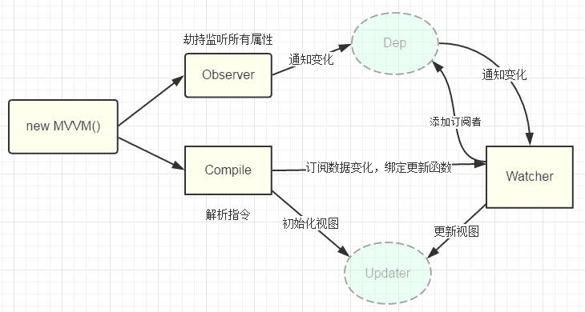

回答文案：当`vue`实例初始化后，会遍历`data`中的属性对属性进行`数据劫持`。同时对模板进行编译，找到需要更新的数据，从`data`的属性中获取并更新视图。同时会定义`watcher`用来监听数据的变化来更新视图。数据可能会复用，所以需要用一个管家`dep`管理多个集合的`watcher`。当数据发生变化的时候，会找到对应的管家`dep`，然后管家`dep`通知`watcher`更新哪一部分的数据。

---

## <font color="#e96900">使用 Object.defineProperty() 来进行数据劫持有什么缺点？ / defineProperty和Proxy的区别</font>

### Object.defineProperty

`Object.defineProperty`能够劫持对象的**属性**，但是需要对对象的每一个属性进行遍历劫持；

如果对象上有**新增**的属性，则需要对新增的属性再次进行劫持；**如果属性是对象，还需要深度遍历**。

这也是为什么`Vue`给对象新增属性需要通过`$set`的原因，其原理也是通过`Object.defineProperty`对新增的属性再次进行劫持。

`Object.defineProperty`也可以劫持**数组**，虽然数组没有属性，但是我们可以把数组的索引看成是属性，虽然我们监听到了数组中元素的变化，但是和监听对象属性面临着同样的问题，就是新增的元素并不会触发监听事件

为此，`Vue`的解决方案是劫持`Array.property`原型链上的`7`个函数(`push、pop、shift、unshift、splice、sort、reverse`)，

但是修改数组的`length`，`下标方式修改`数组，还是无法监听到的


我们总结一下`Object.defineProperty`在劫持对象和数组时的缺陷：

1. **无法检测到对象属性的添加或删除**
2. **无法检测数组元素的变化，需要进行数组方法的重写**
3. **无法检测数组的长度的修改**


---

### Proxy
>在目标对象之前架设一层“拦截”，外界对该对象的访问，都必须先通过这层拦截，因此提供了一种机制，可以对外界的访问进行过滤和改写

> var proxy = new Proxy(target, handler);

　`Proxy`本身是一个构造函数，通过`new Proxy`生成拦截的实例对象，让外界进行访问；构造函数中的`target`就是我们需要代理的目标对象，可以是对象或者数组；`handler`和`Object.defineProperty`中的`descriptor`描述符有些类似，也是一个对象，用来定制代理规则。


---

相较于`Object.defineProperty`劫持某个**属性**，`Proxy`则更彻底，不在局限某个属性，而是直接对**整个对象**进行代理

`Proxy`直接代理了`target`整个对象，并且返回了一个新的对象，通过监听代理对象上属性的变化来获取目标对象属性的变化；

而且我们发现`Proxy`不仅能够监听到属性的`增加`，还能监听属性的`删除`，比`Object.defineProperty`的功能更为强大。

不管是`数组下标`或者`数组长度的变化`，`还是通过函数调用`，`Proxy`都能很好的监听到变化

可以看到`Proxy`相较于`Object.defineProperty`在语法和功能上都有着明显的优势；而且`Object.defineProperty`存在的缺陷，`Proxy`也都很好地解决了。

**缺点**就是兼容性问题，主要Proxy是es6提供的新特性,兼容性不好,最主要的是这个属性无法用polyfill来兼容。(Polyfill 指的是用于实现浏览器并不支持的原生 API 的代码)
### 总结
- `Object.defineProperty`监听的是对象中的某个属性，而不是对象本身，所以无法监听到对象的添加属性,也无法监听到数组下标方式添加还有修改数组的`length`
- `Proxy`是对整个对象进行的拦截，返回一个新的实例对象 ，对象的属性修改和添加都可以拦截到

---


## <font color="#e96900">Computed 和 Watch 的区别</font>

### Computed
- `它支持缓存`，只有依赖的数据发生了变化，才会重新计算
- `不支持异步`，当`Computed`中有异步操作时，无法监听数据的变化
- `computed`的值会默认走缓存，计算属性是基于它们的响应式依赖进行缓存的，也就是基于`data`声明过，或者父组件传递过来的`props`中的数据进行计算的。
- 如果一个属性是由其他属性计算而来的，这个属性依赖其他的属性，一般会使用`computed`
- 如果`computed`属性的属性值是函数，那么默认使用`get`方法，函数的返回值就是属性的属性值；在`computed`中，属性有一个`get`方法和一个`set`方法，当数据发生变化时，会调用`set`方法。

### Watch
- `它不支持缓存`，数据变化时，它就会触发相应的操作
- `支持异步监听`
- 当一个属性发生变化时，就需要执行相应的操作
- 监听数据必须是`data`中声明的或者父组件传递过来的`props`中的数据，当发生变化时，会触发其他操作，函数有两个的参数：
  - `immediate`：组件加载立即触发回调函数
  - `deep`：深度监听，发现数据内部的变化，在复杂数据类型中使用，例如数组中的对象发生变化。需要注意的是，`deep`无法监听到数组和对象内部的变化。
当想要执行异步或者昂贵的操作以响应不断的变化时，就需要使用`watch`。

**`Computed`和`Watch`没有做特殊处理的情况是获取不到`$refs`的（可以在里面添加`this.$nextTick`之后再处理逻辑）**

### computed和v-model可以连用吗
可以

这里需要使用`computed`的第二种写法`getter/setter`的形式
```js
<template>
	//data绑定的输入框数据可以改变
	<el-input v-model='inputData'></el-input>
	//通过prop传递数据的输入框数据不可以改变
	<el-input v-model='inputProp'></el-input>
</template>

<script>
export default {
	props: {
		wordProp: {
			type: 'String',
			default: '传递数据'
		}
	}
	data() {
		return {
			wordData:'data数据'
		}
	},

	computed: {
	    //data里的数据
		inputData: {
			get() {
                return this.wordData
            },

            set(val) {
                this.wordData= val
            }
		},
		
		//props传递的数据，
		inputProp: {
			get() {
                return this.wordProp
            },

            set(val) {
                //实现prop双向改变，子组件改变的数据可以传递给父组件
                this.$emit('update:wordProp', val)
            }
		},
	}
}
</script>

```

---

## <font color="#e96900">data为什么是一个函数而不是对象</font>

`Vue`组件可能存在多个实例，如果使用对象形式定义`data`，则会导致它们共用一个`data`对象，那么状态变更将会影响所有组件实例，这是不合理的；采用函数形式定义，在`initData`时会将其作为工厂函数返回全新`data`对象，有效规避多实例之间状态污染问题。而在`Vue根实例`创建过程中则不存在该限制**既可以是函数形式也可以是对象形式**，也是因为根实例只能有一个，不需要担心这种情况。

---

## <font color="#e96900"> v-if、v-show、v-html 的区别</font>

### v-if
v-if会调用addIfCondition方法，生成vnode的时候会忽略对应节点，render的时候就不会渲染 **(初始化为false的时候是不渲染组件的)**
### v-show
v-show会生成vnode，render的时候也会渲染成真实节点，只是在render过程中会在节点的属性中修改show属性值，也就是常说的display **（不管true/false都会初始化组件）**
### v-html
v-html会先移除节点下的所有节点，调用html方法，通过addProp添加innerHTML属性，归根结底还是设置innerHTML为v-html的值 **(通过innnerHTML渲染组件内容，所以可以渲染富文本)**

### v-if和v-show的区别
1. **`v-if`是动态的向DOM树内添加或者删除DOM元素；`v-show`是通过设置DOM元素的display样式属性控制显隐；**
2. **`v-if`切换有一个局部编译/卸载的过程，切换过程中合适地销毁和重建内部的事件监听和子组件；`v-show`只是简单的基于css切换；**
3. **`v-if`是惰性的，如果初始条件为假，则什么也不做；只有在条件第一次变为真时才开始局部编译; `v-show`是在任何条件下，无论首次条件是否为真，都被编译，然后被缓存，而且DOM元素保留；**


---

##  <font color="#e96900">能不能说下$nextTick 原理及作用</font>
[参考这里](https://vue3js.cn/global/nextTick.html)

`Vue` 的 `nextTick` 其本质是对 `JavaScript` 执行原理 `EventLoop` 的一种应用。

`nextTick` 的核心是利用了如 `Promise 、MutationObserver、setImmediate、setTimeout`的原生 `JavaScript` 方法来模拟对应的微/宏任务的实现，本质是为了利用 `JavaScript` 的这些异步回调任务队列来实现 `Vue` 框架中自己的异步回调队列。

```js
const p = Promise.resolve();

function nextTick(cb){
  return cb ? p.then(cb) : p
}
```
### 为什么要nextTick 

一个例子让大家明白，如果没有 nextTick 更新机制，那么 num 每次更新值都会触发视图更新，有了nextTick机制，只需要更新一次，所以为什么有nextTick存在，相信大家心里已经有答案了。
```js
{{num}}
for(let i=0; i<100000; i++){
	num = i
}
```

---

## <font color="#e96900">说说你对vue的mixin的理解，有什么应用场景？</font>

本质其实就是一个`js`对象，它可以包含我们组件中任意功能选项，如`data、components、methods、created、computed`等等

我们只要将共用的功能以对象的方式传入 `mixins`选项中，当组件使用` mixins`对象时所有`mixins`对象的选项都将被混入该组件本身的选项中来

混入也有固定的规则：

- 替换型策略有`props、methods、inject、computed`，就是将新的同名参数替代旧的参数
- 合并型策略是`data`, 通过`set`方法进行合并和重新赋值
- 队列型策略有`生命周期函数`和`watch`，原理是将函数存入一个数组，然后正序遍历依次执行
- 叠加型有`component、directives、filters`，通过原型链进行层层的叠加

---


## <font color="#e96900">什么是虚拟dom</font> 

实际上它只是一层对真实`DOM`的抽象，由目标节点、目标属性和子节点组成。虚拟`dom`是真实`dom`的映射。

在`Javascript`对象中，虚拟`DOM` 表现为一个 `Object`对象。并且最少包含标签名` (tag)、属性 (attrs) 和子元素对象 (children) `三个属性，不同框架对这三个属性的名命可能会有差别

在`vue`中，每个组件都有一个`render`函数，每个`render`函数都会返回一个虚拟`dom`树，这也就意味着每个组件都对应一棵虚拟`DOM`树

### 为什么需要虚拟dom？
在vue中，渲染视图会调用render函数，这种渲染不仅发生在组件创建时，同时发生在视图依赖的数据更新时。如果在渲染时，直接使用真实DOM，由于真实DOM的创建、更新、插入等操作会带来大量的性能损耗，从而就会极大的降低渲染效率。

因此，vue在渲染时，使用虚拟dom来替代真实dom，主要为解决渲染效率的问题。

### 虚拟dom是如何转换为真实dom的？

在一个组件实例首次被渲染时，它先生成虚拟dom树，然后根据虚拟dom树创建真实dom，并把真实dom挂载到页面中合适的位置，此时，每个虚拟dom便会对应一个真实的dom。

如果一个组件受响应式数据变化的影响，需要重新渲染时，它仍然会重新调用render函数，创建出一个新的虚拟dom树，用新树和旧树对比，通过对比，vue会找到最小更新量，然后更新必要的真实dom节点

这样一来，就保证了对真实dom达到最小的改动。

---

## <font color="#e96900">虚拟dom的diff算法</font>
### 什么是diff算法？
diff 算法是一种通过**同层的树节点**进行比较的高效算法

其有两个特点：
- 比较只会在同层级进行, 不会跨层级比较
- 在`diff`比较的过程中，循环从两边向中间比较

### 比较方式

**diff整体策略为：深度优先，同层比较**


1.比较只会在同层级进行, 不会跨层级比较

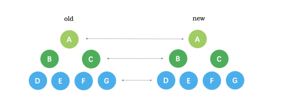

2.比较的过程中，循环从两边向中间收拢

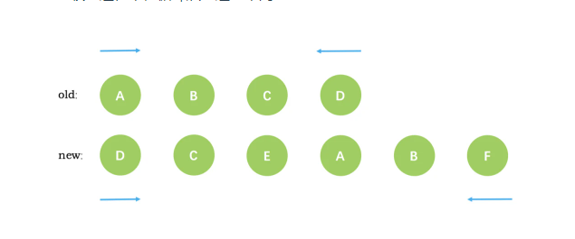

下面举个vue通过diff算法更新的例子：

新旧VNode节点如下图所示：

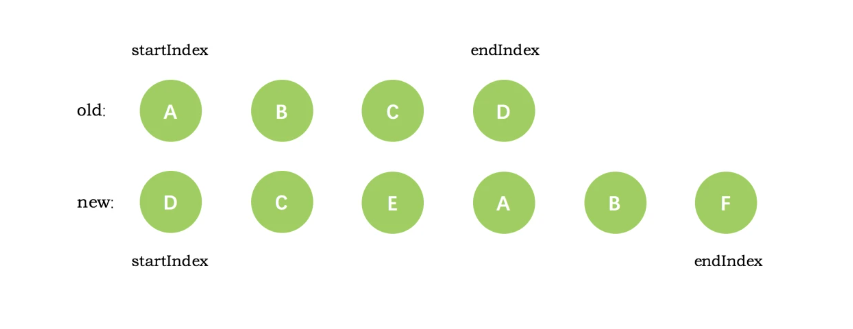

第一次循环后，发现旧节点D与新节点D相同，直接复用旧节点D作为diff后的第一个真实节点，同时旧节点endIndex移动到C，新节点的 startIndex 移动到了 C

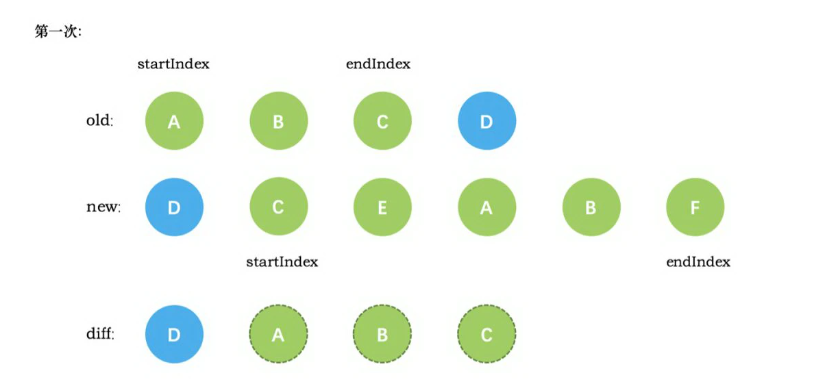


第二次循环后，同样是旧节点的末尾和新节点的开头(都是 C)相同，同理，diff 后创建了 C 的真实节点插入到第一次创建的 D 节点后面。同时旧节点的 endIndex 移动到了 B，新节点的 startIndex 移动到了 E

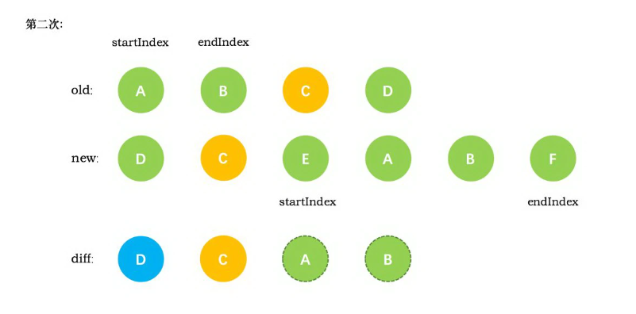

第三次循环中，发现E没有找到，这时候只能直接创建新的真实节点 E，插入到第二次创建的 C 节点之后。同时新节点的 startIndex 移动到了 A。旧节点的 startIndex 和 endIndex 都保持不动

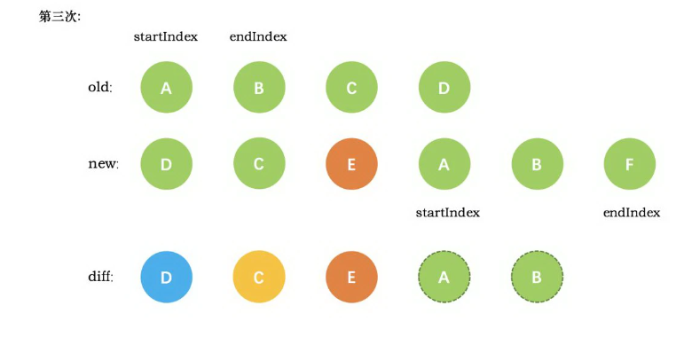

第四次循环中，发现了新旧节点的开头(都是 A)相同，于是 diff 后创建了 A 的真实节点，插入到前一次创建的 E 节点后面。同时旧节点的 startIndex 移动到了 B，新节点的startIndex 移动到了 B


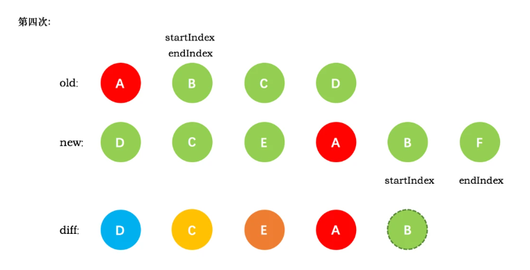

第五次循环中，情形同第四次循环一样，因此 diff 后创建了 B 真实节点 插入到前一次创建的 A 节点后面。同时旧节点的 startIndex移动到了 C，新节点的 startIndex 移动到了 F

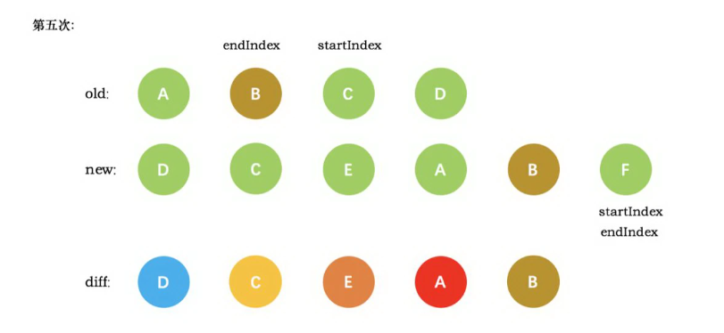

新节点的 startIndex 已经大于 endIndex 了，需要创建 newStartIdx 和 newEndIdx 之间的所有节点，也就是节点F，直接创建 F 节点对应的真实节点放到 B 节点后面

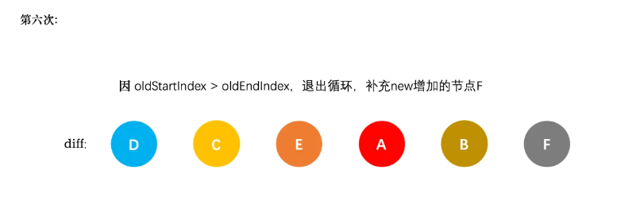

---

## <font color="#e96900">key的原理</font>
`key`是`vue`中一个隐性的`api`，它是一个特殊的属性，可以保证在`dom`更新的时候，`vue`能够跟踪每个节点，从而重用和重新排序元素

### 设置key与不设置key区别
创建一个实例，2秒后往items数组插入数据
```js
<body>
  <div id="demo">
    <p v-for="item in items" :key="item">{{item}}</p>
  </div>
  <script src="../../dist/vue.js"></script>
  <script>
    // 创建实例
    const app = new Vue({
      el: '#demo',
      data: { items: ['a', 'b', 'c', 'd', 'e'] },
      mounted () {
        setTimeout(() => { 
          this.items.splice(2, 0, 'f')  // 
       }, 2000);
     },
   });
  </script>
</body>
```

在不使用key的情况，vue会进行这样的操作：
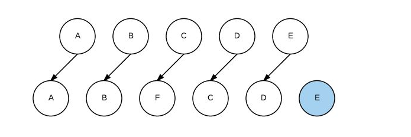

分析下整体流程：

- 比较A，A，相同类型的节点，进行patch，但数据相同，不发生dom操作
- 比较B，B，相同类型的节点，进行patch，但数据相同，不发生dom操作
- 比较C，F，相同类型的节点，进行patch，数据不同，发生dom操作
- 比较D，C，相同类型的节点，进行patch，数据不同，发生dom操作
- 比较E，D，相同类型的节点，进行patch，数据不同，发生dom操作
- 循环结束，将E插入到DOM中

一共发生了3次更新，1次插入操作


在使用key的情况：vue会进行这样的操作：

- 比较A，A，相同类型的节点，进行patch，但数据相同，不发生dom操作
- 比较B，B，相同类型的节点，进行patch，但数据相同，不发生dom操作
- 比较C，F，不相同类型的节点
- 比较E、E，相同类型的节点，进行patch，但数据相同，不发生dom操作
- 比较D、D，相同类型的节点，进行patch，但数据相同，不发生dom操作
- 比较C、C，相同类型的节点，进行patch，但数据相同，不发生dom操作
- 循环结束，将F插入到C之前

一共发生了0次更新，1次插入操作

通过上面两个小例子，可见设置key能够大大减少对页面的DOM操作，提高了diff效率

---

## <font color="#e96900">Vue template 到 render 的过程</font>
`vue`的模版编译过程主要如下：`template -> ast -> render函数`

`vue` 在模版编译版本的码中会执行 `compileToFunctions` 将`template`转化为`render`函数：


CompileToFunctions中的主要逻辑如下∶

1、调用`parse`方法将`template`转化为`ast`（抽象语法树）
```js
const ast = parse(template.trim(), options);
```
-` parse`的目标：把`template`转换为`AST`树，它是一种用 `JavaScript`对象的形式来描述整个模板。
- 解析过程：利用正则表达式顺序解析模板，当解析到开始标签、闭合标签、文本的时候都会分别执行对应的 回调函数，来达到构造`AST`树的目的。
`AST`元素节点总共三种类型：`type`为1表示普通元素、2为表达式、3为纯文本

2、对静态节点做优化
```js
optimize(ast, options)
```
这个过程主要分析出哪些是`静态节点`，给其打一个标记，为后续更新渲染可以直接跳过静态节点做优化

深度遍历`AST`，查看每个子树的节点元素是否为静态节点或者静态节点根。如果为静态节点，他们生成的`DOM`永远不会改变，这对运行时模板更新起到了极大的优化作用。

3、生成代码
```js
const code = generate(ast, options)
```
`generate`将`ast`抽象语法树编译成 `render`字符串并将静态部分放到 `staticRenderFns` 中，最后通过 `new Function( render)` 生成`render`函数。

### 总结
1. 调用parse将template转为ast抽象语法树
2. 然后对静态节点做标记，跳过不必要的编译
3. generate将ast抽象语法树编译成 render字符串，最后通过 new Function( render) 生成render函数

---

## <font color="#e96900">Vue data 中某一个属性的值发生改变后，视图会立即同步执行重新渲染吗？</font>
不会立即同步执行重新渲染。`Vue `实现响应式并不是数据发生变化之后 `DOM` 立即变化，而是**按一定的策略进行 DOM 的更新**。**Vue 在更新 DOM 时是异步执行的**。只要侦听到数据变化， `Vue` 将开启一个队列，并缓冲在同一事件循环中发生的所有数据变更。

如果同一个`watcher`被多次触发，只会被推入到队列中一次。这种在缓冲时`去除重复数据`对于避免不必要的计算和 `DOM` 操作是非常重要的。然后，在下一个的事件循环`tick`中，`Vue `刷新队列并执行实际（已去重的）工作。

---

## <font color="#e96900">delete和Vue.delete删除数组的区别</font>

`delete`和`Vue.delete`都是对数组或对象的删除。

这两种方法对于**对象**来说没有区别，直接删除对象的属性；

但是对于数组来说有区别：

`delete`只是被删除的元素变成了 `empty/undefined` 其他的元素的键值还是不变。数组长度也不变。
 
 `Vue.delete`是直接删除该元素，长度发生变化。
 ```js
 let arr = new Array(3).fill('1')
	delete arr[1]
	console.log(arr)  //  ['1', empty, '1']
 ```

 总结：对于数组而言，delete相当于将元素置空，vue.delete相当于真正的删除元素。

 ---

## <font color="#e96900">对SSR的理解</font>
SSR也就是服务端渲染，也就是将Vue在客户端把标签渲染成HTML的工作放在服务端完成，然后再把html直接返回给客户端

SSR的优势：
- 更好的`SEO `(客户端页面是异步加载的 seo查询的时候页面内容可能还没加载完 不利于seo搜索引擎优化)(搜索引擎优先爬取页面HTML结构，使用ssr时，服务端已经生成了和业务想关联的HTML，有利于seo)
- 首屏加载速度更快(用户无需等待页面所有js加载完成就可以看到页面视图（压力来到了服务器，所以需要权衡哪些用服务端渲染，哪些交给客户端）)

SSR的缺点：
- 开发条件会受到限制，服务器端渲染只支持`beforeCreate`和`created`两个钩子；
- 当需要一些外部扩展库时需要特殊处理，服务端渲染应用程序也需要处于Node.js的运行环境；
- 更多的服务端负载。

---

## <font color="#e96900">Vue的性能优化有哪些</font>

### 编码阶段
- 尽量减少data中的数据，data中的数据都会增加getter和setter，会收集对应的watcher
- v-if和v-for不能连用
- 如果需要使用v-for给每项元素绑定事件时使用事件代理
- SPA 页面采用keep-alive缓存组件在更多的情况下，使用v-if替代v-show
- key保证唯一
- 使用路由懒加载、异步组件
- 防抖、节流
- 第三方模块按需导入
- 长列表滚动到可视区域动态加载
- 图片懒加载

### SEO优化
- 预渲染
- 服务端渲染SSR

### 打包优化
- 压缩代码
- Tree Shaking/Scope Hoisting
- 使用cdn加载第三方模块
- 多线程打包happypack
- splitChunks抽离公共文件
- sourceMap优化

### 用户体验
- 骨架屏
- PWA
- 还可以使用缓存(客户端缓存、服务端缓存)优化、服务端开启gzip压缩等。

---

## <font color="#e96900">vue初始化页面闪动问题</font>
使用vue开发时，在vue初始化之前，由于div是不归vue管的，所以我们写的代码在还没有解析的情况下会容易出现花屏现象，看到类似于`{{message}}`的字样，虽然一般情况下这个时间很短暂，但是还是有必要让解决这个问题的。

首先：在css里加上以下代码：
```css
[v-cloak] {
	display:none;
}
```
如果没有彻底解决问题，则在根元素加上style="display: none;" :style="{display: 'block'}"

---

## <font color="#e96900"> v-if和v-for哪个优先级更高？如果同时出现，应如何优化？</font>

v-for**优先于**v-if被解析，如果同时出现，每次渲染都会**先执行循环再判断条件**，无论如何循环都不可避免，浪费了性能。

要避免出现这种情况，则在外层嵌套template，在这一层进行v-if判断，然后在内部进行v-for循环。如果条件出现在循环内部，可通过计算属性提前过滤掉那些不需要显示的项。

---

## <font color="#e96900">Vue常用的修饰符有哪些有什么应用场景</font>
### v-bind修饰符
#### async
>能对props进行一个双向绑定

使用`sync`的时候，子组件传递的事件名格式必须为`update:value`，其中`value`必须与子组件中`props`中声明的名称完全一致

注意带有` .sync `修饰符的` v-bind `不能和表达式一起使用

将` v-bind.sync` 用在一个字面量的对象上，例如` v-bind.sync=”{ title: doc.title }”`，是无法正常工作的


### 表单修饰符

- lazy --- 在我们填完信息，光标离开标签的时候
- trim --- 自动过滤用户输入的首空格字符，而中间的空格不会过滤
- number --- 自动将用户的输入值转为数值类型，但如果这个值无法被parseFloat解析，则会返回原来的值

### 事件修饰符
- stop --- 阻止事件冒泡 相当于调用了event.stopPropagation方法
- prevent --- 阻止默认事件 相当于调用了event.preventDefault方法
- native ---  让组件变成像html内置标签那样监听根元素的原生事件，否则组件上使用 v-on 只会监听**自定义事件**
	- `<my-component v-on:click.native="doSomething"></my-component>`
- capture --- 添加事件侦听器时使用事件捕获模式
- self --- 只当事件在该元素本身（比如不是子元素）触发时触发回调
- once --- 事件只触发一次
- passive --- 事件默认没有preventDefault功能，加上passive后可以阻止默认行为


### 鼠标按钮修饰符
- left 左键点击
- right 右键点击
- middle 中键点击

```js
<button @click.left="shout(1)">ok</button>
<button @click.right="shout(1)">ok</button>
<button @click.middle="shout(1)">ok</button>
```

### 键盘修饰符

键盘修饰符是用来修饰键盘事件`（onkeyup，onkeydown）`的，有如下：

`keyCode`存在很多，但`vue`为我们提供了别名，分为以下两种：

- 普通键`（enter、tab、delete、space、esc、up...）`
- 系统修饰键`（ctrl、alt、meta、shift...）`

```js
// 只有按键为keyCode的时候才触发
<input type="text" @keyup.keyCode="shout()">
```
还可以通过以下方式自定义一些全局的键盘码别名
```js
Vue.config.keyCodes.f2 = 113
```

## <font color="#e96900">vue2和vue3有哪些区别</font>

### 1.响应式原理
1. Vue2 响应式原理基础是 Object.defineProperty : 监听的是对象中的某个属性，而不是对象本身，所以无法监听到对象的添加属性,也无法监听到数组下标方式添加还有修改数组的length
2. Vue3 响应式原理基础是 Proxy : 对整个对象进行的拦截，返回一个新的实例对象 ，对象的属性修改和添加都可以拦截到

### 2. 增加了composition API(组合式API)
Vue2 是选项API（Options API），一个逻辑会散乱在文件不同位置（data、props、computed、watch、生命周期钩子等），导致代码的可读性变差。当需要修改某个逻辑时，需要上下来回跳转文件位置。

Vue3 组合式API（Composition API）则很好地解决了这个问题，可将同一逻辑的内容写到一起，增强了代码的可读性、内聚性，其还提供了较为完美的逻辑复用性方案。

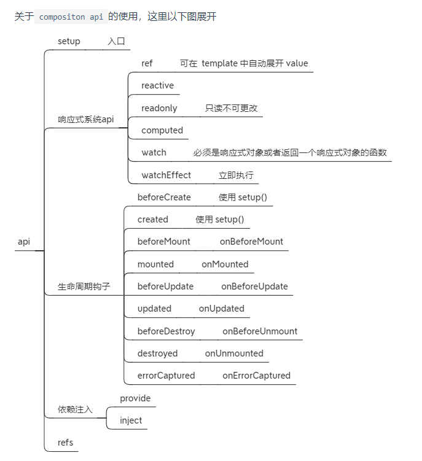

### 3.优化虚拟dom

Vue3 相比于 Vue2，虚拟DOM上增加 patchFlag(静态节点) 字段

patchFlag 帮助 diff 时区分静态节点，以及不同类型的动态节点。一定程度地减少节点本身及其属性的比对。

1. 静态节点不进行diff，直接复用
2. 静态节点不进行打补丁，直接替换
3. 静态节点不进行key比对，直接复用

字段类型情况：1 代表节点为动态文本节点，那在 diff 过程中，只需比对文本对容，无需关注 class、style等。除此之外，发现所有的静态节点（HOISTED 为 -1），都保存为一个变量进行静态提升，可在重新渲染时直接引用，无需重新创建。


### 4.Treeshaking特性
就是在保持代码运行结果不变的前提下，去除无用的代码

主要依赖于 import 和 export 语句，用来检测代码模块是否被导出、导入，且被 JavaScript 文件使用。

而Vue3源码引入tree shaking特性，将全局 API 进行分块。如果您不使用其某些功能，它们将不会包含在您的基础包中

vue3中组合式API都是按需引入的，比如生命周期，watch等等

通过Tree shaking，Vue3给我们带来的好处是：

1. 减少程序体积（更小）
2. 减少程序执行时间（更快）
3. 便于将来对程序架构进行优化（更友好）

### 5.多根节点fragment
vue3 允许我们支持多个根节点,vue3内部已经在创建了虚拟包裹根节点，所以不用像vue2那样只有一个根节点了

### 6.Teleport传送门
Vue3 提供 Teleport 组件可将部分 DOM 移动到 Vue app 之外的位置。比如项目中常见的 Dialog 弹窗。

### 7.异步组件（Suspense）
Vue3 提供 Suspense 组件，允许程序在等待异步组件加载完成前渲染兜底的内容，如 loading ，使用户的体验更平滑。

使用它，需在模板中声明，并包括两个命名插槽：default 和 fallback。Suspense 确保加载完异步内容时显示默认插槽，并将 fallback 插槽用作加载状态

### 8.TypeScript支持
Vue3 由 TypeScript 重写，相对于 Vue2 有更好的 TypeScript 支持。

Vue2 Options API 中 option 是个简单对象，而 TypeScript 是一种类型系统，面向对象的语法，不是特别匹配。

Vue3 提供了 Composition API，它允许我们使用纯 JavaScript 函数来组织组件逻辑，使得代码更加可维护。
